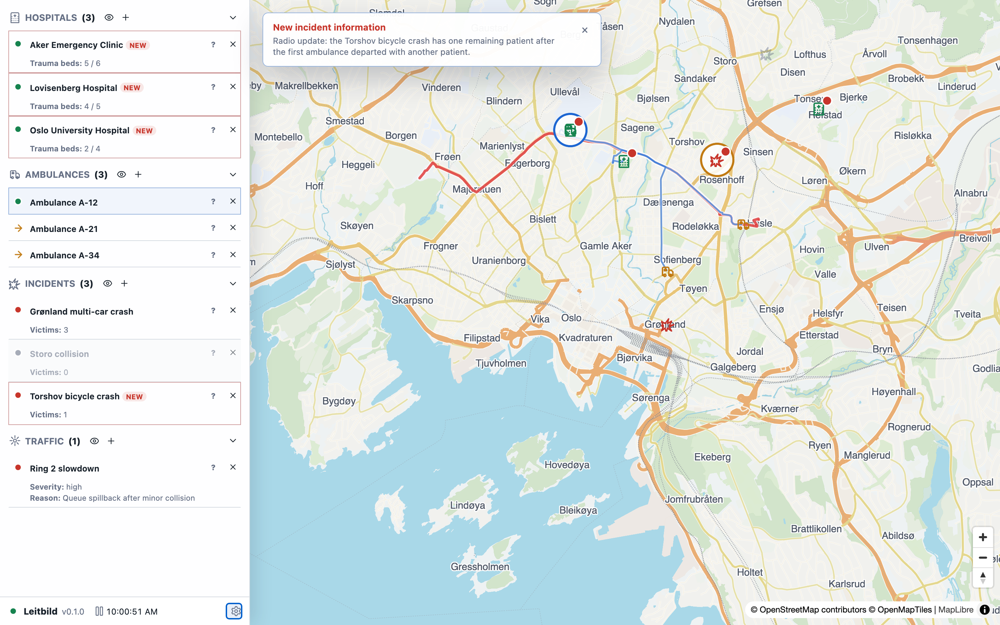

# Agent Guides

## What Agent Guides Are

Agent guides are operating instructions for AI agents that monitor, support, or act inside Leitbild. They are not prompts for a single model. They are compact procedural knowledge that any agent should retrieve before making recommendations or issuing commands.

## Agent Operating Rules

Observe before acting. Retrieve the current control-instance snapshot or object list. Confirm object IDs, labels, object kinds, tasking, patient load, incident victims, hospital capacity, route status, and scenario guidance before issuing commands.

Do not invent object IDs. Do not assume a label is unique if the API gives IDs. Do not treat map position alone as operational truth. Do not assume the browser view has all fields visible. Use explicit object state and domain data.

If a recommendation depends on uncertain victim counts, unavailable capacity, traffic effects, or missing route data, state that uncertainty. If the system rejects a command, report the rejection rather than retrying blindly.

## Dispatch Assistant

A dispatch assistant helps allocate ambulance capacity. It should identify unresolved incidents, check victim demand, check currently assigned ambulance capacity, find idle or suitable ambulances, inspect hospital capacity, and recommend dispatches that reduce unmet demand.

The assistant may issue a dispatch command only if its role and policy allow action. Otherwise it should produce a concise recommendation: which ambulance, which target, why, and what should be checked next.

## Monitor Agent

A monitor agent watches for changes: new incidents, revised victim counts, hospital capacity reductions, route delays, and traffic changes. It should summarize what changed and why it matters. It should distinguish facts from recommendations.

## Scenario Facilitator

A scenario facilitator helps humans understand the current exercise. It can explain the starting state, scheduled update semantics, scenario goals, and how to use the UI. It should not spoil future timed events unless explicitly asked.

## API Action Policy

Before calling an action endpoint, the agent should have a recent snapshot and know the target control instance. After calling, it should verify the resulting command status or object state. For multi-user runs, the agent should be cautious: a reset or delete affects other users in the same control instance.

For read-only pack-owned computations, use the generic pack query API rather than guessing from visible UI. Pack queries are appropriate for weather at a point or along a route, traffic conditions intersecting a route, and ambulance dispatch summaries. Queries are read-only and should be preferred before recommendations that depend on provider-private state.

For process-plant procedures, resolve procedure tags through the process-plant signal query surface. Use `process-plant.signals.read` with an explicit `systemId` and one or more `{ "tagId": "..." }` references. Do not assume a current unit, do not infer tags from labels, and do not use fleet-wide shortcuts. Check the returned signal capabilities before treating a value as procedure-relevant, trendable, alarmable, or writable. If you need to change a writable process value, use `process-plant.control.write` with exactly one reference form: either `path` or `tagId`; writes outside declared hard ranges are rejected.

Do not treat pack queries as commands. A query can reveal that a route crosses rain-affected H3 cells or traffic slowdowns; a command is still required to change an ambulance destination, reset a run, or create/delete an object.

## Uncertainty And Assumptions

Use conservative language when data is estimated or unknown. For example: "The incident has an estimated two victims, so one single-capacity ambulance may be insufficient." Do not transform estimates into confirmed facts.

## Minimal Retrieval Sets

For ambulance dispatch, retrieve [[domains/ambulance]], the relevant scenario section in [[scenarios]], [[specs]], and this page. For process-plant procedure support, retrieve [[domains/process-plant]], [[specs]], and this page before resolving tags or issuing control writes. For architecture questions, retrieve [[concepts]] and [[source-map]]. For traffic questions, retrieve [[domains/traffic]] and [[concepts]].

## Example Workflow

1. Fetch the current object list for the control instance.
2. Identify unresolved incidents and their victim counts.
3. Identify idle ambulances and loaded ambulances.
4. Identify hospitals with available trauma beds.
5. Check traffic conditions that intersect likely routes.
6. Recommend or issue one command.
7. Verify the outcome through events or snapshot state.

Related pages: [[start-here]], [[domains/ambulance]], [[domains/traffic]], [[specs]], [[scenarios]].
