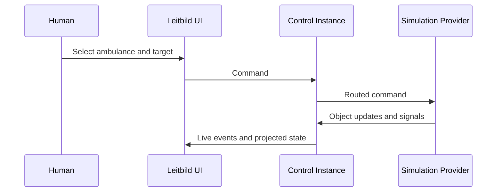
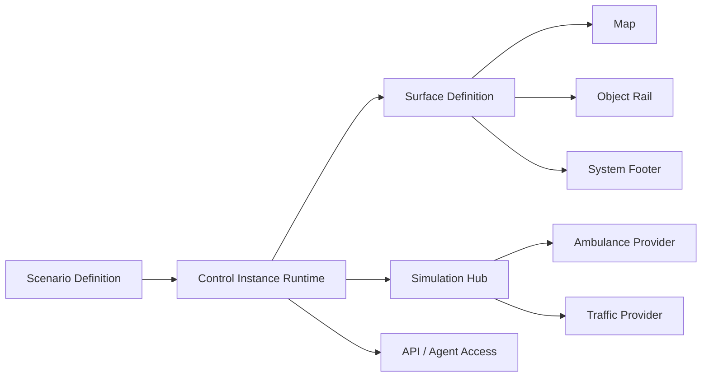

# Concepts

## Control Instances

A Control Instance is the running shared world that clients join. It owns the canonical projected state, the control-instance clock, live events, persistent snapshots, command lifecycle, and scenario runtime state. Reloading a client should rejoin the same Control Instance rather than create a hidden copy.

The Control Instance is not the same as a browser tab. One user may have several clients open. Several users may join the same run. In the future, a run may continue even when no browser is connected, pause when the last user leaves, or be explicitly stopped and deleted.

## Scenario Runs

A Scenario Definition is reusable data. A Scenario Run is a running instance of that definition. URLs are scenario-first: `/i/halden` creates a new Halden run, and `/i/halden/sandbox` joins a concrete run named `sandbox`.

Scenario definitions initialize packs, world time, map view, surface primitives, initial objects, and optional timed script steps. Restored runs use snapshots and durable history instead of replaying the scenario from scratch.

## Packs And Providers

A pack is the user-facing capability bundle. The ambulance pack contributes ambulance-domain objects, commands, presentation, scenario codecs, simulation provider metadata, and domain interaction handlers. The traffic pack contributes traffic condition objects and route-impact semantics.

A simulation provider is runtime wiring inside a pack. Providers emit object updates and signals into a Control Instance, observe committed events, and maintain any provider-private mechanics they need. Leitbild core owns event ordering and canonical shared state.

## Operational Objects

Operational Objects are the canonical things on the map and in the rail. They have identity, kind, domain, label, spatial state, operational state, tasking, alerts, provenance, timestamps, optional `domainData`, and optional `context`.

The object envelope is use-case agnostic. Domain-specific truth lives in validated `domainData`; for example ambulance capabilities, hospital trauma beds, incident victims, or traffic severity.

## Object Context

Object Context is perspective-bearing artificial situation awareness. It represents what an object, actor, system, or AI perspective knows or remembers. Context can include facts, activity entries, references, and summaries. It should not replace canonical domain truth.

For AI agents, Object Context is important because agents need more than current map coordinates. They may need radio call summaries, prior task history, uncertainty, recent observations, or relevant nearby objects.

## Events, Signals, And Commands

Commands are requests to do something, such as setting an ambulance destination. Signals are claims or observations that may trigger interaction handlers, such as an asset arriving at a target. Domain Events are accepted canonical changes ordered by the Control Instance runtime.

## Surfaces And UI

A Surface is the scenario-declared UI assembly. V1 supports safe primitives such as map, object rail, system footer, and scenario guidance overlay. Scenarios should not rely on hidden default UI; they declare their initial surface.

## Projected State, Journal, Live Feed

Projected State is the current canonical operational picture. The Durable Journal is meaningful accepted history, not every volatile movement tick. The Live Feed keeps connected clients current. Stale clients reload from snapshots.
