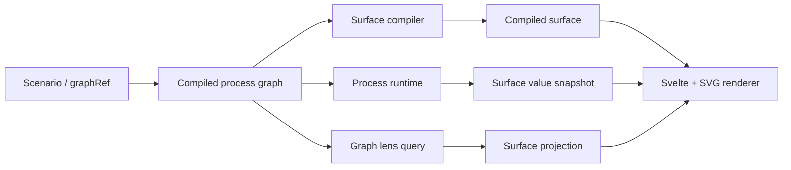

# Design Guides

This page records interface design guidance for Leitbild surfaces that are expected to support operational work, AI-assisted monitoring, and future user-configurable dashboards. It is intentionally written as a practical reference for people and agents editing the Svelte/SVG process displays, scenario-authored surfaces, and future control-room views.

## Information-Rich Design For Process Displays

Information-rich design means that the display should carry operational meaning without forcing the user to open many popups or mentally join disconnected numbers. A vessel should show level, pressure, and abnormality in the same visual object. A pump should show whether it is running, how hard it is running, and what flow it is producing. A flow path should show direction, service, and relative activity. The goal is not decoration; it is faster pattern recognition under time pressure.

For Leitbild, information richness must remain disciplined. Normal operating state should be visually quiet. Color should be reserved for semantic state, service identity, abnormal conditions, selected context, and active flow. A display that is colorful everywhere makes every condition look equally important, which is exactly the opposite of what a command-and-control surface needs.

The useful mental model is a layered display. The first layer is the topology: what is connected to what, and in which broad system the element lives. The second layer is process state: level, pressure, power, flow, valve position, pump speed, electrical availability, alarm count, and trip state. The third layer is attention: warnings, trips, unavailable equipment, selected paths, and newly changed values. The third layer should be sparse and unmistakable.

## OpenBridge Lessons

[OpenBridge](https://www.openbridge.no/) is useful to Leitbild because it treats complex operational interfaces as a design system rather than as ad hoc screens. The most important lesson is not a particular visual style; it is consistency across components, status meanings, interaction patterns, and device contexts. A process plant surface, a map surface, and a future AI-built dashboard should feel like parts of one operating environment.

OpenBridge also reinforces the value of component libraries for high-consequence interfaces. Leitbild should not hand-draw every reactor vessel, pump, alarm strip, or map popup differently. We should maintain a small set of reusable surface objects with stable semantics: vessel, heat exchanger, pump, valve, electrical source, header, alarm strip, status banner, trend strip, and compact numeric readout. A scenario or AI agent should configure these objects; it should not invent visual grammar from scratch.

The OpenBridge direction also cautions against overfitting to one plant. Leitbild surfaces should use domain-neutral primitives where possible and plant-specific components only where the physical meaning really is plant-specific. For example, a steam generator deserves its own process component behavior, but its display can still be a heat-exchanger-style object with configured bindings and annotations.

## Component Principles

Every process surface component should answer three questions at a glance: what is this, what is its current state, and why should I care now? The label answers the first question, embedded live values answer the second, and status/alarm styling answers the third. If a component cannot answer those questions without a tooltip, the surface is not information-rich enough.

The shape should match the physical role. Vessels should visually support inventory and level. Heat exchangers should show two-sided transfer or internal coil semantics. Pumps should show rotation/running state and flow. Valves should show position or availability. Headers and connections should carry service, direction, and relative flow. Generic rounded rectangles are acceptable only for genuinely abstract readouts such as unit status or alarm summaries.

Component text must be sparse. A surface object is not a table. Show two to four high-value fields in the component, use short labels, and push deeper inspection into selected panels or query surfaces. In the process-plant overview, the component should help the operator scan; it should not try to replace the full control room.

## Color And Status

Use a low-color normal state. Normal components should use subdued shells, quiet fills, and readable dark/light text. Service colors may distinguish primary coolant, steam, feedwater, condensate, electrical, cooling, and support paths, but those colors should be less prominent than alarms or selected states.

Use warning and critical colors only for operational state. Orange and red should mean that the simulation or I&C layer has produced a meaningful concern, not merely that a component belongs to a hot system. Avoid “red steam pipes” if that competes with actual alarm coloring. When service colors are needed, use muted service strokes and reserve saturated color for attention.

New information badges should be event-specific. They should not appear just because a value changes every tick. Process values move continuously; “new” should mean a meaningful message, alarm, state change, trip, operator action, or scenario event.

## Data Binding

The process surface must be driven by pack data, not by UI guesses. Component displays bind to declared variable paths in the process-plant graph. Graph projection and visibility should come from the process-plant pack through the pack query surface, because the pack owns the component graph and connection semantics.

The current direction is: scenario or graphRef defines the plant, the process-plant pack compiles the graph, surfaces bind widgets and paths to graph components/connections, and the UI asks for snapshots and graph/surface projections. That lets future AI agents manipulate a display by changing surface specifications or lens choices without duplicating plant topology in Svelte.

If a value is unavailable, the surface should show the absence honestly. Do not silently substitute plausible-looking numbers. If a binding path is invalid, validation should fail at the pack/surface boundary rather than leaving a blank display.

## Layout And Lenses

The authored overview surface is the default display, but operators and agents need lenses. A lens is a pack-backed graph projection such as “primary coolant,” “steam path,” “feedwater,” or “direct neighborhood of this selected component.” The UI should render the projected surface rather than pretending that hidden components do not exist.

When a component is shown through a lens, its relevant connections should be shown when the graph projection says they are relevant. The UI should not infer topology from screen coordinates. Backtracking to nearest visible components is a graph problem first and a drawing problem second.

The process surface should support panning, zooming, and remembered local positions. Remembered positions are a user layout preference, not process truth. They should never change graph connectivity, variable identity, or simulation behavior.

## AI-Authored Surfaces

Future AI agents should be able to propose and modify surfaces by editing a structured surface specification: widgets, bindings, paths, regions, lens presets, and layout metadata. That only works if the visual vocabulary is small, explicit, and well documented. An agent should choose a `heatExchanger` widget and bind it to `sgA.levelPercent` and `sgA.pressureMPa`; it should not generate arbitrary SVG.

Generated displays must be validated at the same boundary as human-authored displays. The validator should check widget ids, region ids, binding paths, source component ids, source connection ids, port references, and unsupported widget types. If an AI-generated display cannot be validated, it should not be shown.

AI-generated dashboards should favor task lenses over full diagrams. A procedure agent might create a compact SGTR display showing pressurizer pressure, SG radiation, affected steam-generator level, containment pressure, and makeup/letdown state. A dispatch agent might create a map-linked plant status panel. The design guide’s job is to keep those generated surfaces coherent.

## Current Leitbild Implementation Notes

The current process display uses Svelte for the modal and interaction shell, SVG for zoomable process graphics, and pack queries for process data. The renderer uses component-specific SVG elements for vessels, heat exchangers, pumps, valves, status banners, and readouts. This keeps the display vector-based and zoomable without introducing a heavyweight canvas or 3D stack.

The process-plant pack now exposes a surface projection query. The UI can ask for a service-layer projection such as primary coolant, steam, feedwater, or support. The pack applies the graph lens and projects it onto the compiled surface, returning visible widget and path ids. That is the correct boundary: graph truth stays in the pack, rendering stays in the UI.

Do not move graph traversal or plant semantics into the UI. UI helpers may format values, draw symbols, and manage local layout. They should not decide what a reactor coolant system path is, which components are neighbors, or which hidden component should be included in a process lens.

## Mermaid Overview

## References

- [OpenBridge](https://www.openbridge.no/) for operational design-system thinking and reusable maritime interface components.
- [ISA-101 committee page](https://www.isa.org/standards-and-publications/isa-standards/isa-standards-committees/isa101) for the human-machine interface standards context used in industrial control systems.
- [High Performance HMI Handbook site](https://www.highperformancehmi.com/) as a commonly cited source for low-color, operator-focused industrial display practice.
