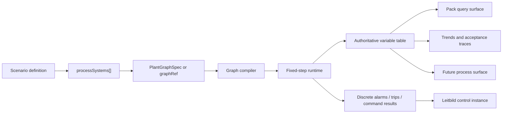
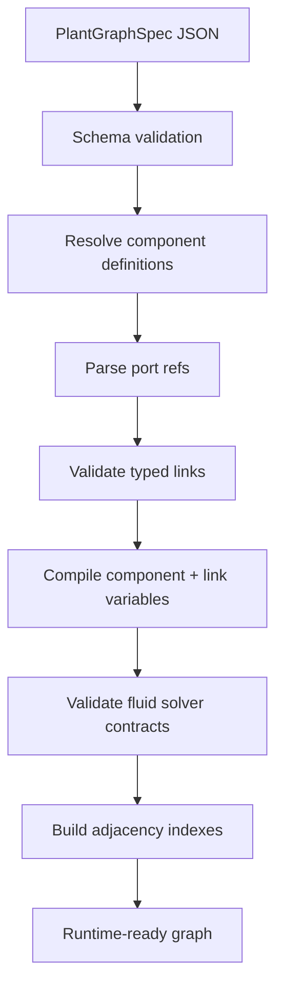
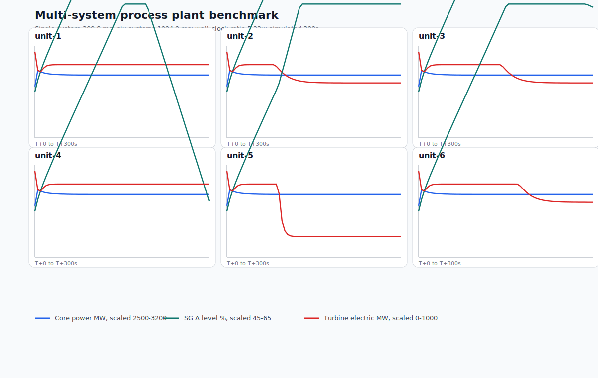
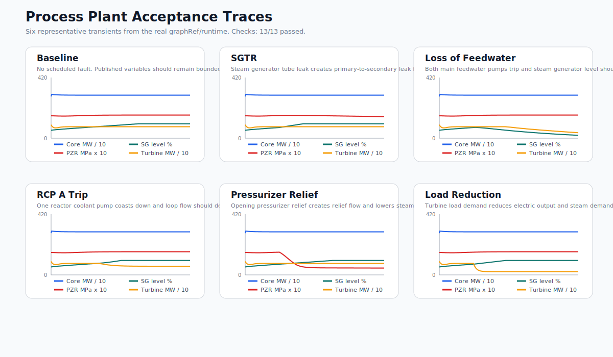

# Process Plant Pack

The Leitbild `process-plant` pack is the foundation for running detailed process-control simulations inside the same multi-pack world as maps, vehicles, weather, traffic, incidents, and AI agents. It is meant for systems whose important state is an evolving network of process variables: flows, pressures, temperatures, powers, inventories, valve positions, pump states, trips, alarms, and operator commands. A nuclear plant is the current feasibility example because it stresses the architecture, but the pack is deliberately generic enough to support future hospital utilities, chemical plants, water-treatment facilities, ship machinery plants, district heating networks, or other interconnected process systems.

The key architectural boundary is simple: continuous physics stays inside the process-plant runtime. Leitbild events record discrete accepted history such as commands, alarms, trips, fault injections, and threshold crossings. A pump does not emit “water moved” messages to a steam generator; the fixed-step runtime computes flow, heat transfer, inventory changes, and process state from a compiled component graph.



## Current Status

The pack now has a real graph compiler, scenario-owned system assembly, a fixed-step headless runtime, provider lifecycle integration, provider-private snapshot/restore, a generic pack query surface, writable-variable commands, timed pack-owned schedules, telemetry buffers, multi-system testbeds, benchmark scripts, and acceptance traces. It is not yet a finished control-room product. The current work is about making the runtime and model strong enough to bear more detailed process displays, alarms, procedures, and AI-agent interaction later.

The built-in demonstration graph is `process-plant.pressurized-water-reactor.v1`. It is a medium-fidelity research model, not licensing-grade analysis software. It currently models a four-loop PWR-like plant skeleton with core, vessel, pressurizer, four steam generators, four reactor coolant pumps, main and auxiliary feedwater paths, main steam paths, turbine, generator, condenser, condensate pumps, charging, letdown, volume-control tank, process links, link sensors, link valves, and link leak modifiers.

## Scenario-Owned Plant Assembly

Plant systems are assembled from scenario data. A scenario may instantiate one or many process systems, each with a `graphRef` or inline graph, parameter overlays, initial state, schedules, and telemetry configuration.

```json
{
  "processSystems": [
    {
      "id": "unit-1",
      "pack": "process-plant",
      "componentLibrary": "process-plant",
      "graphRef": "process-plant.pressurized-water-reactor.v1",
      "parameters": {
        "core": {
          "ratedPowerMw": 2890
        }
      },
      "initialState": {
        "core.rodInsertionFraction": 0.18,
        "sgA.secondaryInventoryKg": 60000
      }
    }
  ],
  "providerConfigs": {
    "process-plant": {
      "systems": {
        "unit-1": {
          "schedule": {
            "actions": [
              {
                "id": "trip-rcp-a",
                "atMs": 60000,
                "type": "tripComponent",
                "componentId": "rcpA"
              }
            ]
          },
          "telemetry": {
            "sampleIntervalMs": 5000,
            "variables": ["core.powerMw", "sgA.levelPercent", "turbine.electricMw"]
          }
        }
      }
    }
  }
}
```

This design keeps topology configurable without letting scenarios execute arbitrary code. Scenarios instantiate components and links; component physics remains code-backed, typed, reviewed, and tested. A future AI agent can author a graph or choose a known `graphRef`, but the compiler still rejects invalid topology, parameters, units, link contracts, initial state, schedules, and commands before runtime.

## Component Graph

The canonical model is `PlantGraphSpec`. It contains `schemaVersion`, `id`, `title`, `timestep`, `components`, `connections`, and `publishedVariables`. Components declare an id, kind, label, parameters, ports, and process variables. Connections link typed ports and may carry physical metadata plus link-local variables.

The compiler validates and indexes the graph before runtime. It rejects duplicate ids, unknown component kinds, invalid parameters, impossible port connections, missing published variables, bad initial values, invalid link actuators, duplicate variable paths, incompatible fluid link solver models, and broken primary-loop topology. Runtime code receives compiled component/link tables and adjacency indexes, not raw strings to reparse on every tick.



Current component kinds include `reactorCore`, `reactorVessel`, `steamGenerator`, `centrifugalPump`, `processHeader`, `steamHeader`, `processTank`, `processValve`, `steamValve`, `pressurizer`, `pressurizerHeaters`, `generatorSink`, `turbineLoadSink`, and `condenserSink`. Some are richer behaviors, while others are still topology or simple lumped models. That is intentional: the graph can become more detailed without forcing every component to become high-fidelity at once.

## Rich Process Links

Connections are also process links. A link may be a pure topology edge, or it may own physical metadata and link-local variables such as flow, pressure, pressure drop, temperature, radiation, valve position, leak area, or leak flow. This avoids graph explosion. A simple valve or instrument does not need to become its own component between two pipe segments unless it has multiple ports, independent dynamics, or a meaningful standalone failure mode.

Current fluid links declare `connectionKind`, `service`, `nominalFluid`, `designPhase`, and `solverModel`. These fields are not prose labels. The graph compiler treats them as a contract. For example, primary-coolant links must expose pressure and pressure-drop variables, and steam links must expose the state surfaces required by the steam solver model.

```json
{
  "id": "sg-a-steam-to-msiv-a",
  "from": "sgA.steamOutlet",
  "to": "mainSteamIsolationValveA.inlet",
  "connectionKind": "fluidFlow",
  "service": "mainSteam",
  "nominalFluid": "steam",
  "designPhase": "steam",
  "solverModel": "compressibleSteam",
  "physical": {
    "lengthM": 38,
    "diameterM": 0.72,
    "volumeM3": 15.5,
    "nominalResistance": 0.08
  },
  "variables": [
    {
      "path": "flowKgPerS",
      "label": "Main steam flow",
      "kind": "derived",
      "domain": "hydraulic",
      "writable": false,
      "publish": "telemetry",
      "quantity": "flowRate",
      "unit": "kg/s",
      "initialValue": 0,
      "tagId": "FT-SG-A-001",
      "equipmentId": "sgA",
      "description": "Main steam flow from steam generator A"
    },
    {
      "path": "valve.positionFraction",
      "label": "Main steam isolation valve position",
      "kind": "control",
      "domain": "control",
      "writable": true,
      "publish": "telemetry",
      "quantity": "ratio",
      "unit": "fraction",
      "initialValue": 1,
      "tagId": "MSIV-A",
      "equipmentId": "mainSteamIsolationValveA",
      "description": "Main steam isolation valve A position"
    }
  ]
}
```

Compiled link variables become stable paths such as `sg-a-steam-to-msiv-a.flowKgPerS`, `sg-a-steam-to-msiv-a.pressureMPa`, `sg-a-steam-to-msiv-a.radiationMSvPerH`, `sg-a-steam-to-msiv-a.valve.positionFraction`, and `sg-a-steam-to-msiv-a.leak.areaFraction`.

## Solver Models And Runtime

The runtime is fixed-step and headless. It owns one authoritative process variable table and runs ordered solver phases:

1. apply commands,
2. update control logic,
3. solve fluid-flow components,
4. solve fluid-flow links,
5. solve thermal transfer,
6. solve electrical behavior,
7. update component state,
8. update process-link state.

Behavior modules do not mutate arbitrary global state. Each component or link behavior runs through a constrained behavior context with declared read surfaces and declared write outputs. The execution-plan compiler expands behavior invocations once, validates declared write paths, and then reuses the plan on every tick. This gives future components a firm contract without building a general-purpose plugin engine too early.

The current physics is lumped and directional but increasingly coherent. Reactor core behavior includes fission power, decay heat, fuel temperature, primary coolant heat-up, and simple negative temperature feedback. Reactor coolant pumps own loop-flow inertia and developed head. Steam generators track primary/secondary temperatures, tube-metal temperature, heat transfer, boiling rate, secondary inventory, steam mass, pressure, collapsed level, void fraction, and swell level. The pressurizer now has explicit steam mass accounting: heaters create steam mass, spray condenses it, relief removes it, and steam-mass deviation contributes to pressure response. The vessel tracks primary coolant inventory and pressure bias. SGTR-like tube leakage transfers primary mass into secondary inventory and raises the affected secondary/main-steam radiation indication.

The model is deliberately not a RELAP, Modelica, or CFD replacement. Its value is first-order process behavior that is strong enough for control-room workflow research, scenario scripting, AI-agent studies, and cross-pack interaction. The next level of fidelity should continue this approach: deepen specific component physics only when it unlocks scenario value and can be tested without compromising runtime clarity.

## Pack Query And Command Surface

The pack uses Leitbild's generic pack query surface. It does not add a separate `/api/process-plant/*` endpoint family.

Implemented queries include:

- `process-plant.systems.list`
- `process-plant.graph.read`
- `process-plant.variables.read`
- `process-plant.variables.search`
- `process-plant.signals.resolve`
- `process-plant.signals.read`
- `process-plant.signals.search`
- `process-plant.conditions.evaluate`
- `process-plant.runtime.status`
- `process-plant.telemetry.published`
- `process-plant.trends.read`
- `process-plant.ic.status`

Implemented commands:

- `process-plant.control.write`
- `process-plant.ic.acknowledge`

## Signal Bindings For Procedures And AI Agents

Process signal bindings are the bridge between internal process variables and procedure language. A signal binding is not a second state store. It is graph-owned metadata attached to the variable that already exists in the compiled runtime.

The authoritative identity of a signal is:

```text
{ controlRunId, systemId, variablePath }
```

`systemId` is always explicit. Leitbild does not assume a "current unit" and does not introduce fleet-wide aliases. This is deliberate: a future scenario may run one plant, six similar plants, or several unrelated process systems. A tag such as `PT-455` can exist in more than one system, and API calls remain unambiguous because they include the system id.

Variable descriptors may declare:

- `tagId`: a procedure-facing tag such as `PT-455`, `SG-A-LVL-NR`, or `PORV-456A`.
- `equipmentId`: the component or equipment reference associated with the signal.
- `description`: a concise human/agent explanation.
- `externalRefs`: optional stable references such as `process-plant://unit-1/pressurizer.pressureMPa`.
- `capabilities`: optional operational visibility metadata when derived defaults are not enough.
- `limits`: optional normal, operating, hard, and alarm ranges.

`tagId` replaces the older sensor/actuator split. Readability and writability are not different namespaces; they are properties of the same compiled variable. If `writable` is `false`, command attempts fail explicitly.

Capabilities are compiled from existing descriptor data. By default a variable is readable; it is writable if the descriptor says so; it is trendable if it is published to telemetry, alarm, or Leitbild; it is procedure-relevant and AI-visible when it has a `tagId`. Explicit overrides should be rare and should carry operational value. Leitbild rejects a tagged variable that is hidden from operators, AI agents, and procedures.

Limits have a sharper role. `hardRange` is enforced by the runtime and rejects invalid writes or restored values. Normal ranges, operating ranges, and alarm limits are interpretation metadata for UI displays, procedure reasoning, AI monitoring, and future protection-rule authoring. Do not add arbitrary hard limits to generic flow or inventory variables; use hard limits when the component design gives a real bound, such as a 0..1 valve position or a declared equipment control limit.

Component variable tags are declared on the component instance because the reusable component type should not hardcode plant-specific tag names:

```json
{
  "id": "pressurizer",
  "kind": "pressurizer",
  "label": "Pressurizer",
  "parameters": {},
  "variables": [
    {
      "path": "pressureMPa",
      "tagId": "PT-455",
      "equipmentId": "pressurizer",
      "description": "Pressurizer pressure"
    }
  ]
}
```

Link variable tags live directly on the link-local variable because link variables already belong to one graph connection. The compiler validates that tag ids are unique inside one process system and that component variable overlays point at real local variable paths.

Agents can resolve or read procedure tags directly:

```json
{
  "packId": "process-plant",
  "kind": "process-plant.signals.read",
  "payload": {
    "systemId": "unit-1",
    "signals": [{ "tagId": "PT-455" }]
  }
}
```

Commands use the same reference shape:

```json
{
  "kind": "process-plant.control.write",
  "payload": {
    "systemId": "unit-1",
    "tagId": "PORV-456A",
    "value": 1
  }
}
```

Exactly one of `path` or `tagId` is allowed. Unknown tags, unknown paths, and non-writable targets are explicit failures.

## Control And Protection Substrate

The control/protection substrate is deterministic pack-owned behavior for process-plant instrumentation and control. It is intentionally not a general scripting engine, not an emergency procedure interpreter, and not a second physics solver. It sits above continuous physics: the runtime computes mass, energy, pressure, flow, and equipment state; the I&C substrate observes the authoritative variable table through signal bindings, interprets conditions, and emits constrained actions.

The substrate has six semantic layers:

- **Instrumentation signals** are graph-owned process variables used as indications, controller inputs, alarm inputs, procedure inputs, and AI-visible observations.
- **Normal controllers** represent routine automatic control, such as pressure control, level control, flow control, pump speed control, valve positioning, heater/spray control, or turbine/load control.
- **Protection functions** represent safety-like automatic behavior, such as reactor trip, isolation, relief, safeguard actuation, or equipment trip.
- **Alarm and annunciator state** is persistent current truth plus transition events. An alarm can be active, acknowledged, cleared, latched, resettable, or suppressed. Acknowledgement means someone saw the alarm; it does not mean the plant condition cleared.
- **Permissives and interlocks** constrain commands or automatic actions. A permissive must be true before an action can proceed. An interlock prevents, forces, or constrains equipment state.
- **Validated actions** are the only way the substrate affects plant state: alarm/trip state transitions and queued writes to writable process signals.

Rules read signal snapshots and evaluate typed declarative conditions: comparison, `all`, `any`, `not`, simple voting, delay, latch, reset-on-clear, and explicit reset conditions. Effects are constrained to `alarm.enter`, `trip.enter`, or `writeSignal`. Alarm and trip effects create persistent lifecycle state as well as transition events; write effects resolve a signal and queue a validated runtime write for the next solver tick.

External procedure systems remain outside the process-plant pack for now. A procedure runner, human operator, or AI agent can ask for signal values, search procedure-relevant signals, ask whether a condition is true, and issue validated commands. The procedure document, procedure branch state, and procedure execution policy belong to the external procedure runner or human/AI workflow, not to process-plant. `process-plant.conditions.evaluate` is the procedure-facing truth surface: it evaluates the same typed condition shape used by I&C rules and returns both the boolean result and the signals read, including all children of compound conditions.

The ordering is important:

1. external and previously queued writes apply at the runtime phase boundary,
2. continuous physics solver phases run,
3. control/protection rules evaluate against the completed tick snapshot,
4. rule writes are queued for the next tick,
5. alarm/trip interaction signals are emitted,
6. telemetry is recorded.

This means protection logic can react to process state without corrupting the continuous solver. The interaction bus carries discrete operator-facing signals; it is not used to move heat, mass, pressure, or flow.

Automatic actions from normal controllers and protection functions use the same validation semantics as operator, scenario, and AI commands. They resolve a signal, check writability, validate type and hard limits, queue the write at a phase boundary, and fail visibly if the target is invalid. An internal actor such as `actor:process-plant-protection` may request an action, but it does not get a private mutation path.

Current alarm/trip truth is read through `process-plant.ic.status`. The status contains rule snapshots, alarm lifecycle states, trip lifecycle states, and visible failures from invalid rule/effect evaluation. Acknowledgement is an explicit `process-plant.ic.acknowledge` command with `systemId` and `lifecycleId`; acknowledgement records that an operator or agent has seen the state, but it does not clear the condition or mutate plant physics.

This is important for AI agents. An agent can inspect systems, read graph topology, search variables, read current values, inspect configured trends, inspect alarm/protection state, evaluate procedure-relevant conditions, and write only variables that the runtime declares writable. Suggested actions are not plant truth until accepted through the command path and applied by the runtime.

## Multi-System Runs

A scenario can instantiate multiple process systems using the same graphRef or different graphRefs. There is no special fleet runtime. Each system has its own compiled runtime, variable table, schedule, telemetry recorder, and provider-private snapshot. The six-unit benchmark is just a measurement fixture, not a design limit.



The current six-system benchmark runs six expanded plant graphs independently for five simulated minutes with different scheduled faults. It demonstrates that the architecture can support multi-unit use cases such as SMR clusters without duplicating graph definitions inline. The benchmark script reports machine metadata and realtime factor so local and deployed performance can be compared.

## Acceptance Traces

The process-plant pack now has a dedicated acceptance trace harness:

```sh
bun run process-plant:acceptance
```

The harness compiles the real graphRef, runs six representative cases, samples selected telemetry, creates plots, and fails if high-level physical trend checks do not pass. The current cases are baseline, SGTR-like leak, loss of feedwater, RCP A trip, pressurizer relief opening, and turbine load reduction.



Acceptance traces are not proof of engineering fidelity. They are regression guardrails. They make sure that a physics change does not accidentally remove SGTR leak/radiation coupling, break feedwater-level response, make pump coastdown instantaneous, disconnect relief flow from pressurizer steam mass, or leave turbine output insensitive to load demand.

## Authoring Guidance For Humans And AI Agents

When authoring a process scenario, start with the operational purpose. Decide what must be observable, controllable, and faultable. Then choose a graphRef or define an inline graph. Publish only variables that surfaces, agents, tests, or study instrumentation need. Use link-local variables for simple sensors, valve positions, leaks, and radiation monitors on one connection. Use components for items with multiple ports, independent state, or rich internal behavior.

Do not use process events for continuous physics. Do not turn every process variable into an operational object. Do not add arbitrary scenario-authored equations. Do not use free-text units. Do not create a new solver model without a compiler contract and tests. Do not deepen physics without a trend-level test or acceptance trace showing the intended behavior.

## Specification Summary

Important data types and concepts:

- `PlantGraphSpec`: canonical graph data.
- `ComponentInstanceSpec`: scenario-defined component instance.
- `ConnectionSpec`: scenario-defined typed connection/process link.
- `ProcessLinkVariableDescriptor`: link-local process variable.
- `CompiledPlantGraph`: runtime-ready indexed graph.
- `ProcessPlantRuntime`: fixed-step runtime.
- `ProcessPlantVariableSnapshot`: typed variable readout.
- `ProcessPlantScheduleConfig`: pack-owned timed actions.
- `ProcessPlantTelemetryConfig`: pack-owned trend sampling.

Important files in the Leitbild repo:

- `src/packs/process-plant/graph/model.ts`
- `src/packs/process-plant/graph/compiler.ts`
- `src/packs/process-plant/graph/link-contracts.ts`
- `src/packs/process-plant/graph/component-registry.ts`
- `src/packs/process-plant/specs/pressurized-water-reactor.graph.json`
- `src/packs/process-plant/runtime/runtime.ts`
- `src/packs/process-plant/runtime/component-behaviors.ts`
- `src/packs/process-plant/runtime/process-link-behaviors.ts`
- `src/packs/process-plant/runtime/link-flow-helpers.ts`
- `src/packs/process-plant/runtime/thermophysics.ts`
- `scripts/process-plant/acceptance-traces.ts`
- `scripts/process-plant/six-unit-benchmark.ts`

## Next Work

The strongest next step is not a bigger UI yet. The pack should first finish the current physical-depth phase: make remaining feedwater/condensate behavior more persuasive, strengthen primary pressure/inventory edge cases, add more conservative energy/mass checks where needed, and keep extracting shared physics helpers when formulas recur. After that, the project can widen the component library and add more plant systems. Control/protection logic, alarms, procedures, and process-control surfaces should follow once the physical substrate is stable enough.
