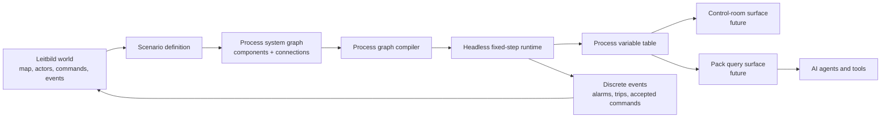
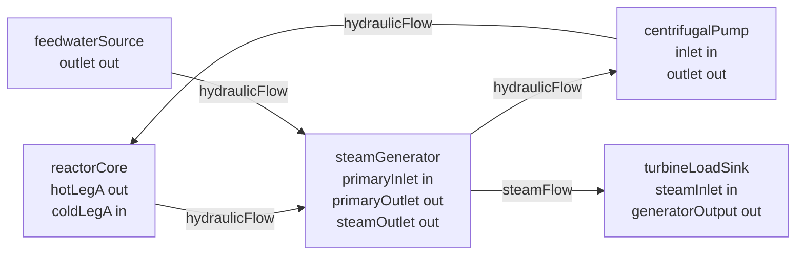
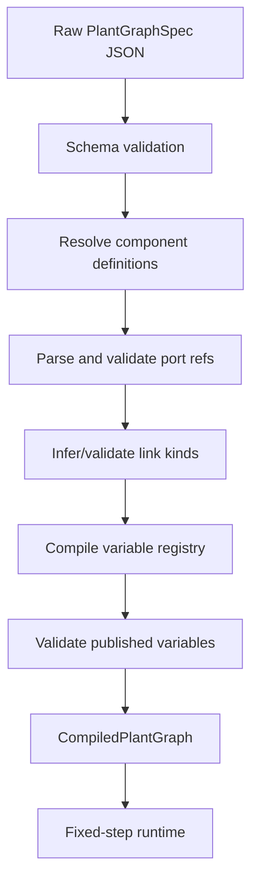
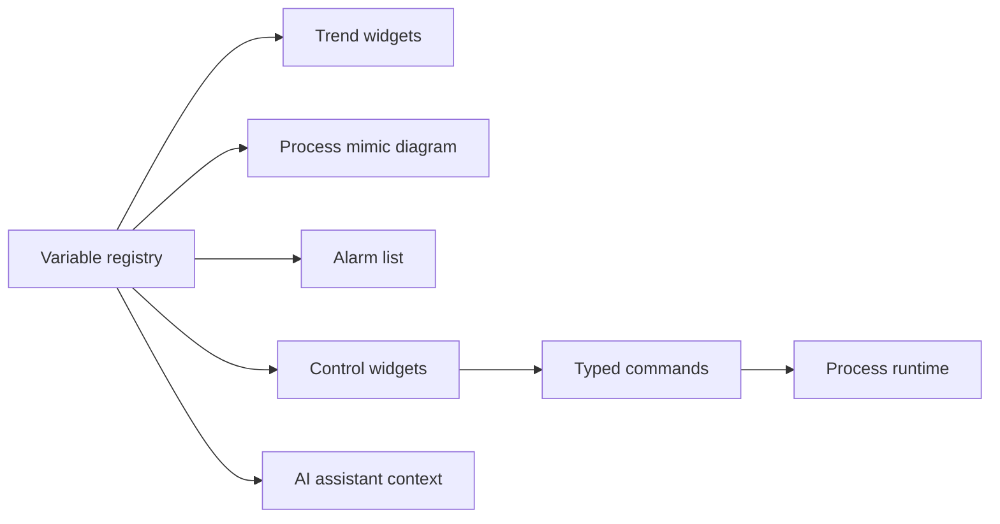

# Process Plant Pack

The Leitbild process-plant pack is the foundation for connecting detailed process-control simulations to the wider Leitbild world. It is designed for systems where the important state is not primarily "things moving on a map," but variables evolving inside an interconnected plant: flows, pressures, temperatures, powers, inventories, valve positions, pump states, trips, alarms, and operator commands. A nuclear power plant, hospital utility system, chemical process plant, water-treatment facility, ship machinery plant, district heating network, or industrial robotics cell can all fit this family if their behavior can be described as components connected by typed process links.

The pack is deliberately named `process-plant`, not `pwr`, because the technical goal is broader than one nuclear example. A pressurized water reactor-style example graph is currently used as the feasibility test because it stresses the architecture in useful ways: hydraulic and thermal coupling, reactor power, steam generation, turbine load, control variables, link sensors, valves, leaks, and radiological monitoring. The pack should, however, remain a generic process simulation engine whose plant-specific behavior comes from scenario-owned graph data and registered component definitions.

## Why This Pack Exists

Leitbild already supports operational map work: ambulances, incidents, hospitals, traffic conditions, weather, and other spatial entities. A process-control simulation adds a second kind of operational world. Instead of only asking "where is the ambulance?", a control-room surface may ask "what is the steam generator level?", "is this valve open?", "what is the main steam line radiation?", "has the pump tripped?", or "how will a loss of feedwater affect heat removal in the next five minutes?"

This is useful because many command-and-control studies involve both an outside world and an inside plant. A hospital may receive ambulances while its emergency department, oxygen supply, backup generator, or bed-management process evolves internally. A power plant may interact with weather, grid stress, road access, supply deliveries, emergency services, and external command centers. A ship may be shown on a map while its engine room, electrical buses, pumps, and damage-control systems evolve in a separate surface. The process-plant pack is the bridge that lets these internal process worlds participate in Leitbild without forcing every internal variable to become a map object.

The most important boundary is this: continuous physics stays inside the process-plant runtime. Leitbild's event bus is excellent for discrete accepted history such as commands, alarms, scenario injections, trips, and threshold crossings. It is not the right mechanism for continuous process physics. A pump should not emit a stream of "water moved" events to a steam generator. A solver should compute flow, heat transfer, and state evolution from a compiled graph in a deterministic update loop.



## Current Status

The pack currently has a real headless runtime and graph compiler, but it is not yet a full interactive control-room product. The implemented foundation includes a JSON-compatible graph specification, a component registry, typed ports, typed process links, link-local variables, structured quantities and units, compile-time validation, a fixed-step runtime, a variable table, component behavior modules, process-link behavior modules, snapshots, and tests.

The current runtime can initialize a scenario-owned process system, evolve a small plant graph, accept typed variable-write commands for writable variables, publish selected variables in snapshots, and model simple link behavior such as flow, valve position, leak area, pressure, and radiation response. This is intentionally modest but meaningful. It proves the data model and computation pattern before adding UI, persistence, and public process query endpoints.

The next major work is provider lifecycle integration: a process system should run as a simulation provider inside a Control Instance, restore from provider snapshots, expose selected variables through the generic pack query surface, and eventually support one or more process-control surfaces.

## Scenario-Based Universal Plant Specification

The process plant is not hardcoded as a TypeScript object in the runtime. The canonical plant topology is scenario-owned data. A Leitbild Scenario Definition can include one or more `processSystems`; each system names the owning pack, the component library, and a graph object.

```json
{
  "processSystems": [
    {
      "id": "plant",
      "pack": "process-plant",
      "componentLibrary": "process-plant",
      "graph": {
        "schemaVersion": 1,
        "id": "process-plant.pressurized-water-reactor.v1",
        "title": "Pressurized Water Reactor",
        "timestep": { "fixedStepMs": 100 },
        "components": [],
        "connections": [],
        "publishedVariables": []
      }
    }
  ]
}
```

This is a radical but clean choice. It means an AI agent or human author can define a new plant layout as validated data: instantiate components, set parameters, connect ports, publish variables, and add rich metadata to links. The reusable engine remains code-owned: schemas, component definitions, solver behavior, unit handling, compiler, runtime, and tests. Scenarios can assemble systems, but they do not execute arbitrary code.

The TypeScript builder still exists as an authoring and test helper. It is useful when writing tests or generating graph data, but it is not the runtime source of truth. Mermaid diagrams are also generated from the compiled graph for review and documentation, but Mermaid is not canonical topology.

## Component Model

A component is a typed process element with parameters, ports, variables, and behavior. Examples in the current component library include `reactorCore`, `steamGenerator`, `centrifugalPump`, `feedwaterSource`, and `turbineLoadSink`. These are early component models, not high-fidelity engineering-grade implementations. Their role is to prove the mechanism: components expose typed interfaces and variables, while the runtime behavior evolves their state.

Component instances in a graph are deliberately small:

```ts
interface ComponentInstanceSpec {
  readonly id: ComponentId
  readonly kind: ComponentKind
  readonly label: string
  readonly parameters: unknown
  readonly initialState?: unknown
}
```

The `kind` points to a registered component definition. The definition owns the schema for parameters and optional initial state. That preserves TypeScript-backed validation even though plant layouts are scenario-authored JSON. The graph author can write `kind: "centrifugalPump"` with parameters, but the compiler checks whether that component kind exists and whether the supplied parameters match its schema.

Component definitions also declare ports. Ports are how the component graph becomes more than a picture. A port has a kind and direction, and the compiler uses that information to reject impossible connections.

Current port kinds are:

| Port kind | Typical meaning |
| --- | --- |
| `hydraulic` | Liquid flow connection. |
| `thermal` | Heat transfer/contact connection. |
| `hydraulicThermal` | Combined hydraulic and thermal process connection. |
| `steam` | Steam flow connection. |
| `electricalAc` | AC electrical power connection. |
| `mechanicalShaft` | Mechanical torque/shaft connection. |
| `controlSignal` | Continuous or analog control signal. |
| `logicSignal` | Discrete logic signal. |

Current port directions are `in`, `out`, and `bidirectional`. The compiler checks both port kind compatibility and direction. For example, a steam outlet can connect to a steam inlet, but an electrical output cannot connect directly to a hydraulic inlet.



## Rich Semantic Process Links

The graph author writes `connections`, but compiled/runtime code treats them as **process links**. A process link is a typed connection between two component ports. It may be pure topology, or it may own physical metadata and link-local variables.

This is a core architectural choice. In a real plant, a pipe can have pressure, flow, temperature, radiation, valves, leaks, volume, resistance, roughness, sensors, and actuators. A naive component graph would model every valve and sensor as a separate node, turning a readable plant graph into a huge chain of pipe-valve-pipe-sensor-pipe fragments. Leitbild's v1 compromise is to let simple conduit-local state live on the link itself.

Use a process-link variable when the value observes or modifies that one connection. Use a component when the item has multiple ports, meaningful internal dynamics, separate failure modes, or deserves a first-class display/control object.

Example main steam link:

```json
{
  "id": "sg-a-steam-to-turbine",
  "from": "sgA.steamOutlet",
  "to": "turbine.steamInlet",
  "linkKind": "steamFlow",
  "medium": "steam",
  "physical": {
    "lengthM": 38,
    "diameterM": 0.72,
    "volumeM3": 15.5,
    "nominalResistance": 0.08
  },
  "variables": [
    {
      "path": "flowKgPerS",
      "label": "Main steam flow",
      "kind": "derived",
      "domain": "hydraulic",
      "writable": false,
      "publish": "telemetry",
      "quantity": "flowRate",
      "unit": "kg/s",
      "initialValue": 0,
      "sensorId": "FT-SG-A-001"
    },
    {
      "path": "valve.positionFraction",
      "label": "Main steam isolation valve position",
      "kind": "control",
      "domain": "control",
      "writable": true,
      "publish": "telemetry",
      "quantity": "ratio",
      "unit": "fraction",
      "initialValue": 1,
      "actuatorId": "MSIV-A"
    }
  ]
}
```

This produces stable variable paths such as:

- `sg-a-steam-to-turbine.flowKgPerS`
- `sg-a-steam-to-turbine.pressureMPa`
- `sg-a-steam-to-turbine.radiationMSvPerH`
- `sg-a-steam-to-turbine.valve.positionFraction`
- `sg-a-steam-to-turbine.leak.areaFraction`

Those paths are the shared language for snapshots, tests, future trends, future control-room widgets, future AI agents, and future pack query responses.

## Process Link Kinds

The current link kinds are:

| Link kind | Typical solver ownership |
| --- | --- |
| `hydraulicFlow` | Liquid flow or inventory transfer. |
| `thermalContact` | Heat transfer/contact. |
| `steamFlow` | Steam flow and steam-line conditions. |
| `electricalPower` | Electrical power transfer. |
| `mechanicalTorque` | Shaft/torque transfer. |
| `controlSignal` | Analog or continuous control signal. |
| `logicSignal` | Discrete logic signal. |

The compiler can infer link kind from typed ports. Scenario authors may declare `linkKind` explicitly, but the declaration must agree with the ports. If `feedwaterA.outlet` and `sgA.feedwaterInlet` require `hydraulicFlow`, a declared `linkKind: "steamFlow"` fails before runtime.

## Process Variables

Every meaningful process value has a stable path and structured metadata. Variables can belong to components or process links. A variable descriptor includes:

| Field | Meaning |
| --- | --- |
| `path` | Stable path. Component-local paths are compiled to `componentId.localPath`; link-local paths are compiled to `connectionId.localPath`. |
| `label` | Human-readable name. |
| `kind` | `state`, `derived`, `control`, `parameter`, `alarm`, or `discrete`. |
| `domain` | `hydraulic`, `thermal`, `nuclear`, `electrical`, `control`, `operator`, or `radiological`. |
| `writable` | Whether accepted commands may write this variable. |
| `publish` | `internal`, `telemetry`, `alarm`, or `leitbild`. |
| `quantity` | Structured physical quantity. |
| `unit` | Structured unit validated against the quantity. |

Process-link variables also require `initialValue`, and may declare `sensorId` or `actuatorId`. A variable cannot declare both a sensor and actuator id. An actuator id requires a writable variable. Initial values are type checked: boolean quantities require boolean values, while physical numeric quantities require numeric values.

Current quantities and units are intentionally finite:

| Quantity | Allowed units |
| --- | --- |
| `boolean` | `boolean` |
| `flowRate` | `kg/s` |
| `head` | `Pa` |
| `power` | `MW` |
| `pressure` | `MPa`, `Pa` |
| `radiationDoseRate` | `mSv/h` |
| `ratio` | `fraction`, `percent` |
| `reactivity` | `pcm` |
| `temperature` | `degC` |

Units are not free text. This is important for AI agents and future UI surfaces. A trend widget can distinguish percent from fraction. A control assistant can know that `rcpA.running` is boolean. A simulator can reject a command that writes `"open"` to a numeric valve position. A future unit conversion layer has structured input rather than prose.

## Graph Compiler

The graph compiler is the gate between scenario-authored configuration and runtime execution. It validates once, compiles once, and gives the runtime indexed structures so hot loops do not repeatedly parse strings.

Compilation performs these checks and transformations:

1. Validate the raw graph schema.
2. Reject duplicate component ids and connection ids.
3. Resolve component kinds through the component registry.
4. Validate component parameters and optional initial state.
5. Parse compact port refs such as `sgA.primaryOutlet`.
6. Validate referenced components and ports.
7. Validate port compatibility and direction.
8. Infer or validate process link kind.
9. Compile component variables and link variables into one registry.
10. Reject duplicate final variable paths.
11. Validate published variables against compiled variables.
12. Build indexed component and process-link tables.
13. Group process links by link kind.



The result is a `CompiledPlantGraph`:

```ts
interface CompiledPlantGraph {
  readonly specId: PlantGraphId
  readonly title: string
  readonly timestep: TimestepSpec
  readonly components: ReadonlyArray<CompiledComponent>
  readonly componentIndexById: ReadonlyMap<ComponentId, number>
  readonly links: ReadonlyArray<CompiledProcessLink>
  readonly linksByKind: Readonly<Record<ProcessLinkKind, ReadonlyArray<number>>>
  readonly variables: ReadonlyArray<CompiledVariable>
}
```

The compiled graph uses numeric component and link indices. That keeps the runtime deterministic and gives a path toward higher-performance representations later, such as typed arrays for hot numeric state, without changing scenario authoring.

## Runtime Architecture

The runtime is fixed-step and headless. It is created from a compiled process system. It owns one authoritative process variable table, applies queued commands at solver phase boundaries, advances deterministic solver phases, and returns snapshots.

Current runtime modules:

| Module | Responsibility |
| --- | --- |
| `runtime.ts` | Fixed-step orchestration, elapsed/remainder clock, solver phase order, public runtime API. |
| `variable-table.ts` | Single authoritative variable map, command queue, writability/type checks, snapshots, published snapshots. |
| `component-behaviors.ts` | Current component initialization and component solver behavior. |
| `process-link-behaviors.ts` | Current process-link behavior such as flow, valve/leak modifiers, pressure, and radiation updates. |
| `units.ts` | Canonical value conversion for structured units. |

This split matters because it avoids duplicate state. Component behavior and link behavior do not maintain shadow state maps. They read and write through the variable table. The variable table is where unknown paths, non-writable writes, and wrong value types fail visibly.

```mermaid
sequenceDiagram
  participant Caller
  participant Runtime
  participant Table as Variable Table
  participant Components as Component Behaviors
  participant Links as Process-Link Behaviors

  Caller->>Runtime: tick(elapsedMs)
  Runtime->>Table: applyQueuedCommands()
  Runtime->>Components: updateControlLogic(dt)
  Runtime->>Components: solveElectrical(dt)
  Runtime->>Components: solveFluidFlowComponents()
  Runtime->>Links: solveFluidFlowLinks()
  Runtime->>Components: solveThermalTransfer()
  Runtime->>Components: updateComponentState(dt)
  Runtime->>Links: updateProcessLinkState(dt)
  Runtime->>Table: publishedSnapshot()
  Table-->>Runtime: selected variables
  Runtime-->>Caller: tick result
```

The phase order is currently:

1. `applyCommands`
2. `updateControlLogic`
3. `solveElectrical`
4. `solveFluidFlow`
5. `solveThermalTransfer`
6. `updateComponentState`
7. `publishOutputs`

The phase names are intentionally explicit. They make the runtime auditable and testable. Future higher-fidelity components may need more sophisticated ordering, iterative convergence, or domain-specific subsolvers, but the core principle should remain: continuous process evolution belongs in ordered solver phases, not incidental event order.

## Commands, Events, And Queries

The current headless runtime accepts typed variable-write commands through its runtime API. A command targets a variable path and supplies a value. The variable table rejects unknown paths, non-writable variables, and type mismatches. This is the foundation for future UI controls and AI-agent actions.

Leitbild events should represent discrete accepted history:

- operator command accepted,
- valve demand changed,
- pump started or stopped,
- reactor trip actuated,
- alarm entered or cleared,
- threshold crossed,
- scenario fault injected,
- plant mode changed.

Continuous physics should not be emitted as event chatter. Internal high-frequency process state belongs in provider-private runtime state and snapshots. Selected variables can be published through snapshots, trends, surfaces, or pack queries.

The future pack query surface should use Leitbild's generic pack query route rather than a separate process-plant-specific HTTP family unless a new ADR approves that split. Candidate queries include:

- `process-plant.variables.read`
- `process-plant.variables.search`
- `process-plant.graph.read`
- `process-plant.alarms.list`
- `process-plant.trends.read`
- `process-plant.runtime.status`

Candidate commands include:

- `process-plant.control.write`
- `process-plant.control.operate`
- `process-plant.alarm.acknowledge`
- `process-plant.scenario.injectFault`

The important rule for AI agents is that suggested actions are not plant truth until they are accepted through the command surface and committed by the runtime/provider.

## Surfaces And UI

A process plant surface is different from the current map surface. It may look like a control-room display: mimic diagrams, process trends, alarm lists, controls, procedure panes, parameter cards, interlock status, and simulator controls. Leitbild's surface architecture should eventually allow a scenario to assemble one or more process surfaces alongside a map surface.

The process-plant pack should not force every plant into the same display. A hospital utility plant, chemical process, and nuclear plant may need different mimic diagrams. The shared layer is the compiled process graph and variable registry. A surface can bind display widgets to stable variable paths.



The first process-control UI should probably be narrow and practical: a headless runtime inspector, a variable table, a small trend panel, and a simple mimic of the example graph. A polished control-room surface can come later once provider lifecycle, snapshot/restore, and pack queries are settled.

## AI Agent Use

The process-plant pack is intentionally AI-friendly. Its core artifacts are structured and inspectable:

- scenario-owned graph JSON,
- component kinds and labels,
- typed ports,
- typed process links,
- stable variable paths,
- structured quantities and units,
- writable flags,
- publish policies,
- sensor and actuator ids,
- Mermaid diagrams generated from the graph.

An AI agent can read a graph, identify available controls, inspect published variables, look up a procedure, and propose an action in terms of variable paths. For example, an agent can explain that `sg-a-steam-to-turbine.valve.positionFraction` is writable and that reducing it should lower main steam flow, but that `sg-a-steam-to-turbine.pressureMPa` is telemetry and cannot be written directly.

Agents must not assume hidden physics beyond the implemented component and link behavior. If a variable is not published or a component does not model a phenomenon, the agent should say that the current simulator does not expose that state. This is especially important for nuclear examples: the current runtime is a medium-fidelity research prototype, not an engineering analysis code.

## Specification Reference

### `PlantGraphSpec`

```ts
interface PlantGraphSpec {
  readonly schemaVersion: 1
  readonly id: PlantGraphId
  readonly title: string
  readonly timestep: TimestepSpec
  readonly components: ReadonlyArray<ComponentInstanceSpec>
  readonly connections: ReadonlyArray<ConnectionSpec>
  readonly publishedVariables: ReadonlyArray<VariablePath>
}
```

### `TimestepSpec`

```ts
interface TimestepSpec {
  readonly fixedStepMs: number
}
```

`fixedStepMs` must be a positive integer and currently cannot exceed 10 seconds. The example graph uses 100 ms.

### `ConnectionSpec`

```ts
interface ConnectionSpec {
  readonly id: ConnectionId
  readonly from: PortRef
  readonly to: PortRef
  readonly linkKind?: ProcessLinkKind
  readonly medium?: string
  readonly physical?: ConnectionPhysicalSpec
  readonly variables?: ReadonlyArray<ProcessLinkVariableDescriptor>
}
```

`from` and `to` use compact port refs in the form `componentId.portName`. These refs are parsed by the compiler and should not be repeatedly parsed by the runtime.

### `ConnectionPhysicalSpec`

```ts
interface ConnectionPhysicalSpec {
  readonly lengthM?: number
  readonly diameterM?: number
  readonly roughnessM?: number
  readonly volumeM3?: number
  readonly nominalResistance?: number
}
```

All physical values are optional. A link can be pure topology. Add physical metadata only when behavior, display, or AI interpretation needs it.

### `ProcessLinkVariableDescriptor`

```ts
interface ProcessLinkVariableDescriptor {
  readonly path: LocalVariablePath
  readonly label: string
  readonly kind: VariableKind
  readonly domain: VariableDomain
  readonly writable: boolean
  readonly publish: VariablePublishPolicy
  readonly quantity: ProcessQuantity
  readonly unit: ProcessUnit
  readonly initialValue: number | boolean
  readonly sensorId?: string
  readonly actuatorId?: string
}
```

The `path` is local to the connection in the scenario file. The compiler turns it into a full path by prefixing the connection id.

### `CompiledVariable`

```ts
interface CompiledVariable {
  readonly path: VariablePath
  readonly owner:
    | { readonly type: "component"; readonly componentIndex: number }
    | { readonly type: "link"; readonly linkIndex: number }
  readonly descriptor: VariableDescriptor
  readonly published: boolean
  readonly initialValue?: number | boolean
}
```

The owner tells the runtime whether the variable belongs to a component or a process link. It uses numeric indices, not raw string refs.

## Current Example System

The current built-in graph is `process-plant.pressurized-water-reactor.v1`. It includes:

- a reactor core with power, reactivity, and rod insertion fraction,
- a steam generator with level, pressure, and heat transfer,
- a reactor coolant pump with running state, speed fraction, and flow,
- a feedwater source with flow,
- a turbine load sink with electrical output and load fraction,
- primary-water, feedwater, and steam process links,
- a rich main steam process link with flow, pressure, radiation, valve position, and leak area variables.

The runtime behavior is intentionally simple. Reactor power trends toward a target based on rod insertion and reactivity. Pump flow follows running state and speed. Steam generator heat transfer depends on core power, primary flow, and level. Steam generator level and pressure trend in response to feedwater and turbine load. The main steam link flow responds to demand, valve position, and leak area. Link radiation responds to leak state.

This is not a physical simulator that should be used for engineering conclusions. It is a feasibility model for Leitbild's component graph, variable table, process-link semantics, and fixed-step runtime.

## What To Build Next

The next work should strengthen the process-plant pack without jumping prematurely to a large control-room UI.

Recommended sequence:

1. Add provider lifecycle integration so a process system can run inside a Control Instance, persist provider-private snapshots, and restore without replaying scenario initialization as current state.
2. Add generic pack queries for graph metadata, published variables, variable search, and runtime status.
3. Add a minimal process surface: variable table, published telemetry, writable controls, and generated graph diagram.
4. Add scenario actions for process commands and timed fault injection.
5. Add alarm definitions and threshold crossing events.
6. Add trend storage for selected variables at controlled sampling rates.
7. Expand component behavior only when a concrete scenario requires it.

Avoid adding arbitrary user-authored equations in v1. They are powerful, but they open a much larger safety, validation, determinism, and debugging problem. A better early path is scenario-authored topology plus code-backed, tested component definitions.

## Guardrails

- Do not model continuous process physics through the interaction event bus.
- Do not turn process variables into `OperationalObject`s.
- Do not add process-plant-specific HTTP endpoint families without a new architecture decision.
- Do not make Mermaid canonical.
- Do not make a TypeScript plant graph the runtime source of truth when scenario/config data can define the graph.
- Do not add placeholder component behavior. If a component behavior exists, it must be real enough to test.
- Do not use free-text units.
- Do not put unrelated behavior into process links. A process-link variable should observe or modify that one link.
- Do not hide failed graph validation behind silent fallback or auto-repair.

Related pages: [[concepts]], [[specs]], [[simulation-technologies]], [[future-projects]], [[adrs/0017-process-plant-component-graph]].
