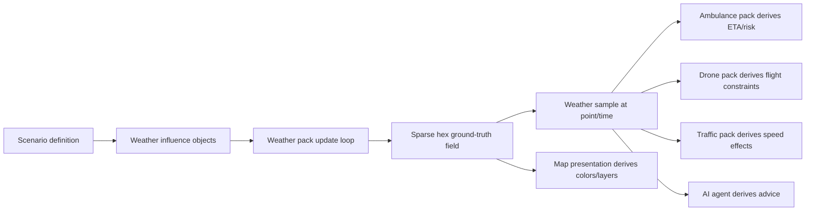
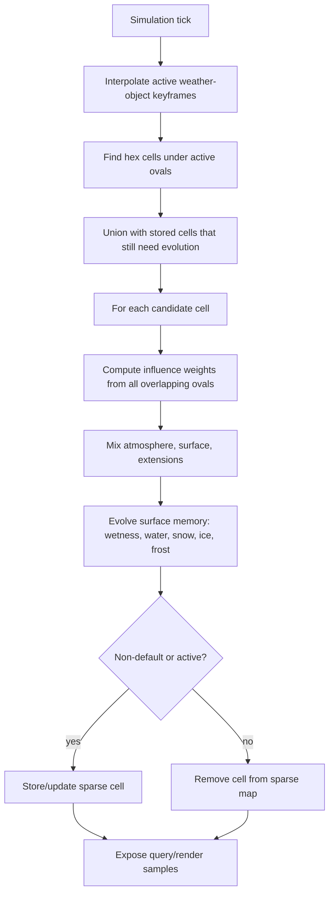

# Weather Domain

The Leitbild weather pack represents weather as an operational environment: a changing field of conditions that humans, simulation packs, and AI agents can inspect and use. It is not just a visual overlay. Weather can make a road wet, reduce visibility around an airport, increase drone workload in gusty wind, delay vessel operations in poor visibility, raise demand for emergency response, or create a moving line of risk that a dispatcher should anticipate before it reaches the incident area.

The current implementation is deliberately modest but architecturally important. Leitbild models weather through scenario-authored weather influence objects that move and change over time, a sparse hexagonal ground-truth field that stores environmental state only where it differs from global defaults, and a sampling interface that lets other packs ask: "what are the weather conditions at this point, at this time?" That gives us a real foundation for weather-aware ambulance, traffic, drone, aviation, maritime, wildfire, and process-control scenarios without turning the weather pack into a hidden global rule engine.

## Audience And Use

This page is written for two audiences. Human readers should be able to understand what the weather pack does, why it matters, and how to reason about future extensions. AI agents should be able to use it as a compact operating reference: how to author a weather scenario, how to interpret the data model, what the canonical fields mean, and where not to invent derived state that the pack does not own.

The page is also intentionally explicit about boundaries. Weather publishes environmental source data. It does not decide whether an ambulance may drive, whether a drone may launch, whether a ship should reroute, or whether a hospital should activate a surge plan. Those decisions belong to the consuming pack or agent. This separation matters because the same rain, fog, or ice can have different operational meaning for a heavy ambulance, a bicycle responder, a drone, an aircraft, or a ship.

## Why Weather Matters In Leitbild

Weather is a natural stressor for command-and-control research because it changes the world without asking the operator for permission. A clear dispatch problem becomes harder when a rain band crosses the route, visibility drops around an airport, a cold surface turns wet roads into ice, or a wildfire front accelerates because wind shifts. Weather also creates asymmetric information: a facilitator may know that snow will intensify in five minutes, a forecast may only suggest it, and an operator may discover it only when vehicles slow down.

That makes weather useful for studying anticipation, workload, automation trust, shared situation awareness, and human-AI coordination. An AI dispatch assistant can warn that a selected route enters a wet/icy field. A monitor agent can watch for assets whose missions cross a weather front. A facilitator can script a fog bank so that participants must decide whether to pre-position units before visibility collapses. A multi-user study can give one operator current conditions and another operator forecast products, then observe how they coordinate.

Several Leitbild use cases become richer once weather is available:

- Ambulance dispatch: rain reduces visibility, roads become wet, incidents increase, and available routes become more or less attractive depending on vehicle capability.
- Traffic management: a slow traffic area can interact with wet road surfaces; a minor queue becomes a major delay when road conditions worsen.
- Drone operations: wind speed, wind direction, precipitation, and visibility can constrain launch, endurance, sensor quality, and safe recovery.
- Aviation or airport control: visibility, cloud cover, wind, gusts, precipitation, and surface contamination can affect runway throughput and diversion decisions.
- Maritime control: fog, wind, precipitation, and freezing spray can affect vessel speed, harbor operations, and search-and-rescue risk.
- Wildfire response: wind, humidity, temperature, and precipitation can alter spread rate, smoke behavior, and evacuation timing.
- Process-control simulations: external weather can stress a power plant, hospital, or industrial site through heat load, flood risk, icing, grid instability, or access-road degradation.

The useful research question is rarely "is it raining?" It is usually "who knows that it is raining, where does it matter, what does it change, and how should the system explain that change?"

## Inspirations From Weather And Simulation Systems

Leitbild does not try to be a numerical weather prediction system. It borrows concepts from several families of systems and deliberately chooses a lighter, more operationally legible subset.

Full atmospheric models such as the Weather Research and Forecasting model (WRF) solve physical equations over three-dimensional grids. WRF is open-source public-domain code and is widely used in research and forecasting. It is powerful, but it brings Fortran-era scientific workflows, boundary-condition data, domain setup, nesting, physics schemes, and substantial compute demands. It is a reference point for future high-fidelity integration, not the right runtime dependency for a small interactive Leitbild scenario.

Nowcasting systems such as pySTEPS are a different inspiration. pySTEPS focuses on probabilistic short-term precipitation nowcasting, often from radar fields. Conceptually it is closer to our needs than full NWP: it treats precipitation as a moving/evolving spatial field and makes short-horizon predictions. Leitbild's moving oval weather influences are much simpler, but they use the same broad idea that weather can be represented as a field advected through time rather than as isolated point facts.

Road-weather models such as RoadSurf are especially relevant to emergency response. RoadSurf is an open-source Fortran road-weather library that models road surface temperature, water, ice, snow, and black ice using atmospheric inputs and surface energy balance. Leitbild currently uses a much simpler normalized surface state, but RoadSurf validates the core abstraction: operational road condition is a state of the surface, not just a precipitation label.

Aviation weather conventions such as METAR and TAF are useful because they show how compact, structured weather reports encode operationally relevant values: wind, visibility, present weather, cloud/sky condition, temperature, dew point, pressure, and forecast change groups. Leitbild does not encode METAR strings internally, but future aviation packs should know that these categories are established operational language.

Meteorological data formats such as GRIB and BUFR matter for future ingestion. GRIB is commonly used for gridded forecast fields; BUFR is used for many kinds of meteorological observations. ECMWF's ecCodes is an open-source library for encoding and decoding WMO GRIB and BUFR messages. Leitbild's v1 scenario-authored weather avoids this complexity, but a future data-ingestion pack may convert GRIB/BUFR/Open-Meteo products into Leitbild weather objects and hex-field state.

Geospatial indexing systems such as H3 are a close match to Leitbild's weather field idea. H3 partitions the world into hierarchical hexagonal cells and is designed for spatial aggregation and analysis at multiple resolutions. Leitbild currently uses its own local axial hex grid, but H3 is an important future candidate if we need global, stable, multi-resolution cells that can be shared across packs, persisted, queried, and aggregated consistently.

Game and simulation software offers another lesson: the whole world rarely updates at full fidelity every tick. Large games use grids, chunks, dirty sets, event queues, level of detail, deterministic update loops, and local activation regions. Weather effects may be stored as fields, particles, cellular automata, or scripted volumes. Leitbild follows the same broad strategy: sparse state, deterministic ticks, scenario-authored influences, and viewport rendering as a projection of simulation truth.

Wildfire systems are a useful stress test. Cell2Fire represents landscape fire spread as a cell-based model with fuel, weather, fuel moisture, and topography per cell. ForeFire uses a C++ front-propagation/fire-spread engine and supports fire-atmosphere coupling. These systems show that fire, weather, terrain, and operations are tightly connected, and they help us think about whether future fire state should live in a separate fire grid or reuse/extensibly annotate Leitbild's environmental grid.

## Core Architectural Principle

The weather pack owns environmental truth for weather. Other packs consume that truth, but they do not get to redefine it. Conversely, the weather pack must not secretly decide domain behavior for other packs. It should not tell an ambulance that it must slow down, tell a drone that it must abort, or tell a traffic provider which route to choose. It exposes source data; consumers derive operational implications according to their own capabilities, policies, and domain rules.

This gives us a clean interaction pattern:



The word "derives" is deliberate. The canonical weather state is the raw environmental state: atmosphere, surface, and declared extensions. Derived concepts such as "hazard," "slippery," "bad for drones," or "reroute recommended" are interpretations by a presentation layer, a consuming pack, or an AI policy. They should be explainable from the raw state and should not be stored as weather truth.

## Big-Picture Weather Model

Leitbild's weather model has four layers:

1. A global default state. If a point has never been touched by a weather influence, sampling that point returns default atmospheric and surface conditions for the current time.
2. Scenario-authored weather influence objects. These are named weather systems such as a damp background, a moving rain band, a fog bank, a cold area, or a future snow front.
3. A sparse hexagonal field. Hex cells are materialized only when weather influences affect them or when they retain non-default surface memory after an influence has passed.
4. Presentation and consumers. The UI renders weather cells and influence shapes; other packs and AI agents query weather at points and derive their own operational meaning.

This is a goldilocks model for Leitbild. It is more structured than drawing a polygon and calling it "rain," but much lighter than a meteorological solver. It lets a scenario author create meaningful moving weather without coding, while the sparse field gives the simulation somewhere to store persistence: wet roads can stay wet after the rain band moves on, snow can remain after snowfall stops, and ice can decay only when conditions allow.

## Weather Objects

A weather object is an operational object in the weather domain whose `domainData` has `type: "weather_condition"` and `conditionKind: "weather_influence"`. It describes an environmental influence over space and time. The current scenario examples include `weather:oslo-damp-background`, a broad stationary background influence, and `weather:oslo-moving-rain-band`, a narrower moving oval that crosses Oslo.

Weather influence geometry is keyframed. Each keyframe defines:

- `atSeconds`: scenario time in seconds from scenario start;
- `center`: GeoJSON point coordinates as `[longitude, latitude]`;
- `semiMajorAxisM`: oval semi-major axis in meters;
- `semiMinorAxisM`: oval semi-minor axis in meters;
- `rotationDeg`: oval rotation angle;
- `state`: the weather state at that keyframe;
- `falloffCurve`: a normalized parametric curve controlling strength from center to edge.

Between keyframes, Leitbild interpolates the center, oval size, rotation, atmosphere values, surface values, extension values, and falloff curve. A stationary weather object is simply one whose keyframes keep the same center. A moving front is one whose center changes. A rain band that grows wider or intensifies is one whose oval and state change across keyframes.

This is intentionally general. We do not need separate hard-coded classes for "stationary area," "moving band," "front," or "blob." They are all weather influences with keyframed geometry and keyframed state.

## Canonical Weather State

The canonical weather state is stored as:

```ts
interface WeatherState {
  atmosphere: WeatherAtmosphere;
  surface: WeatherSurface;
  extensions: Record<string, number | string | boolean>;
}
```

The atmosphere model currently contains:

| Field | Meaning |
| --- | --- |
| `airTemperatureC` | Air temperature in degrees Celsius. |
| `humidity` | Optional normalized humidity, 0..1. |
| `windSpeedMps` | Wind speed in meters per second. |
| `windDirectionDeg` | Direction in degrees, 0..360. |
| `visibilityM` | Horizontal visibility in meters. |
| `cloudCover` | Optional normalized cloud cover, 0..1. |
| `precipitation.type` | One of `none`, `rain`, `snow`, `sleet`, `freezing_rain`, `hail`. |
| `precipitation.intensityMmPerHour` | Precipitation intensity in mm/h. |

The surface model currently contains normalized, source-level conditions:

| Field | Meaning |
| --- | --- |
| `groundTemperatureC` | Ground or road-surface temperature in degrees Celsius. |
| `wetness` | Normalized surface wetness, 0..1. |
| `standingWater` | Normalized standing water, 0..1. |
| `snow` | Normalized snow presence/accumulation, 0..1. |
| `ice` | Normalized ice presence, 0..1. |
| `frost` | Normalized frost presence, 0..1. |

The weather pack deliberately does not store `frictionClass`, `frictionEstimate`, `labels`, or canonical `severity`. Those are derived interpretations. A traffic pack may interpret `ice: 0.6` as a large speed penalty. A winter-equipped ambulance may tolerate the same condition better. A drone pack may ignore road ice but care strongly about `windSpeedMps`, `precipitation`, and `visibilityM`.

## Extensions

Extensions let a scenario add typed, namespaced weather fields without changing the core weather schema. They are declared under `providerConfigs.weather.fields.extensions` in the scenario definition. A scenario can then set those fields in weather objects and keyframes.

Example:

```json
"providerConfigs": {
  "weather": {
    "fields": {
      "extensions": {
        "research.operatorWeatherLoad": {
          "type": "number",
          "unit": "0..1",
          "default": 0,
          "min": 0,
          "max": 1
        }
      }
    }
  }
}
```

A weather object can then set:

```json
"extensions": {
  "research.operatorWeatherLoad": 0.65
}
```

Extension keys should be namespaced, such as `research.operatorWeatherLoad`, `radiological.doseRateMicroSvPerHour`, `fire.fuelMoisture`, or `aviation.ceilingFt`. The weather pack validates that an extension is declared before it is used. Number extensions interpolate linearly between keyframes. String and boolean extensions use step behavior.

A radiation example is useful. Suppose a future industrial or nuclear scenario wants a weather field to carry airborne radiological context. The core weather pack should not hard-code nuclear categories. A scenario could declare `radiological.doseRateMicroSvPerHour`, `radiological.airborneIodine`, or `radiological.depositionRisk`, then keyframe those values through a plume-like weather influence. A nuclear response pack or AI agent can consume the values, while ordinary ambulance or traffic packs can ignore them.

Extensions are powerful, so they need discipline. Use built-in atmosphere and surface fields when they fit. Use extensions for scenario- or domain-specific environmental dimensions that still behave like environmental fields. Do not use extensions to smuggle commands, UI layout, or asset state into weather.

## Hexagonal Ground Truth

The sparse weather field stores weather state in hexagonal cells. A cell has an axial coordinate `(q, r)`, a stable id derived from grid id, cell size, and axial coordinates, a center point, a `WeatherState`, a list of `activeInfluenceIds`, a residual value, and an `updatedAt` timestamp.

The current implementation uses a local axial hex grid anchored by a reference latitude and a scenario-specific grid id. Coordinates are projected into local meters using approximate meters per degree latitude and longitude. This is good enough for city-scale scenarios and keeps the model dependency-light. For global or multi-resolution use, H3 is a strong candidate because it gives stable global hex indexes, hierarchical resolution, neighbor traversal, and consistent cross-pack cell identity.

The field is sparse. Leitbild does not allocate a world grid. It materializes cells that matter:

- cells currently under active weather influences;
- cells previously affected by weather and still carrying non-default surface state;
- cells whose state needs continued decay or evolution;
- cells needed for rendering within the current viewport.

A query outside the sparse map still works. The pack computes the containing cell and returns the global default state unless a materialized cell exists. That means consumers can ask for weather anywhere without forcing the system to store every place on earth.

## Update Loop

The weather update loop advances with the control-instance clock. At each tick, the weather provider evaluates current weather influence frames, updates the sparse field, resamples probes, and emits changed weather objects as ordinary Leitbild object updates.

Conceptually, the sparse field update does this:



The loop is deterministic and local. It does not run a global weather solver. It only touches cells that are under active weather objects or that already have stored memory. This gives us persistence without computational sprawl.

## Influence Mathematics

A weather influence uses an oval as its support shape. For a cell center point `p`, the pack transforms the point into a local coordinate system centered on the influence center and rotated by the influence angle. The normalized oval distance is:

```text
d = sqrt((x' / semiMajorAxisM)^2 + (y' / semiMinorAxisM)^2)
```

If `d > 1`, the influence has weight 0 at that cell. If `d <= 1`, the weight is read from the `falloffCurve`. The curve is an ordered list of `{ x, y }` points where `x` is normalized distance from center to edge and `y` is influence strength. This can express sharp edges, gentle gradients, flat-topped systems, or a narrow core with feathered boundaries without inventing hard-coded categories such as "hard fill" or "smooth falloff."

Example curves:

```json
[{ "x": 0, "y": 1 }, { "x": 1, "y": 0 }]
```

```json
[{ "x": 0, "y": 1 }, { "x": 0.75, "y": 1 }, { "x": 1, "y": 0.2 }]
```

The first fades linearly from center to edge. The second stays strong across most of the oval and only fades near the boundary. Scenario authors can use this to create a broad damp background, a narrow rain band, a sharp fog boundary, or an environmental plume.

## Overlapping Weather Objects

Multiple weather objects can overlap. The update loop processes all active influences for a cell and mixes their states according to their weights. This lets a background condition and a moving rain band interact: a damp Oslo background can provide baseline wetness and cloud cover, while a moving rain band increases precipitation intensity, wetness, and operator-weather-load where it passes.

Overlap should be treated as a modeling choice, not as magic. If two strong influences conflict, the resulting state is a weighted mixture. Numeric values interpolate. Precipitation type changes by threshold behavior in the current implementation. Extensions follow their declared type: numbers interpolate; strings and booleans step.

The current `priority` field exists on weather influences. It gives us a path for later rules where a high-priority phenomenon can dominate or override lower-priority background fields. At the moment, the main mental model should remain weighted overlap of active influences plus persistent surface memory.

## Surface Memory And Decay

A key reason for the sparse field is memory. If rain passes over a road, the cell should not instantly return to dry default conditions when the rain oval moves away. The active forcing has ended, but the surface state remains. Wetness, standing water, snow, ice, and frost evolve back toward defaults according to simple deterministic rules.

The current surface evolution is intentionally simple. Precipitation increases wetness or snow/ice-related state depending on precipitation type and ground temperature. Standing water and wetness decay over time. Snow decays more slowly when above freezing. Ice and frost decay according to warming and residual thresholds. When the cell becomes default-like and has no active influences, the sparse field removes it.

That last part is crucial. We do not keep every previously affected cell forever. A cell remains in the sparse map only while it is active, non-default, or still evolving. Once decay/evolution has mathematically finished for practical purposes, the cell disappears from the sparse map and future queries return the global default state.

## Sampling Weather

Consumers access weather through point sampling. A pack or agent supplies a point and a time, and the weather pack returns a `WeatherSample`:

```ts
interface WeatherSample {
  state: WeatherState;
  quality: {
    provenance: "scenario" | "forecast" | "observed" | "inferred" | "intervention";
    confidence: number;
    validAt: string;
  };
  activeInfluenceIds: readonly string[];
}
```

`activeInfluenceIds` tells the consumer which weather objects are currently influencing the sample. If the list is empty, the sample may still be non-default because a previous weather object left persistent surface memory. That distinction is useful: "currently raining here" is different from "rain passed earlier and the surface is still wet."

A future route sampler can call the same point sampler along a route geometry. It can then derive route-specific operational facts such as "40% of the route crosses wet cells," "visibility is below policy threshold near the destination," or "the ambulance with winter tires accepts this route, but the drone mission should be delayed."

## Scenario Authoring

Weather scenario definitions are JSON. A scenario activates the weather pack by listing it in `packs`, then includes weather condition objects in `initialObjects`.

Minimal shape:

```json
{
  "pack": "weather",
  "type": "weather_condition",
  "id": "weather:example-rain-band",
  "label": "Moving rain band",
  "cellSizeM": 750,
  "showField": true,
  "priority": 10,
  "summary": "A narrow rain band moves east and increases surface wetness.",
  "atmosphere": {
    "airTemperatureC": 5.5,
    "humidity": 0.9,
    "windSpeedMps": 7,
    "windDirectionDeg": 250,
    "visibilityM": 6500,
    "cloudCover": 0.9,
    "precipitation": { "type": "rain", "intensityMmPerHour": 1.8 }
  },
  "surface": {
    "groundTemperatureC": 5,
    "wetness": 0.5,
    "standingWater": 0.08,
    "snow": 0,
    "ice": 0,
    "frost": 0
  },
  "falloffCurve": [
    { "x": 0, "y": 1 },
    { "x": 0.65, "y": 0.85 },
    { "x": 1, "y": 0 }
  ],
  "keyframes": [
    {
      "atSeconds": 0,
      "center": [10.6900, 59.9250],
      "semiMajorAxisM": 5200,
      "semiMinorAxisM": 1200,
      "rotationDeg": 68
    },
    {
      "atSeconds": 420,
      "center": [10.8350, 59.9270],
      "semiMajorAxisM": 6800,
      "semiMinorAxisM": 1500,
      "rotationDeg": 78,
      "atmosphere": {
        "precipitation": { "type": "rain", "intensityMmPerHour": 2.3 },
        "visibilityM": 5200
      },
      "surface": {
        "wetness": 0.62,
        "standingWater": 0.12
      }
    }
  ]
}
```

Scenario authors should think in terms of environmental systems, not map decoration. A broad background condition can set the city to damp and overcast. A moving band can add stronger precipitation. A stationary cold region can create frost risk. A later keyframe can intensify rain, widen the oval, rotate the band, or reduce visibility.

## Authoring Guidance For AI Agents

When writing a weather scenario, choose a small number of meaningful weather objects rather than many tiny polygons. Start with a background influence if the whole operating area should have non-default conditions. Add one or two moving or localized influences for operational drama. Use `cellSizeM` large enough for performance and legibility; city dispatch scenarios usually do not need tiny cells.

Use physical consistency. If precipitation type is `snow`, surface snow should probably rise over time or already be nonzero. If `groundTemperatureC` is below zero and wetness is high, consumers may infer ice risk. If visibility is low, explain whether fog, rain, snow, smoke, or another extension caused it. Avoid setting every field to an extreme value unless the scenario is explicitly severe.

Declare extensions before using them. Namespaced keys are best. A good extension key says who owns the concept and what it measures, for example `research.operatorWeatherLoad`, `fire.fuelMoisture`, `aviation.ceilingFt`, or `radiological.doseRateMicroSvPerHour`. Do not invent arbitrary unnamespaced keys such as `badness` or `danger` unless the scenario really defines their meaning.

Do not write derived outcome fields into weather state. Weather state should not say `ambulanceSpeedFactor`, `droneLaunchAllowed`, or `trafficJamExpected`. A consumer can derive those from source weather and its own policy. This keeps the weather pack reusable.

## Map And UI Representation

The map renders weather as a projection of weather truth. Current weather cells can be drawn as low-opacity hex polygons, and influence objects can be drawn as translucent ovals that show the shape and falloff region of the weather system. The UI may derive colors such as normal, notice, adverse, or hazard from raw state, but those colors are presentation only.

MapLibre is a good fit for this because it can render GeoJSON `fill`, `line`, `symbol`, and `heatmap` layers through WebGL. Hex cells and weather ovals should be native MapLibre layers, not DOM elements. Rich explanatory UI such as hover cards, scenario guidance, and rail rows should remain Svelte overlays.

Heatmaps are useful for point-density or fuzzy scalar fields, but they are not the current canonical weather representation. The current model needs inspectable cells with state. A heatmap can become a later visualization mode for temperature, wetness, precipitation, or smoke intensity, but it should not replace the sparse hex truth model.

## Performance And Scaling

Weather can become expensive if handled naively. A global grid at high resolution would explode memory. Updating every hexagon every tick would be wasteful. Rendering every possible cell across the world would make the map unusable. Leitbild avoids this through sparse computation and viewport projection.

The sparse field has three important properties:

- Universal queries are possible because the default state exists everywhere.
- Non-default truth is stored only where the world has actually changed.
- Rendering can be limited to visible cells without limiting simulation truth.

This means an ambulance outside the viewport can still query weather at its position. If a weather front passed over that position earlier and left a wet or icy cell in the sparse field, the query sees it. If nothing has ever affected that location, the query gets defaults. The UI only needs to draw the subset of weather cells relevant to the current view.

The current grid is city-scale and local. For national or global scenarios, we should consider H3 or another discrete global grid system. H3 would give stable cell ids, hierarchy, neighbor rings, and better cross-pack interoperability. It would also let us change resolution by scenario: coarse weather cells for regional weather, finer cells for city dispatch, and special road-segment projections for routing.

## Relationship To Other Packs

The weather pack should interact through queries, contextual fields, and event/signal projections, not through hidden mutation. Current Leitbild already exposes weather as contextual fields on other objects: if the weather pack is active, the rail can show a `Weather` field for ambulances, hospitals, incidents, traffic conditions, or future asset types by sampling weather at their location.

A future ambulance pack might compute weather-aware ETA by sampling weather along a route. A traffic pack might reduce road speed where weather samples indicate high wetness and low visibility. A drone pack might reject missions when wind or precipitation violates vehicle limits. An AI monitor agent might watch for objects entering adverse weather and post an explanation.

This is the right direction because it keeps policy in the consumer. Weather says: air 5 C, road wetness 0.6, visibility 5.2 km, rain 2.3 mm/h. The ambulance policy says what that means for an ambulance. The drone policy says what it means for a drone. A research scenario can then compare different policies without changing weather truth.

## Forest Fire Extension Discussion

Forest fire is the best near-term stress test for the weather model. Fire spread depends on weather, but fire also changes the environment. Wind, humidity, temperature, precipitation, and fuel moisture affect fire behavior. The fire itself produces heat, smoke, visibility loss, road closures, evacuations, and possibly new weather-like environmental fields.

One tempting approach is to create an entirely separate fire grid. That may be necessary for high-fidelity fire spread, especially if we adopt a model like Cell2Fire or ForeFire. But Leitbild's weather extension system suggests a lighter option for early fire scenarios: represent selected fire-relevant environmental fields as weather extensions on the same sparse hex field.

For example, a wildfire scenario could declare:

```json
"extensions": {
  "fire.fuelMoisture": { "type": "number", "unit": "0..1", "default": 0.35, "min": 0, "max": 1 },
  "fire.smokeDensity": { "type": "number", "unit": "0..1", "default": 0, "min": 0, "max": 1 },
  "fire.emberExposure": { "type": "number", "unit": "0..1", "default": 0, "min": 0, "max": 1 },
  "fire.burnState": { "type": "string", "default": "unburned" }
}
```

A fire pack could then query weather cells for wind and humidity, update its own fire-front state, and publish environmental effects back as weather-like influences or extension updates: smoke reduces visibility, heat changes local conditions, ember exposure raises risk, and burned ground changes future spread. This could be a clean early model if the fire simulation is medium fidelity.

The limitation is equally important. A serious wildfire model may need fuel models, slope, aspect, topography, spotting, suppression lines, perimeters, rate-of-spread models, and event scheduling that do not naturally belong in a generic weather field. In that case, the fire pack should own its fire simulation state and publish only environmental projections into weather: smoke, heat, visibility, ash, road access, or fuel-moisture context. The weather field can be shared environmental context, but it should not become an all-purpose "everything grid" for every domain.

The goldilocks path is therefore:

1. Use weather extensions for environmental quantities that many packs may want to sample.
2. Keep fire-specific spread mechanics in a fire pack.
3. Let the fire pack read weather state and publish environmental effects back through weather-like projections.
4. Move to a dedicated fire grid only when the fire simulation needs resolution or semantics that the weather field cannot cleanly provide.

## Strengths Of The Current System

The current weather pack is cleanly scenario-driven. Authors can create moving weather systems in JSON, including keyframed geometry and keyframed values. It is deterministic, easy to test, and does not depend on external weather APIs. It fits Leitbild's pack architecture and can be activated or omitted per scenario.

The sparse field is the right conceptual direction. It avoids global-grid bloat while preserving the ability to query any point. It supports memory after a front passes. It gives the UI a natural map layer and gives other packs a stable sampling interface.

The extension mechanism is also important. It lets us try new research variables without bloating the base schema. Radiation, smoke, operator workload, fuel moisture, ceiling, icing risk, or domain-specific uncertainty can be added in scenario configuration and carried through the same interpolation and sampling path.

## Limitations And Risks

The current model is not meteorological forecasting. It is an operational environmental simulator. It will not predict real weather unless connected to external data or a more sophisticated model. Scenario authors must therefore be honest about whether a weather object represents scenario truth, forecast, observation, or inference.

The current local hex grid is suitable for city-scale scenarios but not a final global indexing strategy. If weather becomes a national or world-scale concern, use H3 or another stable global grid system. The current approximation also needs care near large areas or high latitudes.

Surface evolution is deliberately simple. It is useful for persistence and directional behavior, but it is not a calibrated road-surface model. For winter road studies, RoadSurf or METRo-style physics should inform future improvements.

The current system has only simple typed extensions. More complex extension schemas, arrays, nested objects, units, uncertainty, and interpolation methods may be needed later. For now, keep extension values scalar and simple.

The UI derives presentation severity from raw state. That is acceptable as long as everyone remembers it is presentation, not truth. If a consumer needs a domain-specific threshold, it should implement its own policy.

## Next Steps

The most valuable next step is a route weather sampler. Given an ambulance route or traffic route, sample weather along the route and return affected distance, worst conditions, and a concise explanation. This should be reusable across ambulance, traffic, logistics, and drone packs.

The second step is scenario authoring polish. Add examples for fog, winter road icing, heavy rain/standing water, crosswind/gusts for drones, and smoke/radiation as extensions. These examples should be small, readable, and AI-authorable.

The third step is weather query API exposure. AI agents should be able to call an API such as "sample weather at point" or "sample weather along route" and get structured data with provenance and active influence ids.

The fourth step is stronger field indexing. If scenarios grow beyond city scale, evaluate H3 for global cell identity and multi-resolution aggregation.

The fifth step is better physical evolution. RoadSurf-style concepts can improve surface temperature, water, ice, snow, and black ice behavior without importing a heavy meteorological runtime.

The sixth step is cross-pack interaction. Traffic should be able to consume weather samples for speed effects. A drone pack should consume wind/precipitation/visibility. A future fire pack should consume wind/humidity/temperature and publish smoke or fire-environment extensions.

## Reference And Further Reading

- [WRF Model official GitHub organization](https://github.com/wrf-model) and [WRF repository](https://github.com/wrf-model/WRF): open-source/public-domain atmospheric modeling reference.
- [pySTEPS GitHub](https://github.com/pySTEPS/pysteps) and [pySTEPS GMD paper](https://gmd.copernicus.org/articles/12/4185/2019/): open-source probabilistic precipitation nowcasting.
- [RoadSurf 1.1 GMD paper](https://gmd.copernicus.org/articles/17/4837/2024/): open-source road-weather model library with road surface temperature, water, ice, snow, and black ice concepts.
- [Open-Meteo](https://open-meteo.com/) and [Open-Meteo GitHub](https://github.com/open-meteo/open-meteo): open-source weather API and forecast-data processing stack.
- [H3 official documentation](https://h3geo.org/docs/) and [H3 GitHub](https://github.com/uber/h3): hierarchical hexagonal geospatial indexing.
- [MapLibre GL JS documentation](https://maplibre.org/maplibre-gl-js/docs/) and [MapLibre layer style specification](https://maplibre.org/maplibre-style-spec/layers/): native map rendering layers, including fill, line, symbol, and heatmap.
- [NOAA Aviation Weather Center data help](https://aviationweather.gov/help/data/), [NOAA METAR page](https://www.weather.gov/asos/METAR.html), and [Met Office METAR/TAF training resource](https://www.metoffice.gov.uk/services/transport/aviation/regulated/training-resources-for-aviation/metars-and-tafs): aviation weather reporting concepts.
- [ECMWF ecCodes information](https://codes.ecmwf.int/grib/) and [ECMWF software page](https://www.ecmwf.int/en/computing/software): GRIB/BUFR decoding and encoding tools.
- [ForeFire GitHub](https://github.com/forefireAPI/forefire), [ForeFire documentation](https://forefire.readthedocs.io/), and [ForeFire JOSS paper](https://joss.theoj.org/papers/10.21105/joss.08680): open-source wildfire spread engine.
- [Cell2Fire GitHub](https://github.com/cell2fire/Cell2Fire) and [Cell2Fire Frontiers paper](https://www.frontiersin.org/journals/forests-and-global-change/articles/10.3389/ffgc.2021.692706/full): cell-based wildfire growth model using fuel, weather, topography, and spread-rate models.

Related pages: [[concepts]], [[simulation-technologies]], [[domains/traffic]], [[domains/ambulance]], [[scenarios]], [[agent-guides]].
