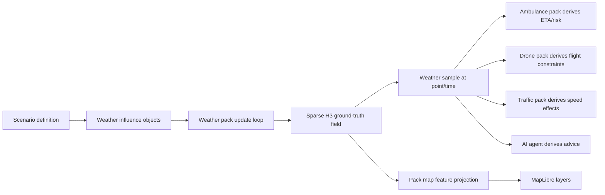

# Weather Domain

The Leitbild weather pack represents weather as operational environment state: a changing field of atmospheric and surface conditions that humans, simulation packs, and AI agents can inspect and use. It is not just a visual overlay. Weather can make a road wet, reduce visibility around an airport, increase drone workload in gusty wind, delay vessels in fog, raise emergency-response demand, or create a moving line of risk that a dispatcher should anticipate before it reaches an incident area.

The current implementation is deliberately modest but architecturally important. Weather is authored as scenario-defined influence objects, computed into a sparse H3 ground-truth field, projected into MapLibre as generic map features, and sampled by other packs through weather-at-location functions. This gives Leitbild a real foundation for ambulance, traffic, drone, aviation, maritime, wildfire, radiation, and process-control scenarios without turning the weather pack into a hidden global rule engine.

## Audience And Use

This page is written for human readers and AI agents. Humans should be able to understand what the weather pack does, why it matters, and where it can grow. AI agents should be able to use this page as an operating reference: how to author weather scenario objects, how to interpret H3 weather cells, what the canonical fields mean, and where not to invent derived state that the pack does not own.

The most important boundary is simple: weather publishes environmental source data. It does not decide whether an ambulance may drive, whether a drone may launch, whether a ship should reroute, or whether a hospital should activate a surge plan. Those decisions belong to the consuming pack or agent. The same rain, fog, or ice can have different meaning for a heavy ambulance, a bicycle responder, a drone, an aircraft, or a vessel.

## Why Weather Matters In Leitbild

Weather is a natural stressor for command-and-control research because it changes the world without asking the operator for permission. A clear dispatch problem becomes harder when a rain band crosses the route, visibility drops around an airport, a cold surface turns wet roads into ice, or a wildfire front accelerates because wind shifts. Weather also creates asymmetric information: a facilitator may know that snow will intensify in five minutes, a forecast may only suggest it, and an operator may discover it only when assets slow down or a warning appears.

That makes weather useful for studying anticipation, workload, automation trust, shared situation awareness, and human-AI coordination. An AI dispatch assistant can warn that a selected route enters a wet/icy field. A monitor agent can watch for assets whose missions cross a weather front. A facilitator can script a fog bank so that participants must decide whether to pre-position units before visibility collapses. A multi-user scenario can give one role current conditions and another role forecast products, then observe how they coordinate.

Several Leitbild use cases become richer once weather is available:

- Ambulance dispatch: rain reduces visibility, roads become wet, incidents increase, and route risk depends on vehicle capability.
- Traffic management: a slow traffic area can interact with wet road surfaces; a small queue becomes a larger delay when road conditions worsen.
- Drone operations: wind speed, wind direction, precipitation, visibility, and icing can constrain launch, endurance, sensor quality, and recovery.
- Aviation and airport control: visibility, cloud cover, wind, gusts, precipitation, and contaminated surfaces can affect runway throughput and diversion decisions.
- Maritime control: fog, wind, precipitation, sea spray, and freezing conditions can affect vessel speed, harbor operations, and search-and-rescue risk.
- Wildfire response: wind, humidity, temperature, and precipitation can alter spread rate, smoke behavior, and evacuation timing.
- Process-control simulations: external weather can stress a power plant, hospital, or industrial site through heat load, flood risk, icing, grid instability, or access-road degradation.

The useful research question is rarely "is it raining?" It is usually "who knows that it is raining, where does it matter, what does it change, and how should the system explain that change?"

## Inspirations From Weather And Simulation Systems

Leitbild does not try to be a numerical weather prediction system. It borrows concepts from several families of systems and deliberately chooses a lighter, more operationally legible subset.

Full atmospheric models such as the Weather Research and Forecasting model (WRF) solve physical equations over three-dimensional grids. WRF is open-source public-domain code and is widely used in research and forecasting. It is powerful, but it brings Fortran-era scientific workflows, boundary-condition data, nested domains, physics schemes, and substantial compute demands. It is a reference point for future high-fidelity integration, not the right runtime dependency for a small interactive Leitbild scenario.

Nowcasting systems such as pySTEPS are a closer conceptual inspiration. pySTEPS focuses on probabilistic short-term precipitation nowcasting, often from radar fields. Leitbild's moving oval weather influences are much simpler, but they use the same broad idea that operational weather can be represented as a spatial field advected and evolved through time rather than as isolated point facts.

Road-weather models such as RoadSurf are especially relevant to emergency response. RoadSurf is an open-source road-weather model library that models road surface temperature, water, ice, snow, and black ice using atmospheric inputs and surface energy balance. Leitbild currently uses a simpler normalized surface state, but RoadSurf validates the core abstraction: operational road condition is a state of the surface, not just a precipitation label.

Aviation weather conventions such as METAR and TAF are useful because they show how compact, structured weather reports encode operationally relevant values: wind, visibility, present weather, cloud/sky condition, temperature, dew point, pressure, and forecast change groups. Leitbild does not encode METAR strings internally, but future aviation packs should understand that these categories are established operational language.

Meteorological data formats such as GRIB and BUFR matter for future ingestion. GRIB is commonly used for gridded forecast fields; BUFR is used for many types of meteorological observations. ECMWF's ecCodes is an open-source library for encoding and decoding WMO GRIB and BUFR messages. Leitbild's v1 scenario-authored weather avoids this complexity, but a future ingestion pack may convert GRIB/BUFR/Open-Meteo products into Leitbild weather objects and H3 weather cells.

Game and simulation software offers another lesson: the whole world rarely updates at full fidelity every tick. Large games use grids, chunks, dirty sets, event queues, level of detail, deterministic update loops, and local activation regions. Leitbild follows the same general strategy: sparse state, deterministic ticks, scenario-authored influences, viewport rendering as projection, and explicit query surfaces for consumers.

Wildfire systems are a useful stress test. Cell2Fire represents landscape fire spread as a cell-based model with fuel, weather, fuel moisture, and topography per cell. ForeFire uses a C++ front-propagation/fire-spread engine and supports fire-atmosphere coupling. These systems show that fire, weather, terrain, and operations are tightly connected, and they help us think about whether future fire state should live in a separate fire grid or reuse Leitbild's shared H3 spatial index.

## Core Architectural Principle

The weather pack owns environmental truth for weather. Other packs consume that truth, but they do not redefine it. Conversely, the weather pack must not secretly decide domain behavior for other packs. It should not tell an ambulance that it must slow down, tell a drone that it must abort, or tell a traffic provider which route to choose. It exposes source data; consumers derive operational implications according to their own capabilities, policies, and domain rules.

This gives us a clean interaction pattern:



The word "derives" is deliberate. The canonical weather state is the raw environmental state: atmosphere, surface, and declared extensions. Derived concepts such as "hazard," "slippery," "bad for drones," or "reroute recommended" are interpretations by a presentation layer, a consuming pack, or an AI policy. They should be explainable from the raw state and should not be stored as weather truth.

## Big-Picture Weather Model

Leitbild's weather model has four layers:

1. A global default state. If a point has never been touched by a weather influence, sampling that point returns default atmospheric and surface conditions for the current scenario time.
2. Scenario-authored weather influence objects. These are named weather systems such as a damp background, moving rain band, fog bank, cold area, or future snow front.
3. A sparse H3 field. H3 cells are materialized only when weather influences affect them or when they retain non-default surface memory after an influence has passed.
4. Presentation and consumers. The UI renders base grid outlines, affected H3 cells, and influence shapes; other packs and AI agents query weather at points and derive their own operational meaning.

This is the goldilocks model for Leitbild. It is more structured than drawing a polygon and calling it "rain," but much lighter than a meteorological solver. It lets a scenario author create meaningful moving weather without writing code, while the sparse H3 field gives the simulation somewhere to store persistence: wet roads can stay wet after the rain band moves on, snow can remain after snowfall stops, and ice can decay only when conditions allow.

## What H3 Is

H3 is a hierarchical geospatial indexing system originally developed by Uber and now maintained as an open-source project. It partitions the earth into cells at multiple resolutions and gives each cell a stable id. Most H3 cells are hexagons, with a small number of pentagons required by global geometry. The hierarchy lets coarse cells summarize larger regions and finer cells represent more local detail.

The purpose of H3 is not to draw pretty hexagons. Its purpose is to give software a durable spatial vocabulary. A latitude/longitude point can be converted into a cell id. A polygon can be covered by a set of cell ids. A cell id can be converted back into a center point or boundary polygon. Neighbor rings can be computed. Parent cells can aggregate child cells. This makes H3 useful for heatmaps, mobility analysis, logistics, risk fields, environmental fields, exposure maps, and any system that needs to reason over spatial state without inventing a bespoke grid every time.

H3 is especially attractive for Leitbild because it gives us these strengths:

- Global identity: the same point maps to the same cell id across clients, server restarts, and machines.
- Hierarchy: a detailed field can be aggregated to coarser cells for low zooms, dashboards, statistics, or AI summaries.
- Neighbor logic: packs can reason about adjacent cells, expanding fronts, local diffusion, or nearby risk without custom geometry code.
- Polygon coverage: a weather oval, wildfire perimeter, radiation plume, or traffic impact polygon can be converted into candidate cells.
- Compact references: an AI agent can refer to a cell id or set of cell ids instead of passing a large polygon every time.
- Cross-pack vocabulary: weather, wildfire, radiation, population exposure, road risk, and drone no-fly context can share cell ids while keeping their own domain state.

For AI systems, H3 is useful because it turns continuous geography into stable tokens. An agent can ask for "conditions in cell 881f1d..." or receive a concise list of affected cells. It can compare route cells, summarize regions, reason about neighboring cells, and produce auditable explanations: "the ambulance route enters three H3 cells currently affected by rain and two cells still wet after the front passed."

H3 does not replace GeoJSON, routing, MapLibre, or the operational object model. It complements them. GeoJSON remains the format for points, lines, and polygons. MapLibre remains the renderer. Routes remain routes. H3 gives field-like packs a shared spatial index for computation, storage, aggregation, and query.

## H3 In Leitbild

Leitbild uses H3 as a shared spatial field index, not as a weather-specific rendering trick. The only direct dependency on `h3-js` lives behind `src/core/spatial/*` in the Leitbild repository. Packs and UI code do not import `h3-js` directly. They use Leitbild's wrapper types and functions.

The core wrapper exposes a small, intentional surface:

| Wrapper concept | Purpose |
| --- | --- |
| `HexCellId` | Branded string id for a validated H3 cell. |
| `HexResolution` | Branded number for a validated H3 resolution from 0 through 15. |
| `hexCellAtPoint(point, resolution)` | Convert a GeoJSON point into a cell id. |
| `hexCellsForPolygon(polygon, resolution)` | Cover a GeoJSON polygon with H3 cells. |
| `hexCellCenter(cellId)` | Convert a cell id into a GeoJSON center point. |
| `hexCellBoundary(cellId)` | Convert a cell id into a GeoJSON polygon boundary for rendering or inspection. |
| `hexParentCell(cellId, resolution)` | Aggregate a fine cell to a coarser parent. |
| `hexNeighborCells(cellId, radius)` | Get neighboring cells around a cell. |

This wrapper is deliberately small. It keeps H3 useful without letting H3 concepts leak everywhere. If the dependency changes, if we need a special validation rule, or if we later add caching or performance instrumentation, the change belongs in the wrapper rather than in every pack.

The weather pack uses H3 in two related but separate ways:

1. Computation: the weather provider maintains a sparse `WeatherSparseField` keyed by H3 cell id. The field stores only materialized cells: cells currently under weather influence, cells still evolving after an influence, and stable non-default cells that remain queryable.
2. Presentation: the weather pack projects base grid outlines, affected cells, and weather influence shapes into generic `PackMapAreaFeature` objects. The UI renders those features with MapLibre. The UI does not know the weather field store and does not compute weather.

The current weather data structures are:

```ts
interface WeatherGridDefinition {
  readonly gridId: string;
  readonly truthResolution: HexResolution;
}

interface WeatherCellState {
  readonly id: HexCellId;
  readonly resolution: HexResolution;
  readonly center: GeoJsonPoint;
  readonly state: WeatherState;
  readonly activeInfluenceIds: readonly ObjectId[];
  readonly residual: number;
  readonly updatedAt: IsoTimestamp;
}

interface WeatherSparseField {
  readonly grid: WeatherGridDefinition;
  readonly cells: ReadonlyMap<HexCellId, WeatherCellState>;
  readonly activeCellIds: ReadonlySet<HexCellId>;
}
```

`cells` is the sparse ground-truth map. It is not a UI list. It is not a list of operational objects. It is internal weather-provider state. `activeCellIds` identifies cells that still need update work because they are under active influence or still have residual surface evolution. Default cells are implicit; they are not stored.

The field update loop is H3-based:

```mermaid
flowchart TD
  Tick["Weather provider tick"] --> Frames["Interpolate active weather influence keyframes"]
  Frames --> Polygons["Build oval influence polygons"]
  Polygons --> H3Cover["Cover polygons with H3 cells"]
  H3Cover --> Candidates["Union forced cells with previously active cells"]
  Candidates --> CellLoop["Evaluate each candidate cell center"]
  CellLoop --> Weights["Compute oval falloff weights"]
  Weights --> Mix["Mix weather state from overlapping influences"]
  Mix --> Evolve["Evolve surface memory and residual"]
  Evolve --> Store{ "Still active or non-default?" }
  Store -->|yes| Sparse["Store/update sparse H3 cell"]
  Store -->|no| Drop["Remove from sparse map"]
```

This keeps computation full-world in principle without materializing the whole world. If a weather object exists outside the current viewport, it can still affect cells and assets. If a rain band passes over an ambulance outside the operator's current map view, the weather pack can still compute the relevant field state. Rendering is viewport-limited; truth is not conceptually viewport-limited.

## Weather Objects

A weather object is an operational object in the weather domain whose `domainData` has `type: "weather_condition"` and `conditionKind: "weather_influence"`. It describes an environmental influence over space and time. The Oslo scenario includes `weather:oslo-damp-background`, a broad stationary background influence, and `weather:oslo-moving-rain-band`, a narrower moving oval that crosses Oslo.

Weather influence geometry is keyframed. Each keyframe defines:

- `atSeconds`: scenario time in seconds from scenario start;
- `center`: GeoJSON point coordinates as `[longitude, latitude]`;
- `semiMajorAxisM`: oval semi-major axis in meters;
- `semiMinorAxisM`: oval semi-minor axis in meters;
- `rotationDeg`: oval rotation angle;
- `falloffCurve`: a normalized parametric curve controlling strength from center to edge;
- optional patches to atmosphere, surface, and extension values.

Between keyframes, Leitbild interpolates the center, oval size, rotation, atmosphere values, surface values, extension values, and falloff curve. A stationary weather object is simply one whose keyframes keep the same center. A moving front is one whose center changes. A rain band that grows wider or intensifies is one whose oval and state change across keyframes.

This is intentionally general. We do not need separate hard-coded classes for "stationary area," "moving band," "front," or "blob." They are all weather influences with keyframed geometry and keyframed state.

## Canonical Weather State

The canonical weather state is stored as:

```ts
interface WeatherState {
  atmosphere: WeatherAtmosphere;
  surface: WeatherSurface;
  extensions: Record<string, number | string | boolean>;
}
```

The atmosphere model currently contains:

| Field | Meaning |
| --- | --- |
| `airTemperatureC` | Air temperature in degrees Celsius. |
| `humidity` | Optional normalized humidity, 0..1. |
| `windSpeedMps` | Wind speed in meters per second. |
| `windDirectionDeg` | Direction in degrees, 0..360. |
| `visibilityM` | Horizontal visibility in meters. |
| `cloudCover` | Optional normalized cloud cover, 0..1. |
| `precipitation.type` | One of `none`, `rain`, `snow`, `sleet`, `freezing_rain`, `hail`. |
| `precipitation.intensityMmPerHour` | Precipitation intensity in mm/h. |

The surface model currently contains normalized, source-level conditions:

| Field | Meaning |
| --- | --- |
| `groundTemperatureC` | Ground or road-surface temperature in degrees Celsius. |
| `wetness` | Normalized surface wetness, 0..1. |
| `standingWater` | Normalized standing water, 0..1. |
| `snow` | Normalized snow presence/accumulation, 0..1. |
| `ice` | Normalized ice presence, 0..1. |
| `frost` | Normalized frost presence, 0..1. |

The weather pack deliberately does not store `frictionClass`, `frictionEstimate`, `labels`, or canonical `severity`. Those are derived interpretations. A traffic pack may interpret `ice: 0.6` as a large speed penalty. A winter-equipped ambulance may tolerate the same condition better. A drone pack may ignore road ice but care strongly about `windSpeedMps`, `precipitation`, and `visibilityM`.

## Extensions

Extensions let a scenario add typed, namespaced weather fields without changing the base weather schema. They are declared under `providerConfigs.weather.fields.extensions` in the scenario definition. A scenario can then set those fields in weather objects and keyframes.

Example:

```json
"providerConfigs": {
  "weather": {
    "fields": {
      "extensions": {
        "research.operatorWeatherLoad": {
          "type": "number",
          "unit": "0..1",
          "default": 0,
          "min": 0,
          "max": 1
        }
      }
    }
  }
}
```

A weather object can then set:

```json
"extensions": {
  "research.operatorWeatherLoad": 0.65
}
```

Extension keys should be namespaced, such as `research.operatorWeatherLoad`, `radiological.doseRateMicroSvPerHour`, `fire.fuelMoisture`, or `aviation.ceilingFt`. The weather pack validates that an extension is declared before it is used. Number extensions interpolate linearly between keyframes. String and boolean extensions use step behavior.

A radiation example is useful. Suppose a future industrial or nuclear scenario wants a weather field to carry airborne radiological context. The weather pack should not hard-code nuclear categories. A scenario could declare `radiological.doseRateMicroSvPerHour`, `radiological.airborneIodine`, or `radiological.depositionRisk`, then keyframe those values through a plume-like weather influence. A nuclear response pack or AI agent can consume the values, while ordinary ambulance or traffic packs can ignore them.

Extensions are powerful, so they need discipline. Use built-in atmosphere and surface fields when they fit. Use extensions for scenario- or domain-specific environmental dimensions that still behave like environmental fields. Do not use extensions to smuggle commands, UI layout, or asset state into weather.

## Influence Mathematics

A weather influence uses an oval as its support shape. For a cell center point `p`, the pack transforms the point into a local coordinate system centered on the influence center and rotated by the influence angle. The normalized oval distance is:

```text
d = sqrt((x' / semiMajorAxisM)^2 + (y' / semiMinorAxisM)^2)
```

If `d > 1`, the influence has weight 0 at that cell. If `d <= 1`, the weight is read from the `falloffCurve`. The curve is an ordered list of `{ x, y }` points where `x` is normalized distance from center to edge and `y` is influence strength. This can express sharp edges, gentle gradients, flat-topped systems, or a narrow core with feathered boundaries without inventing hard-coded categories such as "hard fill" or "smooth falloff."

Example curves:

```json
[{ "x": 0, "y": 1 }, { "x": 1, "y": 0 }]
```

```json
[{ "x": 0, "y": 1 }, { "x": 0.75, "y": 1 }, { "x": 1, "y": 0.2 }]
```

The first fades linearly from center to edge. The second stays strong across most of the oval and only fades near the boundary. Scenario authors can use this to create a broad damp background, a narrow rain band, a sharp fog boundary, or an environmental plume.

## Overlapping Weather Objects

Multiple weather objects can overlap. The update loop processes all active influences for a cell and mixes their states according to their weights. This lets a background condition and a moving rain band interact: a damp Oslo background can provide baseline wetness and cloud cover, while a moving rain band increases precipitation intensity, wetness, and operator-weather-load where it passes.

Overlap should be treated as a modeling choice, not as magic. If two strong influences conflict, the resulting state is a weighted mixture. Numeric values interpolate. Precipitation type changes by threshold behavior in the current implementation. Extensions follow their declared type: numbers interpolate; strings and booleans step.

The current `priority` field exists on weather influences. It gives us a path for later rules where a high-priority phenomenon can dominate or override lower-priority background fields. At the moment, the main mental model should remain weighted overlap of active influences plus persistent surface memory.

## Surface Memory And Decay

A key reason for the sparse H3 field is memory. If rain passes over a road, the cell should not instantly return to dry default conditions when the rain oval moves away. The active forcing has ended, but the surface state remains. Wetness, standing water, snow, ice, and frost evolve back toward defaults according to simple deterministic rules.

The current surface evolution is intentionally simple. Precipitation increases wetness or snow/ice-related state depending on precipitation type and ground temperature. Standing water and wetness decay over time. Snow decays more slowly when above freezing. Ice and frost decay according to warming and residual thresholds. When the cell becomes default-like and has no active influences, the sparse field removes it.

That last part is crucial. We do not keep every previously affected cell forever. A cell remains in the sparse map only while it is active, non-default, or still evolving. Once decay/evolution has mathematically finished for practical purposes, the cell disappears from the sparse map and future queries return the global default state.

## Sampling Weather

Consumers access weather through point sampling. A pack or agent supplies a point and a time, and the weather pack returns a `WeatherSample`:

```ts
interface WeatherSample {
  state: WeatherState;
  quality: {
    provenance: "scenario" | "forecast" | "observed" | "inferred" | "intervention";
    confidence: number;
    validAt: string;
  };
  activeInfluenceIds: readonly string[];
}
```

`activeInfluenceIds` tells the consumer which weather objects are currently influencing the sample. If the list is empty, the sample may still be non-default because a previous weather object left persistent surface memory. That distinction is useful: "currently raining here" is different from "rain passed earlier and the surface is still wet."

The current pack already contributes contextual weather fields to other categories when the weather pack is active. For example, a rail row for an ambulance, hospital, incident, or traffic condition can show weather at that object's location.

The provider-owned sparse H3 field is also exposed through Leitbild's generic pack query surface. Consumers can ask for weather at a point, weather along a route, weather summarized across an area, weather field statistics, or provider-projected map features. This is deliberately not a `/api/weather/*` endpoint family. The generic Control Instance route `POST /api/control-instances/:id/queries` routes `{ packId: "weather", kind, payload }` to the active weather provider for that run. That keeps the weather computation inside the weather pack while still making the read model available to UI, test tools, and AI agents.

## Scenario Authoring

Weather scenario definitions are JSON. A scenario activates the weather pack by listing it in `packs`, then includes weather condition objects in `initialObjects`.

Minimal shape:

```json
{
  "pack": "weather",
  "type": "weather_condition",
  "id": "weather:example-rain-band",
  "label": "Moving rain band",
  "truthResolution": 8,
  "showAffectedCells": true,
  "showInfluenceShape": true,
  "showIcon": true,
  "priority": 10,
  "summary": "A narrow rain band moves east and increases surface wetness.",
  "atmosphere": {
    "airTemperatureC": 5.5,
    "humidity": 0.9,
    "windSpeedMps": 7,
    "windDirectionDeg": 250,
    "visibilityM": 6500,
    "cloudCover": 0.9,
    "precipitation": { "type": "rain", "intensityMmPerHour": 1.8 }
  },
  "surface": {
    "groundTemperatureC": 5,
    "wetness": 0.5,
    "standingWater": 0.08,
    "snow": 0,
    "ice": 0,
    "frost": 0
  },
  "falloffCurve": [
    { "x": 0, "y": 1 },
    { "x": 0.65, "y": 0.85 },
    { "x": 1, "y": 0 }
  ],
  "keyframes": [
    {
      "atSeconds": 0,
      "center": [10.6900, 59.9250],
      "semiMajorAxisM": 5200,
      "semiMinorAxisM": 1200,
      "rotationDeg": 68,
      "falloffCurve": [{ "x": 0, "y": 1 }, { "x": 0.65, "y": 0.85 }, { "x": 1, "y": 0 }]
    },
    {
      "atSeconds": 420,
      "center": [10.8350, 59.9270],
      "semiMajorAxisM": 6800,
      "semiMinorAxisM": 1500,
      "rotationDeg": 78,
      "atmosphere": {
        "precipitation": { "type": "rain", "intensityMmPerHour": 2.3 },
        "visibilityM": 5200
      },
      "surface": {
        "wetness": 0.62,
        "standingWater": 0.12
      },
      "falloffCurve": [{ "x": 0, "y": 1 }, { "x": 0.65, "y": 0.85 }, { "x": 1, "y": 0 }]
    }
  ]
}
```

Scenario authors should think in terms of environmental systems, not map decoration. A broad background condition can set the city to damp and overcast. A moving band can add stronger precipitation. A stationary cold region can create frost risk. A later keyframe can intensify rain, widen the oval, rotate the band, or reduce visibility.

`truthResolution` controls the H3 resolution used by the sparse field for that influence. Resolution 8 is the current city-scale default. Higher resolutions are more detailed but create more cells. Lower resolutions are cheaper and more suitable for regional context or low-precision phenomena. Map rendering may use coarser visual resolutions at low zoom, but that is presentation; the weather pack owns truth resolution.

## Authoring Guidance For AI Agents

When writing a weather scenario, choose a small number of meaningful weather objects rather than many tiny polygons. Start with a background influence if the whole operating area should have non-default conditions. Add one or two moving or localized influences for operational drama. Use `truthResolution` deliberately; city dispatch scenarios usually start well at resolution 8, but not every broad background influence needs highly detailed cells.

Use physical consistency. If precipitation type is `snow`, surface snow should probably rise over time or already be nonzero. If `groundTemperatureC` is below zero and wetness is high, consumers may infer ice risk. If visibility is low, explain whether fog, rain, snow, smoke, or another extension caused it. Avoid setting every field to an extreme value unless the scenario is explicitly severe.

Declare extensions before using them. Namespaced keys are best. A good extension key says who owns the concept and what it measures, for example `research.operatorWeatherLoad`, `fire.fuelMoisture`, `aviation.ceilingFt`, or `radiological.doseRateMicroSvPerHour`. Do not invent arbitrary unnamespaced keys such as `badness` or `danger` unless the scenario really defines their meaning.

Do not write derived outcome fields into weather state. Weather state should not say `ambulanceSpeedFactor`, `droneLaunchAllowed`, or `trafficJamExpected`. A consumer can derive those from source weather and its own policy. This keeps the weather pack reusable.

## Map And UI Representation

The map renders weather as a projection of weather truth. The weather pack returns generic `PackMapAreaFeature` objects through the provider-backed `weather.mapFeatures` query; the UI turns those into MapLibre GeoJSON sources and layers. The current projection has three families:

- base grid outlines for the current viewport and zoom;
- affected H3 cells, colored by presentation severity derived from weather state;
- translucent weather influence shapes showing the keyframed oval support region.

MapLibre is a good fit because it can render GeoJSON `fill`, `line`, `symbol`, and `heatmap` layers through WebGL. H3 cells and weather ovals should be native MapLibre layers, not DOM elements. Rich explanatory UI such as hover cards, scenario guidance, settings, and rail rows should remain Svelte overlays.

Heatmaps are useful for point-density or fuzzy scalar fields, but they are not the canonical weather representation. The current model needs inspectable cells with state. A heatmap can become a later visualization mode for temperature, wetness, precipitation, smoke intensity, or confidence, but it should not replace the sparse H3 truth model.

The UI boundary matters. Generic map code must not import weather sparse-field code, H3 directly, or weather calculators. The weather pack owns its computation and projects map features through the pack query protocol. The UI owns rendering only. In practical terms, the active pack contributes a `mapAreaFeatureQueries` request; the UI asks the current Control Instance to answer it; the weather provider projects the current sparse H3 field for the requested viewport, zoom, and current simulation time.

## Performance And Scaling

Weather can become expensive if handled naively. A global grid at high resolution would explode memory. Updating every H3 cell every tick would be wasteful. Rendering every possible cell across the world would make the map unusable. Leitbild avoids this through sparse computation and viewport projection.

The sparse H3 field has three important properties:

- Universal queries are possible because the default state exists everywhere.
- Non-default truth is stored only where the world has actually changed.
- Rendering can be limited to visible cells without limiting simulation truth.

This means an ambulance outside the viewport can still query weather at its position. If a weather front passed over that position earlier and left a wet or icy cell in the sparse field, the query can see it. If nothing has ever affected that location, the query gets defaults. The UI only needs to draw the subset of weather cells relevant to the current view.

H3 also gives us a scaling path. At low zoom, parent cells can summarize child cells. At high zoom, resolution 8 or 9 cells can show local structure. For dashboards or AI summaries, a pack can report aggregate statistics by parent cell: affected cell count, worst visibility, average wetness, or number of assets inside adverse cells. This lets us keep detailed state without forcing every consumer to read every detailed cell.

## Relationship To Other Packs

The weather pack should interact through pack queries, contextual fields, map feature projections, commands, and explicit interaction signals, not through hidden mutation. Current Leitbild exposes weather as contextual fields on other objects: if the weather pack is active, the rail can show a `Weather` field for ambulances, hospitals, incidents, traffic conditions, or future asset types by sampling weather at their location.

A future ambulance pack might compute weather-aware ETA by sampling weather along a route. A traffic pack might reduce road speed where weather samples indicate high wetness and low visibility. A drone pack might reject missions when wind or precipitation violates vehicle limits. An AI monitor agent might watch for objects entering adverse weather and post an explanation.

This is the right direction because it keeps policy in the consumer. Weather says: air 5 C, road wetness 0.6, visibility 5.2 km, rain 2.3 mm/h. The ambulance policy says what that means for an ambulance. The drone policy says what it means for a drone. A research scenario can then compare different policies without changing weather truth.

H3 improves the interaction surface. A future traffic pack could publish road segments annotated with the H3 cells they cross. A wildfire pack could publish smoke by H3 cell and read wind by H3 cell. A radiation pack could publish deposition fields by H3 cell. An AI agent could ask for all assets in or near a set of affected cells. The cell id is the common spatial reference; each pack still owns its own data.

## Future H3 Benefits Beyond Weather

H3 inclusion gives Leitbild more than weather rendering. It creates a reusable spatial-field substrate for packs that need globally stable environmental or contextual state.

Potential future uses include:

- Wildfire: fire spread state, smoke density, ember exposure, fuel moisture, evacuation exposure, and suppression effects by H3 cell.
- Radiation: plume concentration, ground deposition, dose-rate estimates, protective-action zones, and sampling results by H3 cell.
- Population exposure: estimated people, vulnerable facilities, shelters, and evacuation demand by H3 cell.
- Traffic and mobility: coarse congestion fields, road risk exposure, or weather-affected route summaries by H3 cell.
- Drone operations: wind, precipitation, no-fly context, signal quality, battery risk, and landing-zone quality by H3 cell.
- Maritime and aviation: fog banks, visibility fields, wind fields, harbor/airport operational constraints, and sector summaries by H3 cell.
- AI situation awareness: compact spatial memory, regional summaries, route explanations, and cell-based trigger conditions.

The most important future capability is not any single layer. It is cross-pack composition. A wildfire pack can read wind/humidity from weather cells and publish smoke cells. A traffic pack can read weather and smoke cells and publish route impacts. An ambulance pack can read route impacts and weather samples and compute ETA/risk. An AI agent can summarize the chain: "rain and smoke are affecting these H3 cells, which overlap the route to the hospital, increasing expected arrival time."

## Forest Fire Extension Discussion

Forest fire is the best near-term stress test for the weather model. Fire spread depends on weather, but fire also changes the environment. Wind, humidity, temperature, precipitation, and fuel moisture affect fire behavior. The fire itself produces heat, smoke, visibility loss, road closures, evacuations, and possibly new weather-like environmental fields.

One tempting approach is to store fire directly inside the weather field. That can be useful for early medium-fidelity scenarios if the values are environmental quantities many packs may sample: `fire.smokeDensity`, `fire.emberExposure`, or `fire.fuelMoisture`. But fire spread mechanics should not be hidden inside the weather pack. A serious fire pack needs fuel models, slope, aspect, topography, spotting, suppression lines, perimeters, rate-of-spread models, and event scheduling.

The goldilocks path is therefore:

1. Use H3 as the shared spatial index.
2. Let weather own weather state.
3. Let a future fire pack own fire simulation state.
4. Let fire read weather state through explicit queries.
5. Let fire publish environmental effects such as smoke or heat as explicit pack outputs or weather-compatible extensions where appropriate.
6. Move to a dedicated fire field only when fire semantics require it.

This preserves reuse without turning weather into an all-purpose "everything grid."

## Strengths Of The Current System

The current weather pack is cleanly scenario-driven. Authors can create moving weather systems in JSON, including keyframed geometry and keyframed values. It is deterministic, testable, and does not depend on external weather APIs. It fits Leitbild's pack architecture and can be activated or omitted per scenario.

The H3 sparse field is the right conceptual direction. It avoids global-grid bloat while preserving the ability to query any point. It supports memory after a front passes. It gives the UI a natural map layer and gives other packs a stable sampling concept.

The extension mechanism is also important. It lets us try new research variables without bloating the base schema. Radiation, smoke, operator workload, fuel moisture, ceiling, icing risk, or domain-specific uncertainty can be added in scenario configuration and carried through the same interpolation and sampling path.

## Limitations And Risks

The current model is not meteorological forecasting. It is an operational environmental simulator. It will not predict real weather unless connected to external data or a more sophisticated model. Scenario authors must therefore be honest about whether a weather object represents scenario truth, forecast, observation, or inference.

The current weather query surface is intentionally small, but it is now real. AI agents and tools can use generic pack queries for point, route, area, field-stat, and map-feature reads. Future work should refine response shapes, add stronger aggregation semantics, and migrate any remaining synchronous contextual-field paths that still need provider-private sparse-field truth.

Surface evolution is deliberately simple. It is useful for persistence and directional behavior, but it is not a calibrated road-surface model. For winter road studies, RoadSurf or METRo-style physics should inform future improvements.

The current system has only simple typed extensions. More complex extension schemas, arrays, nested objects, units, uncertainty, and interpolation methods may be needed later. For now, keep extension values scalar and simple.

The UI derives presentation severity from raw state. That is acceptable as long as everyone remembers it is presentation, not truth. If a consumer needs a domain-specific threshold, it should implement its own policy.

## Next Steps

The most valuable next step is to harden route and area weather summaries. The basic `weather.sampleAlongRoute` and `weather.summarizeArea` queries exist; they should grow into concise operational explanations: affected distance, worst conditions, active influence ids, residual surface memory, confidence, and policy-neutral source data.

The second step is stronger use of H3 hierarchy. Parent-cell aggregation can make low-zoom weather views, dashboards, and AI summaries cheap and stable.

The third step is scenario authoring polish. Add examples for fog, winter road icing, heavy rain/standing water, crosswind/gusts for drones, and smoke/radiation as extensions. These examples should be small, readable, and AI-authorable.

The fourth step is better physical evolution. RoadSurf-style concepts can improve surface temperature, water, ice, snow, and black ice behavior without importing a heavy meteorological runtime.

The fifth step is cross-pack interaction. Traffic should be able to consume weather samples for speed effects. A drone pack should consume wind/precipitation/visibility. A future fire pack should consume wind/humidity/temperature and publish smoke or fire-environment extensions.

## Reference And Further Reading

- [H3 official documentation](https://h3geo.org/docs/) and [H3 GitHub](https://github.com/uber/h3): hierarchical geospatial indexing used in Leitbild's current spatial field wrapper.
- [h3-js package](https://www.npmjs.com/package/h3-js): JavaScript/TypeScript binding used behind Leitbild's `src/core/spatial/*` wrapper.
- [WRF Model official GitHub organization](https://github.com/wrf-model) and [WRF repository](https://github.com/wrf-model/WRF): open-source/public-domain atmospheric modeling reference.
- [pySTEPS GitHub](https://github.com/pySTEPS/pysteps) and [pySTEPS GMD paper](https://gmd.copernicus.org/articles/12/4185/2019/): open-source probabilistic precipitation nowcasting.
- [RoadSurf 1.1 GMD paper](https://gmd.copernicus.org/articles/17/4837/2024/): open-source road-weather model library with road surface temperature, water, ice, snow, and black ice concepts.
- [Open-Meteo](https://open-meteo.com/) and [Open-Meteo GitHub](https://github.com/open-meteo/open-meteo): open-source weather API and forecast-data processing stack.
- [MapLibre GL JS documentation](https://maplibre.org/maplibre-gl-js/docs/) and [MapLibre layer style specification](https://maplibre.org/maplibre-style-spec/layers/): native map rendering layers, including fill, line, symbol, and heatmap.
- [NOAA Aviation Weather Center data help](https://aviationweather.gov/help/data/), [NOAA METAR page](https://www.weather.gov/asos/METAR.html), and [Met Office METAR/TAF training resource](https://www.metoffice.gov.uk/services/transport/aviation/regulated/training-resources-for-aviation/metars-and-tafs): aviation weather reporting concepts.
- [ECMWF ecCodes information](https://codes.ecmwf.int/grib/) and [ECMWF software page](https://www.ecmwf.int/en/computing/software): GRIB/BUFR decoding and encoding tools.
- [ForeFire GitHub](https://github.com/forefireAPI/forefire), [ForeFire documentation](https://forefire.readthedocs.io/), and [ForeFire JOSS paper](https://joss.theoj.org/papers/10.21105/joss.08680): open-source wildfire spread engine.
- [Cell2Fire GitHub](https://github.com/cell2fire/Cell2Fire) and [Cell2Fire Frontiers paper](https://www.frontiersin.org/journals/forests-and-global-change/articles/10.3389/ffgc.2021.692706/full): cell-based wildfire growth model using fuel, weather, topography, and spread-rate models.

Related pages: [[concepts]], [[simulation-technologies]], [[domains/traffic]], [[domains/ambulance]], [[scenarios]], [[agent-guides]].
