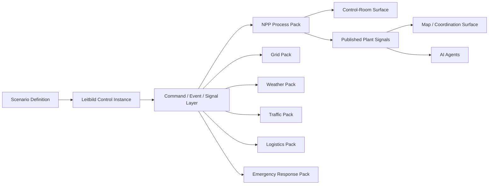
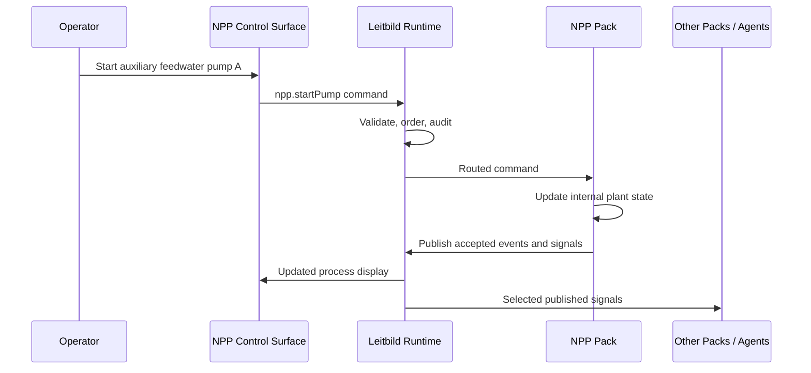

# Future Projects

## NPP Process Control Pack

Leitbild is easiest to understand today as a map-based control surface for ambulances, hospitals, incidents, and traffic. The more durable idea is broader: Leitbild should be able to coordinate many simulation packs inside one shared run, with each pack exposing only the parts of its world that other packs, users, surfaces, and AI agents are allowed to see. A detailed nuclear power plant process-control simulation is a useful stress case because it is almost the opposite of a simple map object. It has thousands of internal variables, dense procedure logic, high-consequence operator actions, alarm floods, physical processes, and a control-room user interface that may not need a map at all. If Leitbild can host that kind of pack cleanly, without turning the core into a plant simulator, the architecture is probably pointing in the right direction.

The proposed `npp-pwr` pack would model a pressurized water reactor at a level suitable for research, training, and human factors experimentation, not for licensing analysis or engineering certification. The pack would own its internal plant state, process equations, operator displays, alarm logic, and scenario hooks. Leitbild would own the scenario run, clock, pack loading, command routing, shared event log, published signals, API access, surfaces, audit trail, and cross-pack interaction. The boundary is the point: the plant sim can be deep, but Leitbild core should remain a coordination and surface platform rather than a monolithic "everything simulator."

The [PWR Operations wiki](https://samsinn-wikis.github.io/pwr-ops/) is the natural source companion for this concept. It already organizes Westinghouse-style PWR operating knowledge, procedure markdown, emergency operating procedures, critical safety-function trees, integration notes, and source context. A future `npp-pwr` pack should link its simulated systems and operator procedures back to that kind of source material. The sim should not copy procedure text into arbitrary code comments or rely on unsourced LLM memory. Instead, each modeled behavior should carry a short assumption trail: which wiki page, procedure family, operating concept, or expert review justified it, and what level of fidelity it claims.

### Why Put A Process Plant Inside Leitbild?

The interesting research question is not whether a browser can show a mimic diagram. It can. The interesting question is what happens when a rich process-control world is connected to other operational worlds. A plant may depend on the electric grid, weather, road access, emergency services, logistics, communications, staffing, and external decision makers. Those domains are often represented as separate tools, and the seams between them are exactly where coordination failures and workload problems appear. Leitbild can make those seams visible.

In a joined run, the plant pack could publish that offsite power is degraded, a diesel generator is running, a safety procedure is active, and external support is requested. The grid pack could publish restoration estimates. The traffic pack could slow a fuel truck. The weather pack could worsen cooling-water intake conditions. The ambulance or emergency-response pack could stage assets. An AI monitor could summarize which plant state changes matter to offsite coordination without receiving every raw sensor in the plant. The plant operators still work in their control-room surface, but they are no longer isolated from the simulated world around them.



### The Pack Boundary

The NPP pack should have a strong internal/public boundary. Internally, the pack may keep detailed state for pumps, valves, buses, tanks, heat exchangers, control rods, alarms, timers, procedures, and operator actions. Externally, it publishes selected signals and events through a catalog. Other packs do not read `plant.primaryLoop.loopA.pumpSealLeakRate` directly. They consume something deliberately published, such as `npp.offsitePower.available`, `npp.siteAlertLevel`, `npp.coolingWater.status`, or `npp.externalSupport.requested`.

The pack also declares the commands it accepts. A control-room operator may issue `npp.startPump`, a facilitator may inject `npp.failComponent`, and an AI assistant may request `npp.summarizeCurrentProcedure`, but every command goes through the same Leitbild command path: validate, authorize, log, route to provider, apply if accepted, publish resulting events or signals. This avoids a dangerous split between "UI control" and "agent control." Humans, AI agents, tests, and scenario scripts all use the same conceptual surface.



### Internal Architecture

The pack should be written as a collection of small, testable modules rather than as one large plant object. A reasonable first layout would separate the physical model, operational logic, command handling, scenario hooks, and surfaces.

```text
packs/npp-pwr/
  pack.json
  model/
    plant-state.ts
    units.ts
    signal-catalog.ts
    command-catalog.ts
    alarm-catalog.ts
    procedure-state.ts
  systems/
    reactor-core.ts
    primary-loop.ts
    pressurizer.ts
    steam-generators.ts
    feedwater.ts
    turbine-generator.ts
    electrical.ts
    safety-injection.ts
    residual-heat-removal.ts
    containment.ts
    cooling-water.ts
    radiation-monitoring.ts
    instrumentation-control.ts
  sim/
    engine.ts
    scheduler.ts
    command-handler.ts
    event-projector.ts
    scenario-hooks.ts
  surfaces/
    control-room.surface.json
    alarm-board.surface.json
    trends.surface.json
    procedure-viewer.surface.json
```

The model should start as a TypeScript operational simulation because the rest of Leitbild is TypeScript, because scenario codecs and tests can share types, and because AI coding agents can read and modify the model more easily. That does not mean TypeScript must remain the physics engine forever. If a subsystem later needs faster numerical integration or a more formal process model, the NPP pack can wrap a Rust, C++, Python, Modelica, or FMU process engine behind the same provider boundary. The external contract stays in TypeScript schemas; the internal engine can evolve.

### What To Model

A useful PWR process-control pack does not need every pipe and relay in the plant, but it does need enough structure to make operator displays, procedures, alarms, and cross-pack consequences meaningful. The first model should include reactor power and decay heat, control-rod position, reactivity effects at a simplified level, reactor coolant system pressure and temperature, primary-loop pump status, pressurizer pressure control, steam generator levels, feedwater and auxiliary feedwater, turbine-generator status, offsite power, safety buses, diesel generators, batteries, safety injection, residual heat removal, containment pressure and isolation state, cooling-water availability, radiation monitoring, alarm state, procedure state, and operator action history.

The hospital and ambulance packs currently publish map objects with domain data such as trauma beds, patients, and destinations. The NPP pack would publish both operational objects and non-map signals. A plant site may appear as a map object with a status color, but most of the useful information is signal-based: `reactor.power.percent`, `pressurizer.pressure.bar`, `sg.a.level.percent`, `offsitePower.available`, `dieselGenerator.a.status`, `procedure.active`, `siteAlertLevel`, and `externalSupport.requests`. This is a strong reason to treat "object on a map" as one projection of a run, not the only kind of state Leitbild understands.

### A Concrete Programming Sketch

This example is deliberately high level. It shows the shape of one subsystem, not a validated reactor model. The important pattern is that the subsystem has typed state, accepts typed commands, advances deterministically, and emits only meaningful published changes.

```ts
export interface SteamGeneratorState {
  id: "sg-a" | "sg-b" | "sg-c" | "sg-d";
  levelPercent: number;
  steamPressureBar: number;
  feedwaterFlowKgPerSecond: number;
  radiationMonitorCps: number;
  tubeLeakSuspected: boolean;
}

export interface SteamGeneratorInputs {
  primaryTemperatureC: number;
  thermalPowerPercent: number;
  auxiliaryFeedwaterAvailable: boolean;
  secondsElapsed: number;
}

export interface PublishedSignal<T> {
  key: string;
  value: T;
  unit?: string;
  quality: "normal" | "estimated" | "degraded";
  source: "npp-pwr";
}

export interface SteamGeneratorStepResult {
  next: SteamGeneratorState;
  signals: PublishedSignal<number | boolean>[];
  events: Array<{
    type: "npp.steamGeneratorTubeLeakSuspected" | "npp.steamGeneratorLevelLow";
    sourceObjectId: string;
    summary: string;
  }>;
}

export const advanceSteamGenerator = (
  state: SteamGeneratorState,
  inputs: SteamGeneratorInputs
): SteamGeneratorStepResult => {
  const heatInput = inputs.thermalPowerPercent * inputs.secondsElapsed * 0.002;
  const feedwaterRecovery = state.feedwaterFlowKgPerSecond * inputs.secondsElapsed * 0.0008;
  const levelDrift = feedwaterRecovery - heatInput;
  const levelPercent = Math.max(0, Math.min(100, state.levelPercent + levelDrift));
  const tubeLeakSuspected = state.radiationMonitorCps > 2_000 || state.tubeLeakSuspected;

  const next: SteamGeneratorState = {
    ...state,
    levelPercent,
    tubeLeakSuspected
  };

  const signals: PublishedSignal<number | boolean>[] = [
    {
      key: `npp.${state.id}.level.percent`,
      value: next.levelPercent,
      unit: "%",
      quality: "estimated",
      source: "npp-pwr"
    },
    {
      key: `npp.${state.id}.tubeLeakSuspected`,
      value: next.tubeLeakSuspected,
      source: "npp-pwr"
    }
  ];

  const events = [];
  if (!state.tubeLeakSuspected && next.tubeLeakSuspected) {
    events.push({
      type: "npp.steamGeneratorTubeLeakSuspected" as const,
      sourceObjectId: state.id,
      summary: `Steam generator ${state.id.toUpperCase()} has indications consistent with tube leakage.`
    });
  }
  if (state.levelPercent >= 15 && next.levelPercent < 15) {
    events.push({
      type: "npp.steamGeneratorLevelLow" as const,
      sourceObjectId: state.id,
      summary: `Steam generator ${state.id.toUpperCase()} level is below the low-level threshold.`
    });
  }

  return { next, signals, events };
};
```

This code is intentionally modest. It does not pretend to perform best-estimate thermal-hydraulics. It shows a research-simulation pattern: meaningful state, declared uncertainty, stable signal names, and events that can trigger procedures, alarms, surfaces, or cross-pack interactions. If the same subsystem later moves to C++ or an FMU, the pack can keep the same published signal keys and command contracts.

### Surfaces For Operators And Facilitators

The main NPP surface should feel like process control, not like a dispatch map. It would have mimic diagrams, trends, alarms, procedure state, command widgets, and equipment detail panels. A second surface could be an alarm board. A third could be a procedure viewer that links active procedure steps back to the PWR Ops wiki. A fourth could be a facilitator view with scenario injects, hidden plant truth, trainee actions, and evaluation notes.

The map remains useful, but it is not the center of the NPP pack. It shows the plant site, access roads, emergency staging areas, weather, traffic, grid assets, logistics movements, evacuation zones, or plume/context overlays if a scenario uses them. Leitbild's surface system should therefore support scenario-declared layouts where the control-room surface is primary and the map is secondary, or where a supervisor sees both.

### AI Agent Use

AI agents should interact with the NPP pack through the same published signals and commands as other users, plus carefully prepared agent context views. An agent does not need every raw variable. A dispatch assistant may need site alert level, requested external support, road access status, and estimated time to loss of a safety margin. A procedure assistant may need current plant mode, active alarms, procedure branch state, and selected trends. A scenario facilitator agent may need a broader view, including hidden scenario intent, but that should be explicitly permissioned.

The PWR Ops wiki is valuable here because it gives agents a retrieval target. An agent can pull a relevant procedure page, compare it with published plant signals, and produce a grounded recommendation or critique. The page must still make clear that such agents are decision-support tools. They should report uncertainty, cite retrieved sources, distinguish observed plant state from inferred diagnosis, and obey command-authority rules.

### Vibe-Coding A Process Sim Responsibly

This pack is a good candidate for careful vibe-coding, but only if the workflow is disciplined. A useful approach is to ask an LLM to draft one subsystem at a time from a small set of source pages, then force it to write assumptions, signal definitions, invariants, and tests before adding behavior. The human author should review each assumption against the PWR Ops wiki and any available subject-matter guidance. The code should say what it models, what it ignores, and what observations would invalidate it.

For example, a development pass for steam generator behavior could ask the model to read the PWR Ops material on initial response and steam generator tube rupture indicators, draft a simplified SG state model, propose signal names, and write tests for low level, radiation indication, and procedure-branch triggers. The author would then remove any ungrounded detail, keep only the behavior needed for the research scenario, and add explicit source links. The goal is not to synthesize a plant from vibes. The goal is to use an LLM as a fast drafting partner while preserving traceability, review, and bounded claims.

### Scenario 1: Storm, Grid Degradation, And Diesel Logistics

The first scenario starts outside the plant. A weather pack introduces severe wind and precipitation. A grid pack degrades one transmission path and then trips offsite power to the plant. The NPP pack responds with a reactor trip, diesel generator start, electrical bus realignment, alarm flood, and entry into an emergency procedure path. A logistics pack creates a high-priority diesel fuel or repair-support movement. The traffic pack slows the support route because the storm has caused congestion and debris.

This scenario is interesting because the control-room problem and the map problem are both real. Inside the plant, operators must stabilize the plant and maintain safety functions. Outside the plant, dispatchers must move support through a degraded road network. An AI monitor can summarize whether the logistics delay matters to the plant state, instead of merely saying that a truck is late. The key cross-pack interaction is not visual; it is semantic: grid loss changes plant state, plant state creates logistics demand, traffic changes arrival time, arrival time changes plant risk.

### Scenario 2: Steam Generator Tube Leak And Site Coordination

The second scenario begins with subtle process symptoms. One steam generator shows abnormal level behavior and rising steam-line radiation. The NPP pack emits a suspected tube-leak event and activates procedure cues. The control-room surface highlights the affected generator, trends the relevant indicators, and shows the active diagnostic branch. The emergency-response pack receives a site notification. The ambulance pack may handle a contaminated or injured worker transport. A communications or facilitator surface can show message traffic between plant, emergency services, and offsite coordination.

This scenario is interesting because it links diagnostic work, procedure adherence, and external coordination. A human operator or AI assistant must distinguish a steam generator fault from a broader plant transient, explain what evidence supports the branch, and decide what information should be shared outside the control room. The Leitbild run can include both the process-display timeline and the map-based response timeline, making it useful for research on shared situation awareness and role boundaries.

### Scenario 3: Cooling-Water Degradation And Supply Chain Failure

The third scenario focuses on slower degradation. A weather or environment pack raises intake temperature, clogs a screen, or otherwise degrades the ultimate heat sink. The NPP pack shows worsening cooling-water margins and generates abnormal procedure guidance. A maintenance/logistics pack requests a repair component or chemical supply. Traffic introduces a blocked route near the plant. The plant may need to reduce power, shut down, or change operating mode depending on whether support arrives in time.

This scenario is interesting because it is not a single dramatic failure. It is a coordination problem across time. Operators watch margins erode. Dispatchers try to route support. A grid pack may impose generation constraints. AI agents can be tested on whether they understand trend, timing, and conditional risk: a condition that is acceptable for ten minutes may be unacceptable in an hour. This is exactly the kind of multi-domain temporal situation that a shared simulation platform should support.

### Control And Runtime Semantics

The NPP pack should run inside a Leitbild Control Instance like any other pack. It advances according to the control-instance clock, not according to a hidden wall-clock loop. Pause, resume, reset, replay, and snapshot rules must therefore apply to plant state as well as map objects. The pack can run faster internal integration steps, but those steps should be anchored to the run clock and projected into published signals at controlled intervals.

High-frequency internal values should not flood the Leitbild durable journal. The pack can keep internal time-series buffers for control displays and publish sampled or event-relevant data outward. Leitbild's snapshot should include enough pack-published state to restore the shared run, while the pack may maintain a private snapshot for detailed internals. Durable history should record meaningful events, commands, alarms, procedure transitions, and scenario injects, not every subsecond variable update.

### Design Risks

The main risk is accidentally turning Leitbild core into the simulator. That would make every pack harder to build and every domain harder to reason about. The corrective rule is simple: the NPP pack owns plant internals; Leitbild owns coordination, identity, command routing, surfaces, persistence, and shared projections.

The second risk is false fidelity. A polished process display can make a simplified model feel more authoritative than it is. The wiki page, pack manifest, and surfaces should state model scope and limitations clearly. Signals should carry quality metadata where useful, such as `normal`, `estimated`, `degraded`, or `scenario-injected`.

The third risk is event spaghetti between packs. Cross-pack interaction should use named events, signals, and handlers, not arbitrary mutation. If the grid affects the plant, it emits grid events or signals. If the plant needs logistics, it emits a support request. If traffic delays support, it publishes route-impact signals. The NPP pack may react, but it should react through its own command/event logic rather than by letting another pack edit its internals.

### Development Roadmap

The smallest credible prototype should model a plant site object, offsite power, diesel generator availability, one or two steam generators, a simplified reactor trip state, a basic alarm board, and a procedure-state surface linked to PWR Ops source pages. It should expose a signal catalog, a command catalog, and one scenario that interacts with at least one external pack such as grid, weather, traffic, logistics, or emergency response.

The second iteration should add richer process displays and time-series trends. The third should add AI-agent context views and procedure assistance. Only after that should we consider a lower-level numerical engine. The first goal is architectural proof: a deep pack can run beside map-based packs, publish a restrained operational interface, and participate in scenario-authored cross-domain events without contaminating Leitbild core.

Related pages: [[concepts]], [[specs]], [[agent-guides]], [[domains/traffic]], [PWR Operations wiki](https://samsinn-wikis.github.io/pwr-ops/).
