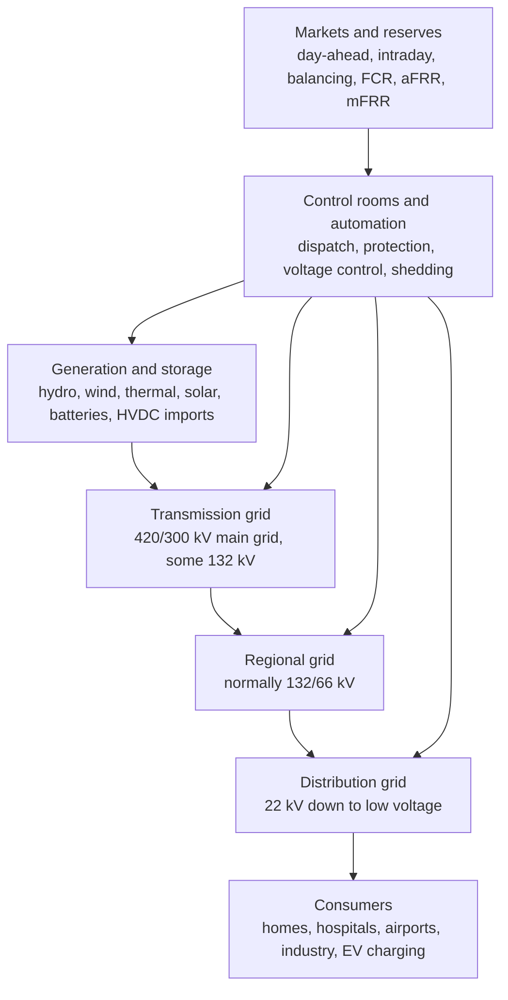
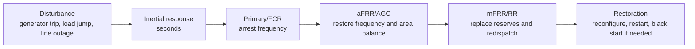
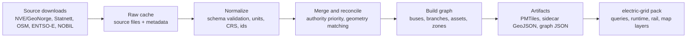
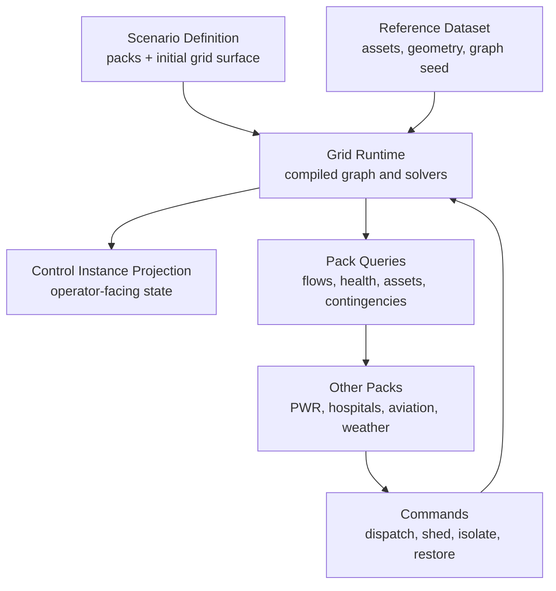

# Electric Grid Pack Reference

!!! note "Status"
    This page is both the research reference and the design record for the initial
    `electric-grid` pack. The current v1 is a credible operational demonstration
    model, not a protection, market-settlement, or grid-planning authority model.

## Implementation Status

**Leitbild guidance.** The first implemented `electric-grid` pack is intentionally
semantic rather than decorative. It ships with a Norway regional grid scenario,
typed grid objects, a local Runtime Hub adapter, a DC-like active-power flow
solver, aggregate frequency dynamics, simple voltage-health indicators, branch
loading, controllable generation/load/branch commands, pack queries, native map
line rendering, and a compact grid monitoring overview panel.

**Implemented v1 scope.**

- `grid_system`, `grid_substation`, `grid_branch`, `grid_generator`,
  `grid_load`, `grid_storage`, and `grid_market_area` object data schemas
- provenance-bearing scenario configuration for configured or defaulted grid
  properties
- Norway demo scenario with substations, corridors, HVDC import, hydro, wind,
  battery storage, hospitals, airport load, industrial load, data-center load,
  and EV charging loads
- local runtime adapter for simulation ticks, command handling, queries, and
  object upsert emissions
- DC-like bus-angle branch-flow approximation for active-power routing and
  overload detection
- aggregate frequency response with reserve, inertia, generator ramping, storage
  response, and under-frequency load shedding
- voltage-health approximation derived from local load, reactive demand,
  generation support, and branch stress
- operator commands for generator dispatch/trip/availability, branch
  open/close/derate, load shed/restore, and EV charging policy
- pack queries for network summary, power-flow snapshot, frequency snapshot,
  voltage-health snapshot, consumer-supply snapshot, and asset search
- native MapLibre branch-line layers plus pack presentation for rail categories
  and object details

**Known v1 boundaries.** The scenario data is authored/configured demonstration
data, not a compiled authoritative national grid dataset. The solver is suitable
for regional/national overview behavior and demonstrations, but it is not a full
AC power-flow solver, relay-coordination model, market-clearing engine, or
security-constrained planning model.

## Credible Real-Data Layout

**Implemented v1.** The `electric-grid` pack contributes a `grid-norway`
reference dataset builder. It now uses a raw Geofabrik/OpenStreetMap Norway
PBF extract as the default geometry backbone instead of relying on public
Overpass query output. The extractor parses OSM nodes, ways, and relations,
normalises power-network features into a Leitbild grid-reference schema,
validates every feature through the shared reference-data pipeline, writes
PMTiles/sidecar/manifest/audit artifacts, and registers MapLibre style layers
for voltage-coloured lines, cables, substations, plants, and generators.

The build path is:

```text
Geofabrik Norway OSM PBF
  -> raw OSM power nodes/ways/relations
  -> exact contiguous line/cable merge by type, voltage, operator, and name
  -> grid reference features with provenance/confidence
  -> reference feature audit
  -> node/branch graph audit
  -> grid-norway.features.geojson
  -> grid-norway.pmtiles
  -> /map/capabilities.json reference tileset
  -> pack-owned map layer toggles
```

Use the shared reference-data scripts:

```bash
bun run reference:build -- --dataset grid-norway
bun run reference:promote -- --dataset grid-norway
```

Optional environment:

```bash
GRID_NORWAY_SOURCE="osm-pbf" # default; set "overpass" only for fallback/debug
GRID_NORWAY_OSM_PBF_PATH="/opt/leitbild/maps/sources/norway-latest.osm.pbf"
GRID_NORWAY_OSM_PBF_URL="https://download.geofabrik.de/europe/norway-latest.osm.pbf"
GRID_NORWAY_OSM_PBF_USER_AGENT="Leitbild/0.1 (https://leitbild.samsinn.app)"
GRID_NORWAY_BBOX="57.5,4.0,71.5,31.5" # Overpass fallback only
GRID_NORWAY_OVERPASS_URL="https://overpass-api.de/api/interpreter"
GRID_NORWAY_OVERPASS_USER_AGENT="Leitbild/0.1 (https://leitbild.samsinn.app)"
```

The raw PBF path is preferred because it is deterministic, does not depend on
public Overpass limits, preserves relation context, and can be rebuilt from the
same OSM snapshot as the base map. `GRID_NORWAY_BBOX` is `south,west,north,east`
and applies only when `GRID_NORWAY_SOURCE="overpass"` is selected for fallback
or debugging.

**What this makes credible.**

- visible line and cable corridors come from a real public map source
- OSM relation geometry is retained for many substations and plants, so the
  map can show real site polygons rather than only point labels
- contiguous OSM way fragments are merged where endpoints and electrical tags
  match, reducing visual fragmentation without inventing topology
- the map overview filters out low-voltage distribution fragments: line,
  cable, transformer, and substation features need at least 66 kV, and small
  generation assets need at least 10 MW unless connected at transmission
  voltage
- voltage, frequency, circuits, operator, names, plant source, and output are
  preserved when OSM tags provide them
- substations and generation sites can be toggled as reference layers
- each feature carries `source`, `externalId`, `propertyProvenance`,
  `confidence`, and raw tags
- a graph audit reports node count, branch count, unresolved endpoints,
  missing voltage tags, and low-confidence geometry

**Important limitations.**

- OSM/OpenInfraMap geometry is open and useful, but completeness and tagging
  quality vary by region
- exact OSM way merging is deliberately conservative and does not yet infer
  missing connectivity across switchgear, substations, or nearby endpoints
- exact utility busbar topology, breaker state, protection settings, dynamic
  ratings, impedances, and secure operating limits are not public and must not
  be invented silently
- the current graph compiler audits topology but does not yet replace the
  hand-authored simulation scenario with imported buses and branches

**Recommended next data-source additions.**

- GeoNorge/NVE transformer-station and generation infrastructure layers for
  authoritative Norwegian asset metadata where available
- Statnett/ENTSO-E time series for demand/generation calibration and operating
  context
- curated Leitbild overlays for scenario-critical substations, interconnectors,
  PWR tie points, hospitals, airports, and industrial loads

## Source Legend

This page intentionally separates three levels of confidence:

- **Verified**: stated by an external source linked in the references.
- **Leitbild guidance**: design advice inferred for Leitbild from the verified material and from the existing pack/runtime architecture.
- **Assumption or gap**: information likely needed for simulation, but not reliably available in the public sources found so far.

## Executive Summary

**Verified.** Electric grids are operated as coupled networks of generation, transmission, distribution, storage, consumers, protection equipment, markets, and control rooms. In Norway, NVE describes the grid as transmission, regional, and distribution levels. Transmission is mainly 300 kV and 420 kV, with some 132 kV; regional grids normally use 132 kV and 66 kV; distribution spans 22 kV down to low-voltage supply around 230 V. Statnett describes the Nordic system as a 50 Hz system where production and consumption must balance continuously, with normal frequency operation in the Nordic power system between 49.90 Hz and 50.10 Hz.

**Leitbild guidance.** The first serious Leitbild grid model should be a semantic electrical graph, not just map polylines. Buses, substations, breakers, transformers, generators, loads, storage, HVDC links, and lines should be typed nodes or branches with electrical properties, operational state, measurements, provenance, confidence, and failure modes.

**Leitbild guidance.** The Goldilocks v1 is a Norway-first regional or national model with:

- first-class geospatial layers for power lines, substations, generators, price areas, hydrology, large loads, and EV charging
- a bus-branch graph derived from authoritative and open data
- DC power-flow for active-power routing and overload detection
- aggregate frequency dynamics for generation-load imbalance, reserves, and load shedding
- simple voltage/reactive indicators at substation or feeder aggregates
- cross-pack energy contracts so PWR, hospitals, airports, factories, EV depots, and other packs can produce or consume grid power

**Assumption or gap.** Public geospatial data can identify many assets and voltage levels, but it will not reliably expose all line impedances, relay settings, substation bus arrangements, dynamic ratings, breaker positions, transformer tap policies, or secure operating limits. Leitbild should model those properties as explicit provenance-bearing fields: observed, derived, configured, defaulted, or unknown.

## System Anatomy

### High-Level Grid Hierarchy

**Verified.** NVE and RME describe the Norwegian network in three main categories: transmission, regional, and local distribution. Statnett is the Norwegian TSO; many network companies own and operate regional and distribution grids.



### Generation

**Verified.** Norway is hydropower-dominant. Statnett notes that hydropower gives producers flexibility to save water for periods when need is greatest, and that aggregated reservoir data is published by NVE. Public European sources such as ENTSO-E, Open Power System Data, and Global Energy Monitor provide generation, load, plant, and time-series data with different geographic and licensing scopes.

**Modeling dimensions.**

- `technology`: hydro reservoir, run-of-river hydro, pumped storage, wind, solar, thermal, nuclear, battery, interconnector import/export
- `capacityMw`: nameplate or dispatchable capacity
- `availableMw`: outage-adjusted or weather-adjusted capacity
- `dispatchMw`: current real-power output
- `reactiveCapabilityMvar`: reactive support range where known
- `rampRateMwPerMinute`: how fast output can change
- `minimumStableMw`: lowest stable generation for thermal/synchronous assets
- `inertiaMwSeconds` or `inertiaConstantSeconds`: contribution to frequency response
- `primaryReserveMw`, `secondaryReserveMw`, `tertiaryReserveMw`
- `fuelOrResourceState`: water reservoir, wind availability, solar irradiance, fuel stock, battery state of charge
- `gridConnectionBusId`: the electrical bus where the unit injects power
- `provenance`: observed source, derived estimate, operator configuration, defaulted, unknown

**Leitbild guidance.** Hydropower should be a first-class model for Norway. A hydro asset is not just a generator; it includes reservoir energy, inflow, environmental constraints, turbine capacity, ramping, and market dispatch. For v1, model hydro as dispatchable generators with reservoir energy and ramp limits. Defer hydraulic cascade optimization until a hydro-focused scenario needs it.

### Transmission Lines, Cables, and HVDC

**Verified.** NVE states that the Norwegian transmission grid is mainly 300 kV or 420 kV, with 132 kV in some areas. OpenStreetMap power tagging uses `power=line`, `power=cable`, `voltage=*`, `frequency=*`, `cables=*`, circuits, and substation-related line tags. OSM and OpenInfraMap can expose power lines, cables, substations, and plants, but their coverage and attributes depend on mapping quality.

**Modeling dimensions for AC branches.**

- endpoints: `fromBusId`, `toBusId`
- geometry: polyline route, length, support/tower metadata where available
- voltage level: nominal line-line voltage in kV
- frequency: normally 50 Hz in Norway and most of Europe
- physical type: overhead line, underground cable, submarine cable, busbar, substation bay
- circuits and phases: one circuit, double circuit, multiple circuits, HVDC pole information
- impedance: resistance `R`, reactance `X`, susceptance `B`, conductance `G`
- thermal ratings: normal, emergency, seasonal, dynamic line rating
- operational state: energized, open, faulted, derated, maintenance, damaged
- flow: real power MW, reactive power Mvar, apparent power MVA, current A, loading percent
- protection: relay zone, breaker ids, trip thresholds, reclosing policy
- environmental exposure: wind, icing, lightning, wildfire, flood, geohazard
- repair model: crew access, expected repair time, spare parts

**Leitbild guidance.** A line must not be represented as a generic link. It is a branch component with physics, limits, state, topology, measurements, protection, and map geometry. This is the same lesson learned from the process-plant piping model: a shallow edge can draw a connection, but it cannot diagnose flow, capacity, valve/isolation state, leaks, failures, or operator consequences.

### Substations and Switchyards

**Verified.** Geonorge object catalog material for NVE network assets includes transformer-station concepts with geometry, voltage in kV, grid level, operator/concessionaire, organization number, name, and commissioning year. OSM power-network guidance maps substations with `power=substation`, roles such as transmission or distribution, voltage tags, transformers, switches, busbars, and generators.

**Key physical components.**

- busbars and bus sections
- circuit breakers and disconnectors
- transformers and autotransformers
- current transformers and voltage transformers
- capacitor banks and reactors
- synchronous condensers or STATCOM/SVC/FACTS devices
- protection relays and control panels
- station service, batteries, communications, and SCADA

**Modeling dimensions.**

- site geometry and boundary polygon
- voltage levels present, e.g. 420/300/132 kV
- bus topology: single bus, double bus, breaker-and-a-half, ring bus, simplified aggregate
- transformer capacities and tap changers
- breaker/switch states
- available reactive support
- station load and auxiliary supply
- damage/outage state
- ownership/operator
- source confidence and security classification

**Leitbild guidance.** V1 should start with an aggregate substation node per voltage level plus transformer branches between voltage levels. Do not try to reconstruct internal busbar/breaker topology from public data unless the data source explicitly provides it. Provide a path to later expand a substation into a detailed internal graph for selected demonstration sites.

### Distribution Feeders

**Verified.** Distribution grids feed end users and range from 22 kV down to low-voltage supply. Distribution modeling often differs from transmission modeling: feeders can be radial, phase-unbalanced, and have lower X/R ratios, so active power can affect voltage more strongly than in high-voltage transmission approximations.

**Leitbild guidance.** Model distribution in v1 as aggregated load zones connected to a distribution substation. Use feeder-level capacity and voltage-quality indicators rather than every LV line. Add radial feeder models later for hospitals, airports, industrial parks, EV depots, or neighborhoods where local voltage and load shedding matter.

### Consumers

**Modeling dimensions.**

- `kind`: residential, commercial, hospital, airport, data center, factory, steel/aluminum smelter, rail traction, port, military, EV charging depot, district heating, water/wastewater
- `criticality`: life-safety, continuity-sensitive, economic, comfort, discretionary
- `demandMw`: current active load
- `reactiveDemandMvar`: reactive load
- `loadShape`: hourly/weekly/seasonal demand curve
- `interruptibility`: shed priority, max curtailment, restoration rules
- `backupPower`: UPS, diesel generators, batteries, islandable microgrid
- `gridConnectionBusId`
- `serviceQuality`: voltage, frequency, interruption history

**Leitbild guidance.** Cross-pack assets should connect through explicit grid service contracts. A hospital pack should not know the grid solver internals; it should declare a critical load profile, backup assets, and consequences if supply is degraded. The grid pack should expose supply quality and accepted load-shed or restoration events.

## Operational Control

### Frequency and Balancing

**Verified.** Statnett describes grid operation as a continuous balance between production and consumption. When load increases, frequency drops; at 50 Hz the Nordic system is in balance. Statnett states the normal Nordic operating range is 49.90 to 50.10 Hz. NERC describes balancing and frequency control, including frequency-responsive reserves, regulating reserves, spinning reserves, supplemental reserves, and replacement reserves. ENTSO-E describes frequency containment, frequency restoration, and replacement reserves in European operation and balancing frameworks.



**Leitbild guidance.** V1 should use an aggregate frequency model per synchronous island, not detailed generator rotor-angle stability. That is enough to demonstrate load-generation imbalance, reserves, under-frequency load shedding, islanding, black start sequences, and cross-pack consequences.

### Voltage and Reactive Control

**Verified.** Power-flow analysis solves bus voltage magnitude, bus voltage angle, active power, and reactive power. Voltage quality describes deviations in magnitude or waveform from ideal values. Reactive power, transformer tap changers, capacitor banks, reactors, and converter controls are central to voltage control.

**Leitbild guidance.** V1 should not attempt full AC power flow everywhere. Use simple voltage health scores derived from local load, transformer loading, reactive margin, and feeder headroom. For selected substations or distribution feeders, add DistFlow or LinDistFlow later.

### Protection and Emergency Control

**Common mechanisms.**

- overcurrent protection
- distance protection
- differential protection
- under-frequency load shedding
- under-voltage load shedding
- generator under/over-frequency and under/over-voltage trips
- transformer overload/temperature protection
- breaker failure protection
- reclosing
- special protection schemes or remedial action schemes

**Leitbild guidance.** Protection should start declarative and coarse: branch overload trips, frequency thresholds, voltage-quality thresholds, and operator-visible relay actions. Detailed relay coordination is a v2 or v3 feature because public data rarely exposes relay settings and because protection logic can dominate scenario behavior.

### Markets and Dispatch

**Verified.** Statnett and Nord Pool describe the Nordic power market as divided into price/bidding areas. Norway has bidding zones NO1 to NO5. ENTSO-E Transparency Platform covers generation, load, transmission, balancing, outages, congestion management, and system-operation datasets. Nord Pool publishes day-ahead and intraday market data; Statnett exposes power-system data and balancing-market information.

**Modeling dimensions.**

- bidding zone
- day-ahead price, intraday price, balancing price
- generation bids and marginal cost
- reserve procurement and activation
- congestion constraints and interconnector flows
- curtailment and redispatch
- consumer demand response

**Leitbild guidance.** V1 should include price-area context and scenario-driven dispatch, not a full market clearing engine. Market clearing becomes valuable when scenarios need economic decisions: hydropower scheduling, industrial curtailment, EV charging price response, or emergency reserve scarcity.

## Physics and Formulas for Leitbild-Scale Simulation

### Three-Phase Power

**Verified.** In a balanced three-phase AC system:

```text
S = sqrt(3) * V_LL * I
P = sqrt(3) * V_LL * I * cos(phi)
Q = sqrt(3) * V_LL * I * sin(phi)
```

Where:

- `S` is apparent power in VA or MVA
- `P` is real power in W or MW
- `Q` is reactive power in var or Mvar
- `V_LL` is line-line voltage
- `I` is current
- `cos(phi)` is power factor

**Leitbild guidance.** These equations are sufficient for capacity checks, line loading, transformer loading, and current estimation when voltage and power factor are known or estimated.

### AC Power Flow

**Verified.** Load-flow or power-flow studies solve steady-state bus voltages, angles, active-power flows, reactive-power flows, and losses from network, load, and generation data. Standard full AC power flow is nonlinear.

For a branch between buses `i` and `j`, the real-power flow depends on voltage magnitudes, angle difference, conductance, and susceptance. Open technical references commonly express the real-power term as:

```text
P_ij = V_i * V_j * (G_ij * cos(theta_i - theta_j) + B_ij * sin(theta_i - theta_j)) - V_i^2 * G_ij
```

**Leitbild guidance.** Full AC power flow should be a future tier or an external solver integration. It is valuable for voltage/reactive behavior, but it adds nonlinear solving, convergence handling, data requirements, and performance complexity.

### DC Power Flow

**Verified.** DC power flow is a linear approximation used for high-voltage AC transmission studies and optimization when voltage magnitudes are near nominal, angle differences are small, resistance is small relative to reactance, and reactive power is ignored.

Simplified branch flow:

```text
P_ij = (theta_i - theta_j) / X_ij
```

Nodal balance:

```text
generation_i - load_i = sum(P_ij for connected branches)
```

Line capacity:

```text
abs(P_ij) <= ratingMw_ij
```

**Leitbild guidance.** DC power flow is the recommended v1 network solver for national and regional overview behavior. It is fast, deterministic, explainable, and sufficient for active-power routing, overloads, N-1 contingency screening, generation loss, interconnector constraints, and load shedding.

### Frequency Dynamics

**Verified.** Frequency response is commonly modeled with swing-equation concepts and droop control. The exact formulas differ by per-unit convention, but the aggregate idea is consistent: imbalance between mechanical/electrical power changes rotational speed/frequency, while damping and primary response oppose the deviation.

Simplified island-level approximation:

```text
df_dt = f0 / (2 * H_total * S_base) * (P_generation - P_load - P_losses - D * (f - f0))
```

Primary droop contribution:

```text
DeltaP_primary = -K_droop * (f - f0)
```

**Leitbild guidance.** Use this as an operational training approximation, not a rotor-stability model. Each synchronous island should maintain:

- nominal frequency
- current frequency
- aggregate inertia
- damping/load-frequency sensitivity
- online primary reserve
- restoration reserve activation state
- under-frequency load-shedding stages

### Distribution Voltage Approximation

**Verified.** Radial distribution systems are often modeled with DistFlow or linearized DistFlow equations. These models account for branch real/reactive flows and voltage drops along radial feeders.

**Leitbild guidance.** V1 should use simple feeder health:

```text
voltageDeviationPu ~= k_load * loadingPercent + k_reactive * reactiveDeficitMvar
```

For v2 selected feeders:

```text
V_j^2 ~= V_i^2 - 2 * (R_ij * P_ij + X_ij * Q_ij)
```

This gives a path to richer EV-depot and hospital-feeder behavior without forcing national-scale AC solving.

### Solver Tiers

**Leitbild guidance.**

| Tier | Capability | Typical use | Risk |
| --- | --- | --- | --- |
| 0 | Static topology and capacity | Map layers, asset inventory, outage visualization | Can look credible while physics is shallow |
| 1 | DC power flow | Transmission flow, overload, N-1, dispatch/load shedding | Weak for voltage/reactive behavior |
| 2 | Aggregate frequency per island | Generator trips, reserves, UFLS, islanding | Does not model rotor-angle stability |
| 3 | Distribution voltage approximation | EV charging, hospitals, critical local loads | Needs feeder calibration |
| 4 | AC power flow for selected regions | Voltage/reactive studies, operator training | Requires richer data and convergence handling |
| 5 | External solver integration | Planning-grade studies | Dependency/runtime boundary must be deliberate |

## Parameters, Measures, and Units

| Quantity | Symbol | Units | Used for |
| --- | --- | --- | --- |
| Voltage | V | V, kV, per-unit | voltage level, voltage quality, power flow |
| Current | I | A, kA | thermal loading, protection |
| Real power | P | W, kW, MW, GW | generation, load, dispatch, line flow |
| Reactive power | Q | var, kvar, Mvar | voltage control, power factor |
| Apparent power | S | VA, kVA, MVA | transformer and line ratings |
| Energy | E | kWh, MWh, GWh, TWh | reservoirs, batteries, consumption, markets |
| Frequency | f | Hz | generation-load balance |
| Phase angle | theta | degrees, radians | power flow |
| Resistance | R | ohm, per-unit | losses, voltage drop |
| Reactance | X | ohm, per-unit | DC power flow, voltage/reactive behavior |
| Susceptance | B | siemens, per-unit | AC power flow, charging |
| Power factor | pf | dimensionless | P/S ratio |
| Inertia constant | H | seconds | frequency dynamics |
| Ramp rate | dP/dt | MW/min | dispatch, reserves |
| Thermal rating | rate | MW, MVA, A | line/transformer limits |
| State of charge | SOC | percent, MWh | batteries, pumped storage |
| Reserve | R | MW | FCR, aFRR, mFRR, contingency response |
| Price | price | NOK/MWh, EUR/MWh | market context |
| Reliability | SAIDI/SAIFI | minutes/customer, interruptions/customer | distribution service quality |

## Public Data Sources

### Norway-First Sources

| Source | Verified content | Access pattern | Leitbild use | Caveats |
| --- | --- | --- | --- | --- |
| NVE grid pages | Norwegian grid hierarchy, voltage levels, network structure | Website, linked map/data pages | Reference facts and documentation | Not a full machine dataset by itself |
| NVE/GeoNorge energy category | NVE datasets covering hydropower, wind, concessions, and infrastructure | Geonorge download APIs, WMS/WFS/Atom depending on dataset | Authoritative Norway geospatial layers | Dataset-specific schema/license review required |
| NVE Nettanlegg product specification | Network assets, grid levels, line/station concepts, operators, voltage fields | SOSI/GML/GeoNorge object specs | Source schema for lines and transformer stations | Public schema does not imply all sensitive operational details are available |
| Geonorge object catalog | Transformer station object attributes such as geometry, voltage, operator, commissioning | Object catalog/API | Schema understanding | Catalog is not the data itself |
| NVE power plant data | Power production and plant information | NVE pages/APIs, GeoNorge where exposed | Hydro, wind, and other generator inventory | Need field-level audit before import |
| Statnett data from the power system | Nordic power flow, balance, import/export, production/consumption, hydrology, frequency context | Download functions and public pages | Scenario calibration and live context | Statnett notes data gaps/delays; not all data is actual measured production |
| Statnett balancing markets | Reserve products and balancing-market information | Public pages/downloads | Reserve and dispatch context | Market details can change; use current docs at implementation time |
| Nord Pool | Day-ahead and intraday market data, bidding areas | Market data/API products | Price-area context and market scenarios | API/licensing terms need review |
| NOBIL | Public EV charging station database for Norway and Sweden, API, real-time product | API key/application, data dumps/test endpoints | EV charging stations and charger capability layers | License/API terms must be checked before bundling |

### International and Open Sources

| Source | Verified content | Access pattern | Leitbild use | Caveats |
| --- | --- | --- | --- | --- |
| ENTSO-E Transparency Platform | Generation, load, transmission, balancing, outages, congestion, system operation | REST API with token registration | European time-series calibration and live context | Requires API access and careful data cleaning |
| OpenStreetMap/OpenInfraMap | Power lines, cables, substations, plants, voltage tags, source tags | OSM extracts, Overpass, OpenInfraMap visual reference | Cross-check geometry and fill data gaps | ODbL obligations; varying completeness |
| Open Power System Data | Curated European power plants, capacities, time series, weather aggregates | CSV/Data Package/JSON metadata | Modeling reference and European demo data | Many packages are older; verify freshness |
| Global Energy Monitor | Global power-plant tracker families integrated into GIPT | Download request/public dataset | Generator inventory beyond Norway | License and thresholds differ by tracker |
| PyPSA-Eur datasets | Open European transmission model data, power plants, demand/time series | Zenodo/GitHub | Benchmark for open-data model assembly | Research model, not official operational truth |
| Open Charge Map | Global EV charging station API | API | International EV charging demos | Crowdsourced/provider-mixed quality |
| European Alternative Fuels Observatory | European charging/fueling infrastructure statistics and data products | Public portal/API depending on endpoint | EV infrastructure reference | API availability and licensing need verification |

## Reference Dataset Plan

**Leitbild guidance.** Build an `electric-grid-norway` reference dataset as pack-owned data using the existing reference-data pipeline pattern:



### Layer Groups

- `grid:transmission-lines`
- `grid:regional-lines`
- `grid:distribution-aggregate`
- `grid:substations`
- `grid:power-plants`
- `grid:hvdc-and-interconnectors`
- `grid:price-areas`
- `grid:large-consumers`
- `grid:ev-charging`
- `grid:outages-and-constraints`

### Canonical Dataset Entities

```text
GridBus
GridBranch
GridSubstation
GridTransformer
GridGenerator
GridLoadZone
GridStorageAsset
GridHvdcLink
GridEvChargingSite
GridMarketArea
GridMeasurementPoint
```

### Provenance Policy

Every imported or derived electrical property should carry:

```text
value
unit
sourceId
sourceUrl
sourceTimestamp
method: observed | converted | inferred | configured | defaulted | unknown
confidence: high | medium | low
```

**Leitbild guidance.** Never silently invent impedances, ratings, breaker topology, or generator limits. If v1 needs estimated values, put them in an explicit profile such as `norway-transmission-defaults.v1` and surface that they are defaults. This prevents the UI from displaying guesses as authority.

### Merge Rules

1. Prefer authoritative Norwegian sources for official asset identity and voltage level.
2. Use OSM/OpenInfraMap geometry to fill public geometry gaps only when license obligations are compatible.
3. Use ENTSO-E and Statnett time series for calibration and live context, not for individual hidden network topology.
4. Use NOBIL for EV charging sites; aggregate charger power and connectors by site.
5. Assign stable Leitbild ids independent of source ids, but keep all source ids in `sourceRefs`.
6. Preserve source geometries separately from solver graph simplification.
7. Keep security-sensitive or absent details as unknown; do not imply precision through defaults.

## Runtime Architecture Plan

### Pack Shape

**Leitbild guidance.**

```text
src/packs/electric-grid/
  pack.ts
  model.ts
  commands.ts
  query.ts
  scenario.ts
  rail.ts
  runtime/
    graph.ts
    dc-power-flow.ts
    frequency-island.ts
    load-shedding.ts
    contingencies.ts
    dispatch.ts
  datasets/
    electric-grid-norway.ts
  ui/
    grid-map-style.ts
    grid-overview-presenter.ts
```

### Canonical State Boundary

**Leitbild guidance.**

- Control Instance projected state should contain operator-facing grid assets and events.
- The pack runtime should own dense solver state: bus angles, branch flows, island membership, frequency, reserves, and internal matrices.
- Pack queries should expose read-only snapshots of solver state to UI, procedures, and AI agents.
- Commands should be validated and queued through the runtime, not applied directly by UI.

### Runtime Data Model



### Commands

- `electric-grid.dispatch-generator`
- `electric-grid.set-generator-availability`
- `electric-grid.set-load-profile`
- `electric-grid.shed-load`
- `electric-grid.restore-load`
- `electric-grid.open-branch`
- `electric-grid.close-branch`
- `electric-grid.derate-branch`
- `electric-grid.clear-derate`
- `electric-grid.set-transformer-tap`
- `electric-grid.set-reactive-device-state`
- `electric-grid.set-ev-charging-policy`
- `electric-grid.evaluate-contingency`
- `electric-grid.start-blackstart-sequence`

### Queries

- `electric-grid.network.summary`
- `electric-grid.asset.get`
- `electric-grid.asset.search`
- `electric-grid.power-flow.snapshot`
- `electric-grid.frequency.snapshot`
- `electric-grid.contingency.evaluate`
- `electric-grid.market.snapshot`
- `electric-grid.ev-charging.snapshot`
- `electric-grid.consumer-supply.snapshot`
- `electric-grid.map-layers.status`

### Cross-Pack Contracts

**Leitbild guidance.**

Use explicit energy service contracts:

```text
GridSupplyContract
  consumerObjectId
  connectionBusId
  nominalVoltageKv
  criticalLoadMw
  interruptibleLoadMw
  backupDurationMinutes
  serviceState

GridGenerationContract
  producerObjectId
  connectionBusId
  maxExportMw
  minExportMw
  rampRateMwPerMinute
  tripState
```

Examples:

- PWR generator exports MW; loss of offsite power becomes a grid-to-plant event.
- Hospital consumes critical and non-critical load; grid pack emits supply degradation, hospital pack starts backup power.
- Airport consumes load and may expose runway/terminal criticality.
- EV charging depots are controllable loads with queueing, charger power, and optional demand response.
- Weather pack can derate overhead lines, reduce solar generation, increase wind generation, or create storm damage.

## Failure and Stress Scenario Catalog

| Scenario | Primary physics | Operator-visible symptoms | Cross-pack consequences |
| --- | --- | --- | --- |
| Large generator trip | frequency drop, reserve activation | frequency deviation, reserve depletion | PWR/industrial trips, load shedding |
| Transmission line outage | topology change, overload redistribution | branch overloads, congestion, price-area stress | hospitals/airports on constrained side degrade |
| Transformer failure | local supply bottleneck | substation alarm, load-zone voltage drop | local consumers shed or transfer |
| Storm/icing event | line derating, forced outages | multiple branch derates, repair backlog | weather-driven cascading outages |
| Dry hydro year | energy scarcity, high prices | reservoir low, import dependence | market-price scenarios, industrial curtailment |
| EV charging peak | local distribution overload | feeder voltage stress, transformer overload | charging queue, depot power limits |
| HVDC interconnector trip | import/export loss | frequency and price-area impact | reserve activation, dispatch changes |
| Voltage collapse precursor | reactive margin exhausted | low-voltage alarms, tap/reactive actions | sensitive loads trip |
| Under-frequency load shedding | imbalance after reserves insufficient | staged shedding events | hospitals use backup, transport disruption |
| Black start | island restoration | energized islands, staged restoration | critical services sequenced |
| Cyber/SCADA degradation | observability/control loss | stale telemetry, command uncertainty | delayed response, manual mode |
| Protection misoperation | unexpected branch/generator trip | unexplained outage cascade | plant/consumer secondary effects |
| Industrial load shock | sudden demand increase/decrease | local congestion/frequency effect | factory processes trip or curtail |
| Solar/wind forecast error | dispatch mismatch | reserve activation, curtailment | market and balancing stress |

## EV Charging

**Verified.** NOBIL is an Enova-owned charging station database operated by the Norwegian EV Association. It is designed to collect and disseminate public charging-station information, exposes an API, has real-time functionality, and contains station and charge-point level information. NOBIL covered thousands of Norwegian stations and tens of thousands of charge points in the public figures found.

**Modeling dimensions.**

- site location and operator
- charger count and connector count
- connector type: Type 2, CCS, CHAdeMO, future MCS for heavy vehicles
- rated power per connector and site-level capacity
- AC or DC
- availability/status when live data is available
- queue and dwell behavior
- vehicle mix: passenger car, bus, truck, ferry, service fleet
- controllability: unmanaged, price-responsive, grid-controlled, depot-scheduled
- grid connection: transformer/substation/feeder

**Leitbild guidance.** For v1, EV charging should be an aggregate controllable load. Passenger-car public charging is useful for map demos. Truck/bus/fleet depots are more useful for grid stress scenarios because they create large, scheduled, geographically concentrated loads.

## UI and Demonstration Requirements

**Leitbild guidance.** The grid pack should support three operator views:

1. **National/regional overview**: price areas, major transmission lines, generation mix, load, frequency, reserves, congested corridors, outages.
2. **Asset detail**: substation, line, generator, load zone, or EV hub with state, capacity, provenance, and trend.
3. **Scenario control**: inject outage, change demand, derate weather-exposed lines, dispatch reserves, shed/restore load, switch live/reference data layers.

The map should show physical grid layers, but the rail and modals should expose operational state. A beautiful map without branch loading, voltage/frequency health, and supply consequences will not help an operator diagnose.

## Implementation Recommendations

### Recommended v1 Scope

**Leitbild guidance.**

- Norway national/regional graph with transmission and major regional assets.
- Reference-data importer for NVE/GeoNorge, OSM/OpenInfraMap cross-checks, Statnett/ENTSO-E time-series calibration, and NOBIL EV chargers.
- Pack-owned PMTiles and sidecar GeoJSON layers.
- Compiled bus-branch graph with provenance-bearing electrical properties.
- DC power-flow solver in TypeScript.
- Aggregate synchronous-island frequency solver.
- Reserve and load-shedding policy model.
- Cross-pack supply/generation contracts.
- Map/rail UI for grid overview and scenario controls.
- Scenario set: generator trip, line outage, storm derating, EV charging peak, hospital critical-load shedding, PWR loss-of-offsite-power.

### Defer from v1

- full AC power flow everywhere
- relay coordination and detailed substation busbar topology
- market clearing engine
- detailed distribution LV networks
- protection-grade transient stability
- confidential/utility-only asset data
- automatic import of unverified values as authoritative solver parameters

### Why Node-Edge Is Necessary but Not Sufficient

**Leitbild guidance.** A graph is the right base abstraction, but generic edges are too weak. In the grid pack:

- a line edge carries impedance, capacity, loading, voltage, losses, protection, damage, weather exposure, and geometry
- a transformer edge changes voltage level and may have tap/thermal limits
- an HVDC edge is controlled active-power transfer, not normal AC admittance
- a switch edge changes topology and may carry no normal impedance
- a consumer edge models service quality and interruptibility

This mirrors the process-plant evolution from shallow pipes to semantically rich links. The cost of richer branches is worth paying early because every serious scenario asks branch questions: how much power is flowing, what happens if it trips, what rating is exceeded, what protection opens, what can be restored, and who is affected.

## Open Decisions

1. **Dataset licensing.** Which NVE/GeoNorge datasets can be redistributed in production artifacts, and under what attribution/licence text?
2. **OSM/ODbL boundary.** If OSM/OpenInfraMap data is merged, how do we satisfy ODbL share-alike obligations and source attribution?
3. **Solver defaults.** Which default impedance/rating tables are acceptable for demonstrations when public data lacks values?
4. **Granularity.** Should v1 include only transmission/regional grids, or selected distribution feeders for high-value demo sites?
5. **External solver path.** Should Leitbild eventually call an external engine such as pandapower, PyPSA, PowSyBl, OpenDSS, or GridCal, or keep the operational simulator fully TypeScript?
6. **Security posture.** What grid detail should never be displayed publicly in demos, even if available from public sources?
7. **Market depth.** Do we need economic dispatch in v1, or only scenario-set dispatch and live price context?

## References

- NVE, "Nett" (Norwegian grid hierarchy and voltage levels): <https://www.nve.no/energi/energisystem/nett/>
- NVE/RME, "Network regulation" (network structure and operators): <https://www.nve.no/norwegian-energy-regulatory-authority/network-regulation/>
- NVE/RME, "Quality of electricity supply": <https://www.nve.no/norwegian-energy-regulatory-authority/network-regulation/quality-of-electricity-supply/>
- Geonorge, "Energi" dataset category: <https://www.geonorge.no/kartdata/datasett-i-geonorge/energi2/>
- Geonorge, developer and download APIs: <https://www.geonorge.no/en/for-developers/> and <https://www.geonorge.no/aktuelt/om-geonorge/slik-bruker-du-geonorge/laste-ned-data/>
- Geonorge object catalog, transformer station object: <https://objektkatalog.geonorge.no/Objekttype/Index/EAID_2D06E9D3_708D_49a9_B4BC_436CE371550B>
- NVE Nettanlegg product specification: <https://register.geonorge.no/data/documents/Produktspesifikasjoner_nettanlegg_v1_produktspesifikasjon-nve-nettanlegg-1_0_.pdf>
- Statnett, "Data from the power system": <https://www.statnett.no/en/for-stakeholders-in-the-power-industry/data-from-the-power-system/>
- Statnett, "The power system": <https://www.statnett.no/en/about-statnett/The-power-system/>
- Statnett, "Do you need data?": <https://www.statnett.no/en/career/for-students-and-apprentices/do-you-need-data/>
- Statnett, "When grid companies and direct customers are going to connect to the power grid": <https://www.statnett.no/en/for-stakeholders-in-the-power-industry/the-grid-connection-process/how-to-get-increased-capacity-for-grid-operators/>
- Statnett, Summary of System Development Plan 2025: <https://www.statnett.no/globalassets/for-aktorer-i-kraftsystemet/planer-og-analyser/sup/summary-of-system-development-plan-2025.pdf>
- ENTSO-E Transparency Platform: <https://www.entsoe.eu/data/transparency-platform/>
- ENTSO-E Transparency Platform API guide: <https://transparency.entsoe.eu/content/static_content/Static%20content/web%20api/Guide.html>
- ENTSO-E Frequency Containment Reserves: <https://www.entsoe.eu/major-projects/network-code-implementation/electricity-balancing/Pages/fcr.aspx>
- ENTSO-E System Operations: <https://www.entsoe.eu/network_codes/sys-ops/>
- NERC, "Balancing and Frequency Control": <https://www.nerc.com/comm/RSTC_Reliability_Guidelines/Reference_Document_NERC_Balancing_and_Frequency_Control.pdf>
- Nord Pool, day-ahead support: <https://www.nordpoolgroup.com/en/support/day-ahead/>
- Nord Pool data API definition: <https://data-api.nordpoolgroup.com/index.html>
- OpenStreetMap power network guidance: <https://wiki.openstreetmap.org/wiki/Power_networks>
- OpenStreetMap voltage tagging: <https://wiki.openstreetmap.org/wiki/Key%3Avoltage>
- OpenStreetMap line/circuit guidance: <https://wiki.openstreetmap.org/wiki/Power_networks/Guidelines/Power_lines> and <https://wiki.openstreetmap.org/wiki/Tag%3Apower%3Dcircuit>
- OpenInfraMap: <https://openinframap.org/>
- Open Power System Data platform: <https://open-power-system-data.org/> and <https://data.open-power-system-data.org/>
- Global Energy Monitor, Global Integrated Power Tracker: <https://globalenergymonitor.org/projects/global-integrated-power-tracker>
- NOBIL information: <https://info.nobil.no/om>
- NOBIL contents and real-time information: <https://info.nobil.no/innhold> and <https://info.nobil.no/sanntid>
- NOBIL API documentation v3: <https://info.nobil.no/images/API-dokumentasjon/API_NOBIL_Documentation_v3_20240603.pdf>
- Open Charge Map API: <https://openchargemap.org/site/develop/api>
- Open Electrical, "Power Flow": <https://openelectrical.org/index.php?title=Power_Flow>
- IntechOpen, "Power Flow Analysis": <https://www.intechopen.com/chapters/65445>
- PowNet documentation, "Linearized DC power flow": <https://pownet.readthedocs.io/en/latest/technical/linear_power_flow.html>
- LinDistFlow documentation: <https://nlaws.github.io/LinDistFlow/dev/math/>
- PyPSA-Eur paper and data context: <https://arxiv.org/abs/1806.01613>
