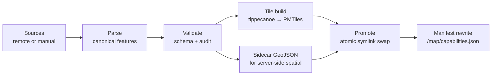

# Reference Data

!!! note "Status"
    Skeleton. Establishes the structure agreed in ADR 0019 / 0020 / 0021. Sections are completed in Phase A.7 once the implementation lands.

Reference data is everything geospatial in Leitbild that is **not canonical operational truth**: slow-moving, externally-sourced, contextual, vector-renderable, read-only at runtime, and licensed. Airspace polygons, airport points, hospital locations, road restrictions, marine zones, and hand-authored scenario overlays all fit this shape.

This page describes the generic abstraction. For the concrete first dataset, see [[domains/airspace|Airspace]].

## Why reference data is its own thing

Leitbild already has two distinct sources of map content:

- The **base map** (OpenStreetMap PMTiles via Planetiler) — wide-area geographic context.
- **Operational truth** owned by simulation providers (ambulances, weather cells, traffic conditions, process plants).

Reference data sits between them. It is more domain-specific than the base map but slower and less owned than operational truth. Hard-coding it into packs would couple unrelated domains; treating it as operational truth would corrupt the canonical state model. Map Context Layers, declared in the Map Capability Manifest, are the right home.

## Pipeline (five stages, one runner)

Each dataset is built by one function call and promoted by another. Both live in `src/core/reference-data/pipeline.ts`. The CLI invokes them.

## Artifacts

For each dataset, the build produces two files served from atomically-swapped release directories:

- `<dataset-id>.pmtiles` — vector tiles for the browser, served by Caddy under `/map/datasets/<id>/current.pmtiles`.
- `<dataset-id>.features.geojson` — sidecar full-fidelity feature collection for the server-side spatial index. Not served to the browser. See ADR 0021.

## Discovery

Reference datasets are advertised through `/map/capabilities.json` alongside the OSM base map. UI surfaces, simulation providers, and AI agents discover layers, fields, and licences from the manifest. No hard-coded layer assumptions in consumers.

## Consumption surfaces

- **UI rendering**: a manifest-driven layer factory creates MapLibre fill/line/symbol layers from per-dataset style modules. Hover cards reuse the existing object hover-card overlay manager. Attribution is composed from per-licence entries in the manifest.
- **Server-side spatial queries**: a lazy-loaded in-process index over the sidecar GeoJSON, exposing `featuresContainingPoint(point, opts)`. Called from interaction handlers and pack-query code paths. See ADR 0021.

## Adding a new dataset

Three files, plus one entry in the registry. No infrastructure code.

1. A `DatasetConfig` in `src/core/reference-data/datasets/<id>.ts`.
2. A style module in `src/ui/map/dataset-styles/<id>.ts`.
3. A source module in `src/core/reference-data/sources/<source-id>.ts` if a new fetch/parse shape is needed; otherwise reuse `geonorge-wfs.ts`, `openaip.ts`, or `manual.ts`.
4. A registration line in `src/core/reference-data/registry.ts`.

Packs opt into a dataset by adding its id to their `referenceDatasetRefs` array on the pack config.

The procedure is finalised in Phase A.7 with worked examples.

## Licensing

Every dataset declares its licences in the manifest. The UI attribution control composes one line per licence, deduplicated across datasets. There is no enforcement infrastructure — licence compliance is a policy obligation the team follows, not a build gate.

The currently used licences are documented per-dataset:

- **OpenAIP airspaces**: CC BY-NC-SA 4.0 — non-commercial, share-alike, attribution required.
- **GeoNorge / Avinor airport points**: NLOD 2.0 — attribution required, fully open.
- **Hand-authored overlays**: repo-owned.

A future commercial Leitbild deployment must swap the OpenAIP source for a paid licensed equivalent. The data layer is pluggable so the swap is a config change, not a code change.

## Cadence

- OpenAIP regenerates weekly (Thursday 03:00 UTC), aligned with the 28-day AIRAC cycle.
- GeoNorge updates per its publishing cycle.
- Our pull runs weekly on Thursday 03:30 UTC with conditional GET; per-source no-ops are cheap.
- Manual overlays change on commit.

## Operational runbook

Build, promote, rollback, and status commands are documented in `docs/reference-data-pipeline.md` in the application repo. This page links to that runbook rather than duplicating it.

## Related

- [[domains/airspace|Airspace (the first dataset)]]
- ADRs **0019** (pipeline), **0020** (OpenAIP and GeoNorge sources), **0021** (sidecar GeoJSON) in the application repo.
- [[concepts|Concepts]] — broader Leitbild architecture context.
- [[design-guides|Design guides]] — Leitbild design constraints (one HTTP server, vector-only base map, validate at trust boundaries).
