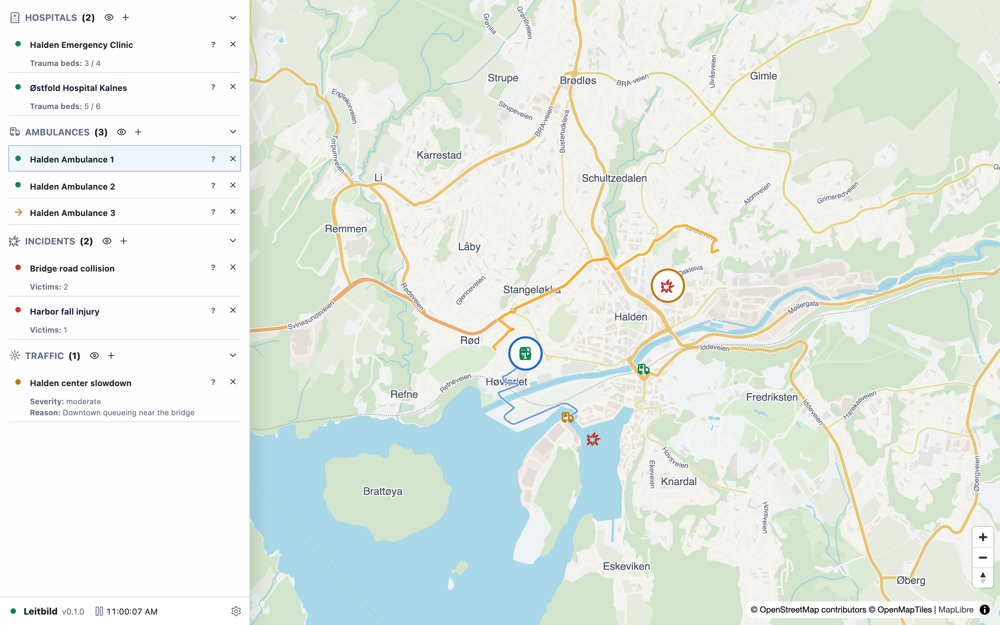

# Halden ambulance response

A compact Halden scenario for checking scenario switching, routed traffic, hospital capacity, and dispatch basics.



## Run It

Open [https://leitbild.samsinn.app/i/halden](https://leitbild.samsinn.app/i/halden) to create a new run. Existing runs can be opened from the scenario picker.

## Scenario Shape

- Scenario id: `halden`
- Packs: `ambulance`, `traffic`, `weather`
- Map center: `11.387, 59.1248`
- Starting objects: 2 hospital, 3 ambulance, 2 incident, 1 weather condition, 1 traffic condition

## Source Of Truth

This page is generated from `src/scenarios/halden.scenario.json` in the Leitbild application repository. Run `bun run sync:leitbild` in this wiki repository after scenario source changes.

## Scenario JSON

```json
{
  "id": "halden",
  "schemaVersion": 1,
  "title": "Halden ambulance response",
  "description": "A compact Halden scenario for checking scenario switching, routed traffic, hospital capacity, and dispatch basics.",
  "packs": ["ambulance", "traffic", "weather"],
  "providerOverrides": {},
  "world": {
    "startsAt": "2026-01-01T10:00:00.000Z",
    "mapCenter": [11.3870, 59.1248],
    "environment": {
      "city": "Halden",
      "mode": "scenario-check"
    }
  },
  "objects": [
    {
      "pack": "ambulance",
      "type": "hospital",
      "id": "facility:halden-hospital",
      "label": "Halden Emergency Clinic",
      "position": [11.3761113, 59.1294303],
      "traumaBeds": { "total": 4, "available": 3 }
    },
    {
      "pack": "ambulance",
      "type": "hospital",
      "id": "facility:kalnes",
      "label": "Østfold Hospital Kalnes",
      "position": [11.0328, 59.3197],
      "traumaBeds": { "total": 6, "available": 5 }
    },
    {
      "pack": "ambulance",
      "type": "ambulance",
      "id": "amb:halden-1",
      "label": "Halden Ambulance 1",
      "atObject": "facility:halden-hospital",
      "equipment": ["defibrillator", "ventilator"]
    },
    {
      "pack": "ambulance",
      "type": "ambulance",
      "id": "amb:halden-2",
      "label": "Halden Ambulance 2",
      "position": [11.3893, 59.1212],
      "equipment": ["defibrillator"]
    },
    {
      "pack": "ambulance",
      "type": "ambulance",
      "id": "amb:halden-3",
      "label": "Halden Ambulance 3",
      "position": [11.3796, 59.1178],
      "equipment": ["stretcher", "oxygen"],
      "patientsOnBoard": 1,
      "targetId": "facility:halden-hospital",
      "status": "transporting"
    },
    {
      "pack": "ambulance",
      "type": "incident",
      "id": "incident:halden-harbor",
      "label": "Harbor fall injury",
      "position": [11.3775431, 59.1183212],
      "triage": "yellow",
      "victims": { "state": "estimated", "count": 1 }
    },
    {
      "pack": "ambulance",
      "type": "incident",
      "id": "incident:halden-bridge",
      "label": "Bridge road collision",
      "position": [11.3923, 59.1265],
      "triage": "red",
      "victims": { "state": "confirmed", "count": 2 }
    },
    {
      "pack": "weather",
      "type": "weather_condition",
      "id": "weather:halden-coastal-showers",
      "label": "Cool coastal showers",
      "truthResolution": 8,
      "showAffectedCells": true,
      "priority": 5,
      "summary": "Cool humid weather with intermittent light rain over central Halden",
      "atmosphere": {
        "airTemperatureC": 5,
        "humidity": 0.86,
        "windSpeedMps": 5.2,
        "windDirectionDeg": 210,
        "visibilityM": 9000,
        "cloudCover": 0.82,
        "precipitation": { "type": "rain", "intensityMmPerHour": 0.6 }
      },
      "surface": {
        "groundTemperatureC": 4.5,
        "wetness": 0.28,
        "standingWater": 0.05,
        "snow": 0,
        "ice": 0,
        "frost": 0
      },
      "keyframes": [
        {
          "atSeconds": 0,
          "center": [11.3820, 59.1244],
          "semiMajorAxisM": 3600,
          "semiMinorAxisM": 1350,
          "rotationDeg": 102,
          "falloffCurve": [{ "x": 0, "y": 1 }, { "x": 0.7, "y": 0.8 }, { "x": 1, "y": 0 }]
        },
        {
          "atSeconds": 360,
          "center": [11.4060, 59.1285],
          "semiMajorAxisM": 4300,
          "semiMinorAxisM": 1600,
          "rotationDeg": 116,
          "atmosphere": {
            "precipitation": { "type": "rain", "intensityMmPerHour": 0.9 },
            "visibilityM": 7600
          },
          "surface": {
            "wetness": 0.38,
            "standingWater": 0.07
          },
          "falloffCurve": [{ "x": 0, "y": 1 }, { "x": 0.7, "y": 0.8 }, { "x": 1, "y": 0 }]
        }
      ]
    },
    {
      "pack": "traffic",
      "type": "traffic_condition",
      "id": "traffic:halden-center-slowdown",
      "label": "Halden center slowdown",
      "geometryMode": "road_segment",
      "from": [11.3705, 59.1223],
      "to": [11.3984, 59.1289],
      "condition": "slowdown",
      "severity": "moderate",
      "speedFactor": 0.65,
      "reason": "Downtown queueing near the bridge"
    }
  ],
  "initialContexts": [],
  "providerConfigs": {
    "ambulance": {},
    "traffic": {},
    "weather": {}
  },
  "surface": {
    "schemaVersion": 1,
    "regions": [
      {
        "id": "main-map",
        "primitive": "map",
        "visible": true,
        "config": {
          "center": [11.3870, 59.1248],
          "zoom": 13,
          "layers": ["objects", "routes", "weather", "traffic", "highlights"]
        }
      },
      {
        "id": "left-rail",
        "primitive": "objectRail",
        "visible": true,
        "config": {
          "width": 360,
          "sections": [
            { "categoryId": "hospitals", "visible": true, "collapsed": false, "visibleFields": ["trauma-beds"] },
            { "categoryId": "ambulances", "visible": true, "collapsed": false, "visibleFields": [] },
            { "categoryId": "incidents", "visible": true, "collapsed": false, "visibleFields": ["victims"] },
            { "categoryId": "weather", "visible": true, "collapsed": false, "visibleFields": ["air-temperature", "precipitation", "surface"] },
            { "categoryId": "traffic", "visible": true, "collapsed": false, "visibleFields": ["severity", "reason"] }
          ]
        }
      },
      { "id": "system-footer", "primitive": "systemFooter", "visible": true, "config": {} },
      { "id": "guidance-overlay", "primitive": "guidanceOverlay", "visible": true, "config": {} }
    ]
  },
  "script": {
    "steps": [
      {
        "id": "scenario-started",
        "at": { "kind": "after_scenario_start", "seconds": 0 },
        "actions": [
          {
            "type": "show_guidance",
            "guidance": {
              "id": "halden-welcome",
              "title": "Halden scenario",
              "message": "This scenario proves that Leitbild can assemble a different city surface from the scenario definition. To dispatch, select an ambulance in the rail or on the map, then click an incident or hospital target. A left-pointing arrow means outbound to an incident; a right-pointing arrow means inbound to a hospital. Dispatch enough ambulance capacity to cover the victims. Use the eye icons in the rail to show details such as victims, beds, traffic severity, and route information.",
              "objectIds": ["amb:halden-1", "incident:halden-bridge", "traffic:halden-center-slowdown"],
              "dismissible": true
            }
          },
          {
            "type": "highlight_objects",
            "objectIds": ["amb:halden-1", "incident:halden-bridge", "traffic:halden-center-slowdown"]
          }
        ]
      },
      {
        "id": "harbor-victim-clarified",
        "at": { "kind": "after_scenario_start", "seconds": 45 },
        "actions": [
          {
            "type": "update_object",
            "objectId": "incident:halden-harbor",
            "operation": {
              "pack": "ambulance",
              "type": "set_incident_victims",
              "victims": { "state": "confirmed", "count": 2 }
            }
          },
          {
            "type": "show_guidance",
            "guidance": {
              "id": "halden-harbor-update",
              "title": "Harbor incident updated",
              "tone": "update",
              "message": "Harbor responders now report two confirmed victims. Check whether the currently assigned resources are still enough.",
              "objectIds": ["incident:halden-harbor"],
              "dismissible": true
            }
          },
          {
            "type": "highlight_objects",
            "objectIds": ["incident:halden-harbor"]
          }
        ]
      },
      {
        "id": "south-queue-started",
        "at": { "kind": "after_scenario_start", "seconds": 90 },
        "actions": [
          {
            "type": "create_object",
            "object": {
              "pack": "traffic",
              "type": "traffic_condition",
              "id": "traffic:halden-south-queue",
              "label": "South bridge queue",
              "geometryMode": "road_segment",
              "from": [11.3773, 59.1157],
              "to": [11.3914, 59.1204],
              "condition": "congestion",
              "severity": "high",
              "speedFactor": 0.42,
              "reason": "Queue forming after southbound bridge approach"
            }
          },
          {
            "type": "highlight_objects",
            "objectIds": ["traffic:halden-south-queue"]
          }
        ]
      },
      {
        "id": "fortress-incident-created",
        "at": { "kind": "after_scenario_start", "seconds": 120 },
        "actions": [
          {
            "type": "create_object",
            "object": {
              "pack": "ambulance",
              "type": "incident",
              "id": "incident:halden-fortress",
              "label": "Fortress stair fall",
              "position": [11.3992, 59.1194],
              "triage": "yellow",
              "victims": { "state": "unknown" }
            }
          },
          {
            "type": "show_guidance",
            "guidance": {
              "id": "halden-new-incident",
              "title": "New incident",
              "message": "A new fall injury has been reported near the fortress. Victim count is initially unknown; keep monitoring for an update.",
              "objectIds": ["incident:halden-fortress"],
              "dismissible": true
            }
          },
          {
            "type": "highlight_objects",
            "objectIds": ["incident:halden-fortress"]
          }
        ]
      },
      {
        "id": "fortress-victims-clarified",
        "at": { "kind": "after_scenario_start", "seconds": 165 },
        "actions": [
          {
            "type": "update_object",
            "objectId": "incident:halden-fortress",
            "operation": {
              "pack": "ambulance",
              "type": "set_incident_victims",
              "victims": { "state": "estimated", "count": 2 }
            }
          }
        ]
      },
      {
        "id": "center-slowdown-cleared",
        "at": { "kind": "after_scenario_start", "seconds": 240 },
        "actions": [
          {
            "type": "delete_object",
            "objectId": "traffic:halden-center-slowdown"
          },
          {
            "type": "clear_highlights",
            "objectIds": ["traffic:halden-center-slowdown", "traffic:halden-south-queue", "incident:halden-harbor", "incident:halden-fortress"]
          }
        ]
      }
    ]
  }
}
```
