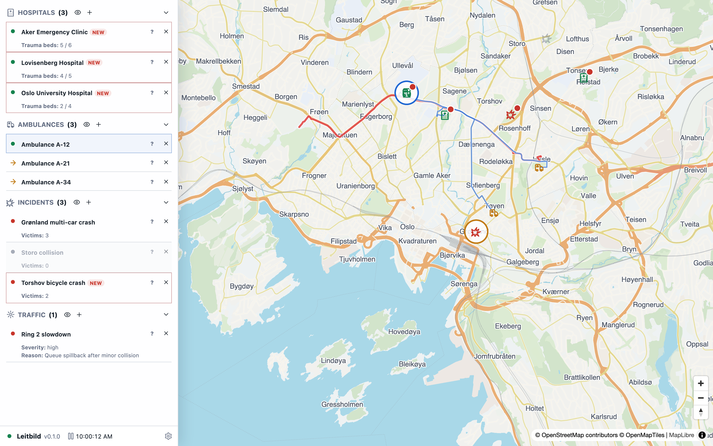

# Oslo ambulance tutorial

A timed Oslo ambulance dispatch scenario with existing transports, unresolved incidents, traffic conditions, and tutorial guidance.



## Run It

Open [https://leitbild.samsinn.app/i/oslo-ambulance](https://leitbild.samsinn.app/i/oslo-ambulance) to create a new run. Existing runs can be opened from the scenario picker.

## Scenario Shape

- Scenario id: `oslo-ambulance`
- Packs: `ambulance`, `traffic`
- Map center: `10.7522, 59.9139`
- Starting objects: 3 hospital, 3 ambulance, 3 incident, 1 traffic condition

## Source Of Truth

This page is generated from `src/scenarios/oslo-ambulance.scenario.json` in the Leitbild application repository. Run `bun run sync:leitbild` in this wiki repository after scenario source changes.

## Scenario JSON

```json
{
  "id": "oslo-ambulance",
  "schemaVersion": 1,
  "title": "Oslo ambulance tutorial",
  "description": "A timed Oslo ambulance dispatch scenario with existing transports, unresolved incidents, traffic conditions, and tutorial guidance.",
  "packs": ["ambulance", "traffic"],
  "providerOverrides": {},
  "world": {
    "startsAt": "2026-01-01T09:00:00.000Z",
    "mapCenter": [10.7522, 59.9139],
    "environment": {
      "city": "Oslo",
      "mode": "tutorial"
    }
  },
  "objects": [
    {
      "pack": "ambulance",
      "type": "hospital",
      "id": "facility:ous",
      "label": "Oslo University Hospital",
      "position": [10.7387, 59.9365],
      "traumaBeds": { "total": 4, "available": 2 }
    },
    {
      "pack": "ambulance",
      "type": "hospital",
      "id": "facility:lovisenberg",
      "label": "Lovisenberg Hospital",
      "position": [10.7519, 59.9326],
      "traumaBeds": { "total": 5, "available": 4 }
    },
    {
      "pack": "ambulance",
      "type": "hospital",
      "id": "facility:aker",
      "label": "Aker Emergency Clinic",
      "position": [10.8001, 59.9391],
      "traumaBeds": { "total": 6, "available": 5 }
    },
    {
      "pack": "ambulance",
      "type": "ambulance",
      "id": "amb:a12",
      "label": "Ambulance A-12",
      "atObject": "facility:ous",
      "equipment": ["defibrillator", "ventilator"]
    },
    {
      "pack": "ambulance",
      "type": "ambulance",
      "id": "amb:a21",
      "label": "Ambulance A-21",
      "position": [10.7707, 59.9146],
      "equipment": ["defibrillator"],
      "patientsOnBoard": 1,
      "targetId": "facility:ous",
      "status": "transporting"
    },
    {
      "pack": "ambulance",
      "type": "ambulance",
      "id": "amb:a34",
      "label": "Ambulance A-34",
      "position": [10.7828, 59.9237],
      "equipment": ["defibrillator"],
      "patientsOnBoard": 1,
      "targetId": "facility:lovisenberg",
      "status": "transporting"
    },
    {
      "pack": "ambulance",
      "type": "incident",
      "id": "incident:storo-cleared",
      "label": "Storo collision",
      "position": [10.7874, 59.9460],
      "triage": "yellow",
      "victims": { "state": "confirmed", "count": 0 },
      "status": "resolved"
    },
    {
      "pack": "ambulance",
      "type": "incident",
      "id": "incident:torshov-partial",
      "label": "Torshov bicycle crash",
      "position": [10.7750, 59.9328],
      "triage": "yellow",
      "victims": { "state": "unknown" }
    },
    {
      "pack": "ambulance",
      "type": "incident",
      "id": "incident:gronland-unattended",
      "label": "Grønland multi-car crash",
      "position": [10.7628, 59.9124],
      "triage": "red",
      "victims": { "state": "confirmed", "count": 3 }
    },
    {
      "pack": "traffic",
      "type": "traffic_condition",
      "id": "traffic:ring2-slowdown",
      "label": "Ring 2 slowdown",
      "geometryMode": "road_segment",
      "from": [10.7019, 59.9294],
      "to": [10.7854, 59.9253],
      "condition": "slowdown",
      "severity": "high",
      "speedFactor": 0.45,
      "reason": "Queue spillback after minor collision"
    }
  ],
  "initialContexts": [],
  "providerConfigs": {
    "ambulance": {},
    "traffic": {}
  },
  "surface": {
    "schemaVersion": 1,
    "regions": [
      {
        "id": "main-map",
        "primitive": "map",
        "visible": true,
        "config": {
          "center": [10.7522, 59.9139],
          "zoom": 12,
          "layers": ["objects", "routes", "traffic", "highlights"]
        }
      },
      {
        "id": "left-rail",
        "primitive": "objectRail",
        "visible": true,
        "config": {
          "width": 360,
          "sections": [
            {
              "categoryId": "hospitals",
              "visible": true,
              "collapsed": false,
              "visibleFields": ["trauma-beds"]
            },
            {
              "categoryId": "ambulances",
              "visible": true,
              "collapsed": false,
              "visibleFields": []
            },
            {
              "categoryId": "incidents",
              "visible": true,
              "collapsed": false,
              "visibleFields": ["victims"]
            },
            {
              "categoryId": "traffic",
              "visible": true,
              "collapsed": false,
              "visibleFields": ["severity", "reason"]
            }
          ]
        }
      },
      {
        "id": "system-footer",
        "primitive": "systemFooter",
        "visible": true,
        "config": {}
      },
      {
        "id": "guidance-overlay",
        "primitive": "guidanceOverlay",
        "visible": true,
        "config": {}
      }
    ]
  },
  "script": {
    "steps": [
      {
        "id": "scenario-started",
        "at": { "kind": "after_scenario_start", "seconds": 0 },
        "actions": [
          {
            "type": "show_guidance",
            "guidance": {
              "id": "welcome",
              "title": "Dispatch overview",
              "message": "Oslo is already active: one incident is resolved, one is partly handled, one red incident is unattended, and Ring 2 is slow. To dispatch, select an available ambulance in the rail or on the map, then click an incident or hospital target. A left-pointing arrow means outbound to an incident; a right-pointing arrow means inbound to a hospital. Dispatch enough ambulance capacity to cover the victims. Use the eye icons in the rail to show details such as victims, beds, traffic severity, and route information.",
              "objectIds": ["amb:a12", "incident:gronland-unattended", "traffic:ring2-slowdown"],
              "dismissible": true
            }
          },
          {
            "type": "highlight_objects",
            "objectIds": ["amb:a12", "incident:gronland-unattended", "traffic:ring2-slowdown"]
          }
        ]
      },
      {
        "id": "partial-incident-clarified",
        "at": { "kind": "after_scenario_start", "seconds": 45 },
        "actions": [
          {
            "type": "update_object",
            "objectId": "incident:torshov-partial",
            "operation": {
              "pack": "ambulance",
              "type": "set_incident_victims",
              "victims": { "state": "estimated", "count": 1 }
            }
          },
          {
            "type": "show_guidance",
            "guidance": {
              "id": "partial-clarified",
              "title": "New incident information",
              "tone": "update",
              "message": "Radio update: the Torshov bicycle crash has one remaining patient after the first ambulance departed with another patient.",
              "objectIds": ["incident:torshov-partial"],
              "dismissible": true
            }
          },
          {
            "type": "highlight_objects",
            "objectIds": ["incident:torshov-partial"]
          }
        ]
      },
      {
        "id": "marienlyst-traffic-created",
        "at": { "kind": "after_scenario_start", "seconds": 90 },
        "actions": [
          {
            "type": "create_object",
            "object": {
              "pack": "traffic",
              "type": "traffic_condition",
              "id": "traffic:marienlyst-event",
              "label": "Marienlyst area slowdown",
              "geometryMode": "area",
              "polygon": [
                [10.7235, 59.9338],
                [10.7394, 59.9340],
                [10.7420, 59.9252],
                [10.7250, 59.9244],
                [10.7235, 59.9338]
              ],
              "condition": "congestion",
              "severity": "moderate",
              "speedFactor": 0.65,
              "reason": "Event crowding around Marienlyst"
            }
          },
          {
            "type": "show_guidance",
            "guidance": {
              "id": "marienlyst-traffic-created",
              "title": "Traffic provider update",
              "tone": "update",
              "message": "A traffic area has been added by the traffic pack. Watch for route impacts when ambulances cross affected areas.",
              "objectIds": ["traffic:marienlyst-event"],
              "dismissible": true
            }
          },
          {
            "type": "highlight_objects",
            "objectIds": ["traffic:marienlyst-event"]
          }
        ]
      },
      {
        "id": "majorstuen-created",
        "at": { "kind": "after_scenario_start", "seconds": 120 },
        "actions": [
          {
            "type": "create_object",
            "object": {
              "pack": "ambulance",
              "type": "incident",
              "id": "incident:majorstuen-tram",
              "label": "Majorstuen tram stop fall",
              "position": [10.7146, 59.9292],
              "triage": "yellow",
              "victims": { "state": "unknown" }
            }
          },
          {
            "type": "show_guidance",
            "guidance": {
              "id": "majorstuen-created",
              "title": "New incident",
              "message": "A fall at Majorstuen tram stop has been reported. Victim count is unknown; dispatch decisions may need to account for uncertainty.",
              "objectIds": ["incident:majorstuen-tram"],
              "dismissible": true
            }
          },
          {
            "type": "highlight_objects",
            "objectIds": ["incident:majorstuen-tram"]
          }
        ]
      },
      {
        "id": "majorstuen-clarified",
        "at": { "kind": "after_scenario_start", "seconds": 165 },
        "actions": [
          {
            "type": "update_object",
            "objectId": "incident:majorstuen-tram",
            "operation": {
              "pack": "ambulance",
              "type": "set_incident_victims",
              "victims": { "state": "estimated", "count": 2 }
            }
          },
          {
            "type": "show_guidance",
            "guidance": {
              "id": "majorstuen-clarified",
              "title": "Victim count updated",
              "tone": "update",
              "message": "Bystander report now estimates two patients at Majorstuen. Watch how the incident status changes as resources are assigned.",
              "objectIds": ["incident:majorstuen-tram"],
              "dismissible": true
            }
          }
        ]
      },
      {
        "id": "ring2-traffic-cleared",
        "at": { "kind": "after_scenario_start", "seconds": 240 },
        "actions": [
          {
            "type": "delete_object",
            "objectId": "traffic:ring2-slowdown"
          },
          {
            "type": "show_guidance",
            "guidance": {
              "id": "ring2-traffic-cleared",
              "title": "Traffic cleared",
              "tone": "update",
              "message": "The original Ring 2 slowdown has cleared. Traffic conditions can disappear while incidents continue.",
              "objectIds": ["traffic:marienlyst-event"],
              "dismissible": true
            }
          }
        ]
      },
      {
        "id": "ring-three-created",
        "at": { "kind": "after_scenario_start", "seconds": 300 },
        "actions": [
          {
            "type": "create_object",
            "object": {
              "pack": "ambulance",
              "type": "incident",
              "id": "incident:ring3-pileup",
              "label": "Ring 3 pile-up",
              "position": [10.8061, 59.9362],
              "triage": "red",
              "victims": { "state": "confirmed", "count": 4 }
            }
          },
          {
            "type": "show_guidance",
            "guidance": {
              "id": "ring-three-created",
              "title": "Escalation",
              "message": "A Ring 3 pile-up has four reported victims. This is deliberately too much for one ambulance and should force prioritization.",
              "objectIds": ["incident:ring3-pileup"],
              "dismissible": true
            }
          },
          {
            "type": "highlight_objects",
            "objectIds": ["incident:ring3-pileup"]
          }
        ]
      },
      {
        "id": "gronland-revised",
        "at": { "kind": "after_scenario_start", "seconds": 360 },
        "actions": [
          {
            "type": "update_object",
            "objectId": "incident:gronland-unattended",
            "operation": {
              "pack": "ambulance",
              "type": "set_incident_victims",
              "victims": { "state": "estimated", "count": 2 }
            }
          },
          {
            "type": "delete_object",
            "objectId": "traffic:marienlyst-event"
          },
          {
            "type": "show_guidance",
            "guidance": {
              "id": "gronland-revised",
              "title": "Assessment revised",
              "tone": "update",
              "message": "Police update: the Grønland victim estimate is revised from three to two, and the temporary Marienlyst traffic condition has cleared.",
              "objectIds": ["incident:gronland-unattended"],
              "dismissible": true
            }
          }
        ]
      }
    ]
  }
}
```
