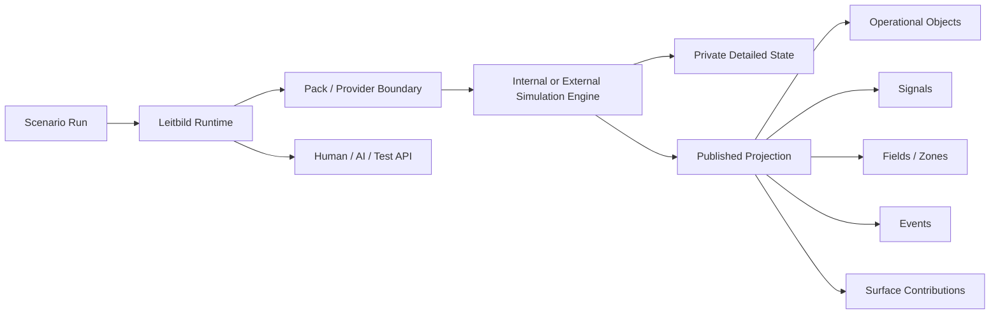
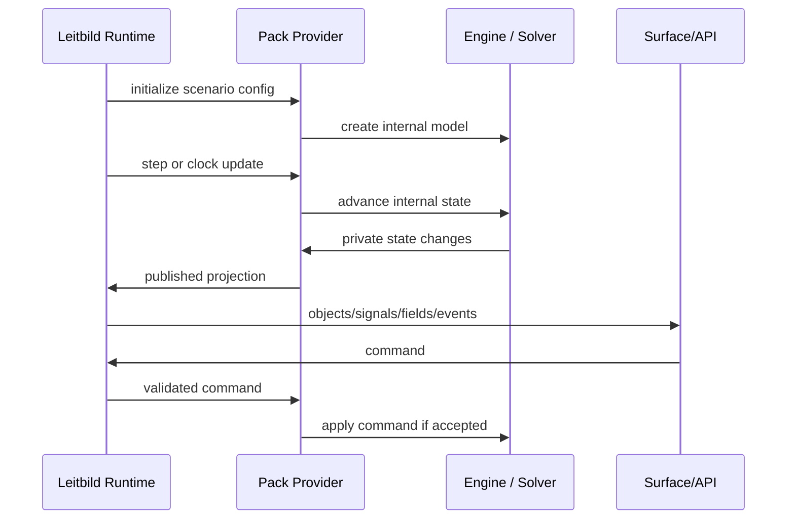

# Advanced Simulation Technologies For Leitbild

Leitbild currently demonstrates a modest but important form of simulation: a small number of operational objects move along routed paths on a map, while hospitals, incidents, traffic conditions, scenario scripts, and users interact in one shared run. That is enough to prove the shape of the platform, but it is not the ceiling. The more interesting future is a platform where many simulation packs can coexist: traffic, drones, weather, wildfire, process plants, hospitals, logistics, power grids, air traffic, emergency response, AI teammates, and deep control-room worlds.

The key architectural decision is that Leitbild should not become one giant simulation engine. Leitbild should become the coordination layer that lets different engines run together without blurring ownership. A traffic pack may use a road-network simulator. A hospital pack may use discrete-event simulation. A wildfire pack may use a cellular grid. A nuclear plant pack may wrap a thermohydraulic solver or a simplified TypeScript process model. Leitbild should own run identity, clock coordination, command routing, event ordering, snapshots, published projections, surfaces, APIs, and AI access. Packs should own their internal models.

This page is a technical foundation for future planning. It surveys major simulation domains, identifies common computational patterns, names mature open-source or public reference systems, and proposes concrete Leitbild paths for building or integrating each capability. The goal is not to pick heavy dependencies prematurely. The goal is to know which doors exist, which are worth opening early, and which should remain adapter-backed future options.

## Leitbild's Simulation Doctrine

The most important rule is separation of concerns. Advanced simulation engines live inside packs or external providers. Leitbild sees a curated operational projection, not every internal variable. That projection can contain objects, signals, fields, events, routes, zones, health status, scenario state, and surface definitions.

This protects both sides. A domain pack can be as sophisticated as it needs to be, even if that means C++, Python, Modelica, ROS 2, SUMO, or a specialist solver. Leitbild core remains understandable: it coordinates time, users, commands, events, persistence, visibility, and surfaces. Other packs and AI agents interact with published facts and commands, not with private solver memory.

For a simple ambulance provider, the projection may be an ambulance object with position, route, target, patient load, and capabilities. For a weather provider, the projection may be a time-varying wind field and a set of alert polygons. For a nuclear process-control provider, the projection may be selected plant signals, alarms, procedure state, and a control-room surface. The same Leitbild run can contain all of them because the runtime contract is stable even when the internal engines differ.

This doctrine also gives us a performance rule. High-frequency internal state should not flood the global event journal. A pack may update thousands of cells or entities per simulation tick, but Leitbild should receive only the meaningful projection needed for surfaces, decisions, audit, and cross-pack interaction. Fine-grained details can remain queryable through pack-specific APIs when justified.

## Common Simulation Patterns Across Domains

The domains below look different on the surface, but many of them reuse the same computational structures. Recognizing those common structures helps Leitbild grow without inventing a new architecture for every pack.

Graphs are the most obvious shared structure. Roads, rail networks, airways, power grids, pipe systems, communications networks, and hospital patient pathways can all be represented as nodes and edges with capacities, delays, states, and constraints. A road edge may have a speed factor. A pipe edge may have flow and pressure. A hospital edge may represent movement from triage to imaging to treatment. A power-grid edge may represent a transmission line. The domain physics differ, but the operational projection often looks like a graph with changing edge conditions and resource constraints.

Fields are the second major structure. Weather, smoke, radiation, wildfire intensity, traffic density, noise, visibility, flood depth, and risk can be represented as rasters, vector fields, polygons, or sampled grids. A field is not "an object moving on a map." It is a value distributed across space and time. Leitbild should eventually support field projections as first-class surface inputs: draw wind arrows, color congestion density, show a smoke plume, sample a radiation field at an ambulance location, or let a drone pack query wind along a planned route.

Agents are the third structure. Cars, drones, aircraft, patients, pedestrians, firefighters, operators, AI teammates, and synthetic dispatchers can all be agents: entities with state, rules, goals, and perception. Some agents should be projected as operational objects. Others should remain internal. A traffic pack with 50,000 vehicles may not publish all vehicles to the main map; it may publish aggregate congestion, selected emergency-relevant vehicles, and sampled diagnostics.

Queues and resources appear everywhere. Hospital beds, ambulance seats, runways, chargers, fuel, staff, operating rooms, roads, pumps, valves, diesel generators, and radio channels are all capacity-constrained resources. Discrete-event simulation is often the cleanest way to model these systems because the important state changes occur at events: a patient arrives, a bed frees, a truck reaches a depot, a pump fails, a runway closes, an ambulance is dispatched.

Continuous solvers are needed when the state changes through physics rather than discrete events: thermohydraulics, weather, fluid flow, structural response, power systems, and wildfire-atmosphere coupling. These systems often use ordinary differential equations, differential-algebraic equations, finite volume methods, finite element methods, finite difference methods, sparse matrices, implicit solvers, and coupling algorithms. Leitbild should not reimplement these casually. It should be able to wrap them.

Spatial indexing is the quiet performance enabler. Large worlds need grids, quadtrees, R-trees, bounding-volume hierarchies, or chunk maps so agents only inspect nearby entities and surfaces only render relevant detail. Without spatial indexing, "for each object, check every other object" becomes a performance trap. This matters for traffic, swarms, wildfire, crowds, air traffic, and large map overlays.

Level of detail is equally important. Serious simulations rarely compute everything at maximum fidelity all the time. Games and engineering simulators both use forms of aggregation: inactive chunks, aggregate traffic density, low-fidelity whole-world simulation with high-fidelity local regions, sampled fields, and event-triggered detail. Leitbild should allow packs to publish multiple projections: detailed entities for selected objects, aggregate fields for large populations, and high-level status for dormant regions.

| Shared concept | Domains that use it | Leitbild implication |
|---|---|---|
| Graph / network | traffic, rail, pipes, grid, airways, hospitals | Need route, flow, capacity, and edge-condition projections. |
| Raster / field | weather, fire, smoke, radiation, congestion | Need map field layers and sampled field APIs. |
| Agent system | cars, drones, patients, aircraft, operators | Need selective object projection and internal agent privacy. |
| Event queue | hospitals, logistics, scenarios, failures | Need shared run clock and scheduled event semantics. |
| Continuous solver | thermohydraulics, CFD, weather, power systems | Need external provider and co-simulation contracts. |
| Spatial index | traffic, swarms, wildfire, crowds | Packs need local-neighborhood updates, not full scans. |
| Level of detail | games, traffic, weather, large fleets | Publish aggregates by default; detail on demand. |
| Snapshot/replay | studies, debugging, AI evals, games | Pack snapshots must restore meaningful state deterministically. |

## Large-Scale Traffic And City Mobility

Traffic looks like a map problem, but city-scale traffic is mainly a graph and agent-flow problem. Roads are edges with lanes, priorities, signals, capacity, turning restrictions, speed limits, and transient conditions. Vehicles are agents with origins, destinations, planned routes, driver rules, and sometimes stochastic behavior. Congestion is not just "a slower line on the map"; it emerges when edge demand exceeds capacity, queues spill back into upstream intersections, and route choice adapts to perceived travel time.

The mature open-source reference is [SUMO](https://sumo.dlr.de/docs/), a microscopic, multimodal traffic simulator designed for large networks. SUMO's [TraCI](https://sumo.dlr.de/docs/TraCI/index.html) interface is especially relevant because it gives external software access to a running simulation and allows online manipulation of simulated objects. [MATSim](https://matsim.org/) represents a different point in the design space: large-scale agent-based transport simulation where many travelers have daily plans and can replan. [CityFlow](https://github.com/cityflow-project/CityFlow) is useful for large-scale city traffic and traffic-signal learning. [A/B Street](https://a-b-street.github.io/docs/software/abstreet.html) is useful as a public-facing design reference because it shows how OpenStreetMap-derived roads, trip demand, user-editable infrastructure, and simulation assumptions can be made understandable.

The algorithmic core includes shortest-path routing on weighted graphs, dynamic edge weights, car-following models, lane-changing models, queue spillback, signal phase control, demand generation, route replanning, and sometimes reinforcement learning for signal control. The data structures are mostly graph adjacency, edge/lane occupancy, priority queues for events, and spatial indexes for rendering/querying.

For Leitbild, the right first step is not to integrate SUMO immediately. The current traffic pack should evolve into a dependency-light traffic edge-condition model: road segment geometry, severity, speed factor, density, confidence, active time interval, and reason. That model would let us represent congestion on actual routes, make ambulance ETA and route choice traffic-aware, and show professional traffic overlays without simulating every car. It also defines a projection shape that a future SUMO adapter can publish.

The concrete next step is to introduce a `TrafficEdgeCondition` projection and routing-cost hook. A scenario or user would define congestion by drawing a route or polygon; the traffic pack would convert that into one or more edge conditions; the routing adapter would apply speed factors or penalties; the map surface would render graded yellow/orange/red route overlays. Once that is stable, a SUMO provider can run externally and publish the same edge-condition projection plus selected vehicle objects.

## Drone Swarms And Robotics

Drone swarms are not just many moving markers. A serious swarm has local autonomy, sensing limits, communication topology, formation logic, collision avoidance, task allocation, battery state, vehicle health, geofencing, and command authority boundaries. Leitbild should not become a flight controller. It should be a supervisory and research surface for swarm state, mission allocation, intervention, and multi-pack coordination.

Mature robotics simulation commonly uses [PX4 SITL/HITL](https://docs.px4.io/main/en/simulation/index.html), [Gazebo](https://gazebosim.org/docs/harmonic/ros2_overview/), ROS 2, MAVLink, and DDS-style publish/subscribe. PX4's simulation architecture is valuable because it separates autopilot code, simulator world, ground station, and external APIs, and supports distributed simulation over the network. [Crazyswarm2](https://imrclab.github.io/crazyswarm2/) is a useful reference for ROS 2-based aerial robot teams. [AirSim](https://github.com/microsoft/AirSim) is no longer the default choice for new development, but remains an important reference for high-fidelity visual and physical simulation of autonomous vehicles.

The algorithms include boids-style flocking, consensus control, formation control, graph-based communication, potential fields, velocity obstacles, task allocation, auction mechanisms, coverage planning, simultaneous localization and mapping, and local trajectory optimization. For thousands of drones, the update model must be local: each drone should consider nearby neighbors, assigned mission constraints, and selected global fields, not every other drone.

Leitbild's dependency-light path is a TypeScript swarm-supervision pack with simple 2D or 3D kinematics, battery drain, formations, task assignment, and geofence rules. That pack would be enough to study operator supervision, workload, handoff, alerting, and AI dispatch. It should publish selected drones as operational objects, aggregate swarm shape as polygons or vectors, communication health as signals, and constraint violations as events.

The concrete next step is to build a small swarm pack with 20-100 simple agents and a formation/tasking surface. The pack should declare commands such as `swarm.assignArea`, `swarm.hold`, `swarm.returnHome`, and `swarm.splitGroup`, and publish signals such as `swarm.coverage.percent`, `swarm.battery.lowCount`, and `swarm.communication.partitioned`. Only later should we bridge PX4/Gazebo/ROS 2 for hardware-faithful behavior.

## Weather And Environmental Fields

Weather is field-first. Wind, precipitation, visibility, temperature, pressure, lightning risk, and turbulence are values distributed over space and time. They influence other packs but are rarely controlled as individual objects. A drone pack samples wind and visibility. A traffic pack applies precipitation penalties. A wildfire pack uses wind and fuel moisture. A hospital pack may receive heat-stress or storm-injury demand. A power-grid pack may increase failure risk.

High-fidelity weather simulation is its own world. The [Weather Research and Forecasting model](https://www.emc.ncep.noaa.gov/emc/pages/infrastructure/wrf.php), NOAA's [Unified Forecast System](https://www.ufs.epic.noaa.gov/), MPAS-style atmospheric models, and CFD tools such as [OpenFOAM](https://openfoam.org/) solve large numerical models. They use grids, nested domains, physics parameterizations, boundary conditions, ensembles, and heavy computation. Leitbild should not try to reproduce that internally.

The dependency-light path is scenario weather: time-varying fields and zones authored from JSON, generated procedurally, or ingested from external data. For many research studies, we do not need a full forecast model. We need operationally meaningful weather effects: wind from the west at 14 m/s over this area, visibility under 500 m near this road, freezing rain reducing vehicle speed by 30%, or thunderstorm polygons moving across the map.

The concrete next step is a generic field projection model. It should support scalar fields, vector fields, polygons, time intervals, units, quality metadata, and sampling. A weather pack could publish `weather.wind.vector`, `weather.visibility.m`, `weather.precipitation.mmPerHour`, and alert polygons. Other packs should query these through a stable field API rather than hardcoding weather-specific logic. Later, a WRF or UFS adapter can publish into the same projection model.

## Wildfire And Forest Fire Spread

Wildfire simulation sits between field modeling, cellular automata, and physics. Fire spread depends on fuel, topography, wind, moisture, ignition pattern, suppression actions, and sometimes fire-atmosphere feedback. The operational projection is usually a fire perimeter, intensity field, smoke plume, threatened assets, and evacuation or access constraints.

The reference systems show multiple fidelity levels. [FARSITE](https://research.fs.usda.gov/firelab/products/dataandtools/farsite) is a classic fire area simulator used by fire managers and dependent on landscape/GIS inputs. [Cell2Fire](https://github.com/cell2fire/Cell2Fire) is a cell-based forest and wildland landscape fire spread simulator, explicitly designed around homogeneous cells, fuel/weather/topography attributes, and parallel computation. [QUIC-Fire](https://research.fs.usda.gov/treesearch/59686) couples a rapid wind solver to a physics-based cellular automata fire spread model. [WRF-Fire](https://unr-wrf-fire.readthedocs.io/) couples atmospheric modeling with wildland surface fire simulation.

The algorithmic core can be simple or very deep. A dependency-light model can use a grid where each cell has fuel, moisture, slope, wind exposure, and state: unburned, heating, burning, burned. Spread probability or rate depends on neighbor state and environmental factors. More advanced models use elliptical spread assumptions, level-set fronts, coupled wind fields, or CFD-like fire-atmosphere feedback.

For Leitbild, the first useful wildfire pack should be a grid-based cellular fire model over a bounded area. It should publish perimeter polygons, intensity rasters, smoke/risk polygons, blocked roads, and threatened objects. Emergency-response, traffic, drone, and hospital packs can react to those projections. A drone swarm could be assigned to map the perimeter. A traffic pack could close evacuation routes. A hospital pack could receive smoke-inhalation surge demand.

The concrete next step is a `FieldAndPerimeter` capability: one fire pack that advances a cellular grid, publishes perimeter and intensity every simulation step, and emits events when fire enters zones or threatens objects. The implementation can be TypeScript for small scenarios; larger landscapes should use a C++/Python external provider or adapt public Cell2Fire-style algorithms.

## Nuclear Thermohydraulics And Process Systems

Nuclear thermohydraulics and plant process systems are network-and-solver problems. Pipes, pumps, valves, steam generators, pressurizers, vessels, heat exchangers, containment volumes, diesel generators, electrical buses, and control systems interact through pressure, temperature, flow, level, heat transfer, power, and control logic. The math often becomes ordinary differential equations, differential-algebraic equations, conservation laws, component networks, sparse matrices, implicit solvers, and event-driven controller logic.

This is not an area for casual reimplementation if the claim is engineering fidelity. [RELAP5-3D](https://inl.gov/relap53d/) is a major INL thermal-hydraulics code. The NRC's [CAMP](https://www.nrc.gov/about-nrc/regulatory/research/camp) program maintains and improves reactor safety codes including TRACE and RELAP5; the NRC describes TRACE as its primary thermal-hydraulic reactor system analysis code. [MOOSE](https://mooseframework.inl.gov/moose/index.html) is an open-source, parallel finite-element framework for multiphysics simulation. [FMI](https://fmi-standard.org/) is a standard for exchanging dynamic simulation models as FMUs for model exchange and co-simulation.

Leitbild's path should be two-layered. For operational research scenarios, we can build simplified TypeScript process models that represent plant behavior at a coarse, transparent level: offsite power, diesel generators, steam generator levels, pressurizer pressure bands, safety injection state, procedure state, alarms, and external support requests. These models should carry explicit limitations and source links to the [PWR Ops wiki](https://samsinn-wikis.github.io/pwr-ops/). For engineering-grade dynamics, the pack should wrap Modelica/FMU, MOOSE applications, or licensed/specialist solvers behind the same published signal contract.

The concrete next step is not a thermohydraulic solver. It is a process-signal pack pattern: component state, signal catalog, command catalog, alarms, procedure state, time-series buffers, and a control-room surface. A future NPP pack can start with a few systems and stable signal names, then replace internals with an FMU or external solver if needed. The published projection remains stable while fidelity increases.

## Air Traffic Patterns And Processes

Air traffic simulation combines moving agents, procedural constraints, airspace sectors, trajectories, conflict detection, runway/arrival capacity, weather impacts, and human controller workload. Aircraft are objects on a map, but the interesting state is often temporal: predicted loss of separation, sector overload, runway sequence, arrival metering, reroute options, and controller task load.

[BlueSky](https://github.com/TUDelft-CNS-ATM/bluesky) is a strong open-source reference: it is explicitly an open air traffic simulator for ATM and air traffic flow research, with aircraft performance, flight management, autopilot behavior, conflict detection/resolution, and scenario files. NASA's [FACET](https://www.nasa.gov/aeronautics/nasa-air-traffic-management-research-tool-shows-new-colors/) shows the value of fast analysis of thousands of aircraft paths and traffic-flow management concepts. NASA's [MFSim](https://software.nasa.gov/software/ARC-17449-1) is especially interesting because it is a pluggable multi-fidelity air traffic flow simulator: low-fidelity whole-airspace simulation can run with higher-fidelity plugins in selected regions. [openScope](https://www.openscope.co/) is useful as a browser-based ATC simulator and UI reference.

The algorithms include trajectory prediction, waypoint/airway routing, aircraft performance models, conflict detection, conflict resolution, arrival sequencing, sector load estimation, weather rerouting, and workload metrics. Data structures include route graphs, time-indexed trajectories, spatial indexes for conflict detection, and priority queues for scheduled events.

Leitbild's dependency-light path is an airspace pack with aircraft projected along scenario routes, sector polygons, conflict alerts, and simple controller commands. It should not start with full ATC. A first version can simulate aircraft along routes, estimate conflicts by projecting positions forward, and publish sector load and alerts. A later adapter can integrate BlueSky-like simulation if we need richer aircraft dynamics or ATM research.

The concrete next step is to define generic trajectory objects and conflict signals. That is useful beyond aviation: drones, vessels, trains, and robotaxis also need trajectory prediction and conflict alerts. Start with `trajectory.predicted`, `conflict.detected`, `sector.load`, and `restriction.active` projections, then build aviation-specific semantics on top.

## Hospital Process Simulation

Hospital simulation is one of the best near-term candidates because it aligns with the current ambulance scenario and is feasible without heavy dependencies. A hospital is a process system: patients arrive, wait, are triaged, consume resources, receive treatment, transfer, deteriorate, or depart. The important state is not only "beds available" but the flow of patients through constrained resources.

The classic model is discrete-event simulation. [SimPy](https://simpy.readthedocs.io/) is a process-based DES framework in Python. [simmer](https://r-simmer.org/) is a trajectory-based DES package for R. [AnyLogic](https://www.anylogic.com/use-of-simulation/discrete-event-simulation/) describes the general DES paradigm and its use in healthcare, and its [healthcare](https://www.anylogic.com/healthcare/) material shows the industry framing: capacity, resource utilization, patient flow, policy testing, and risk-free experimentation.

The algorithmic model is straightforward but powerful. Events include patient arrival, triage start/end, bed assignment, imaging request, treatment completion, transfer, discharge, staff shift change, and ambulance arrival. Resources include trauma bays, nurses, doctors, imaging, operating rooms, ICU beds, transport staff, and ambulance bays. Queues have priorities and timeouts. Patients have acuity, needs, expected service times, and deterioration risks.

Leitbild can build this natively in TypeScript. A dependency-light DES engine is mostly a priority queue of events, resource pools, entity state, and deterministic random streams. This should be easier to own and test than integrating Python for the first version. It would immediately improve ambulance dispatch: hospitals would publish expected handoff delay, trauma capacity, diversion status, staff bottlenecks, and bed turnover forecasts.

The concrete next step is to replace the simple trauma-bed counter with a hospital process pack. V1 should model ambulance arrival bay, trauma beds, one staff capacity constraint, patient acuity, treatment time, and discharge/transfer events. It should publish `hospital.traumaBeds.available`, `hospital.handoffDelay.estimatedMinutes`, `hospital.diversion.status`, and `hospital.patientQueue.count`. This gives us a serious process sim while staying dependency-light.

## Power Grid, Logistics, Maritime, Rail, Crowds, And Other Future Domains

Several additional domains deserve early architectural attention because they are likely to interact with map-based response and process-control packs.

A power-grid pack would model buses, generators, loads, transmission lines, substations, breakers, protection state, and restoration actions. At low fidelity, it can be a graph with available/unavailable edges and capacity margins. At high fidelity, it may need power-flow solvers, contingency analysis, and dynamic stability models. The Leitbild projection should be grid status, outage zones, restoration estimates, and dependencies affecting hospitals, plants, traffic lights, and communications.

A logistics pack would model depots, vehicles, inventory, delivery tasks, routing constraints, loading/unloading times, and priority orders. This is mostly graph routing plus discrete-event resources. It is a good candidate for dependency-light TypeScript because many research scenarios need "critical item must arrive by T+45" more than full warehouse simulation.

Maritime and port operations combine vessel trajectories, channels, berths, tides, weather, cargo handling, pilot availability, and port queues. Rail networks combine timetables, blocks, signals, switches, platforms, and rolling stock. Both are graph/resource/time systems, and both would benefit from a common Leitbild network-flow and schedule projection.

Crowd and evacuation simulation introduces pedestrians, buildings, exits, routes, densities, panic/behavior models, and bottlenecks. A dependency-light version can use graph or cellular flow; a deeper version may use social-force or agent-based models. Leitbild should project evacuation zones, density fields, route capacity, and responder tasks.

Communications-network simulation matters for command-and-control research. Radio channels, cellular outages, latency, message loss, and overloaded dispatch channels can all be modeled as signals and constraints. A simple comms pack could degrade message delivery or create uncertainty in object context, which would be valuable for AI and human factors studies.

Industrial logistics and factory-flow simulation overlaps with Factorio-like production graphs: machines, buffers, conveyors, vehicles, resources, maintenance, and failures. This is useful because many real control centers supervise plants, mines, ports, warehouses, and infrastructure rather than ambulances.

## Lessons From Games And Large Simulation Software

Game engines and simulation games offer practical lessons because they must make large worlds feel alive under strict frame-time budgets. The lesson is not to copy game mechanics. The lesson is to copy performance discipline.

[Factorio's deterministic lockstep writing](https://factorio.com/blog/post/fff-188) is relevant because it shows the debugging and networking benefits of deterministic simulation: clients can exchange inputs rather than full state, and desyncs become diagnosable artifacts. Leitbild probably should not use pure lockstep for all packs, because browser clients should not run authoritative simulation. But packs should strive for deterministic server-side stepping, explicit random seeds, and replayable event histories where feasible.

Factorio's optimization discussions, Luanti/Minetest's active block concepts, and transport games such as [OpenTTD](https://github.com/OpenTTD/OpenTTD) all point in the same direction: do not update everything at full fidelity every tick. Use chunks, active regions, dirty sets, cached paths, precomputed adjacency, event queues, and specialized data layouts. [Luanti](https://docs.luanti.org/about/luanti) is a useful open-source voxel-engine reference because it distinguishes loaded/active world regions from inactive ones. OpenTTD is useful because it is an open-source transport simulation with pathfinding, vehicles, schedules, and network constraints.

For Leitbild, the concrete engineering doctrine should be: no pack gets to full-scan the world by default; large packs must declare update cadence and health metrics; populations may be aggregated; selected objects can be promoted to detailed projection; and expensive computations should be event-triggered, spatially bounded, or scheduled. A thousand ambulances should not require a thousand DOM widgets. Ten thousand cars should not require ten thousand rail entries. The surface should be allowed to show density, samples, alerts, and selected details.

## Open-Source And Dependency-Light Paths

There are three different ways to use public simulation work.

Direct integration is appropriate when a mature engine is clearly better than anything we should build. SUMO for serious traffic, PX4/Gazebo/ROS 2 for robotics, BlueSky for air traffic, Modelica/FMU for engineering process models, and specialist wildfire or thermohydraulic codes belong in this category when fidelity matters.

Dependency-light re-engineering is appropriate when the core idea is simple enough, the domain is central to our product, and owning the model improves testability. Hospital discrete-event simulation, simple traffic edge conditions, field-based scenario weather, cellular wildfire prototypes, boids-style drone swarms, logistics dispatch, and trajectory conflict detection are good candidates. We can learn from public algorithms and open-source systems without importing their entire runtime.

Do-not-reimplement is the third category. High-fidelity weather forecasting, validated nuclear thermal-hydraulics, high-fidelity CFD, certified flight dynamics, and engineering-grade power-grid transient analysis should not be recreated casually. Leitbild should wrap or ingest those systems when needed.

| Capability | Good public engine path | Dependency-light path | Recommendation |
|---|---|---|---|
| City traffic | SUMO, MATSim, CityFlow | Edge conditions and aggregate congestion | Start dependency-light, keep SUMO adapter path. |
| Drone swarms | PX4, Gazebo, ROS 2, Crazyswarm2 | Simple kinematic swarm pack | Start with supervisor pack, bridge robotics later. |
| Weather | WRF, UFS, OpenFOAM | Scenario fields and moving polygons | Build field projection first. |
| Wildfire | FARSITE, QUIC-Fire, Cell2Fire | Cellular grid + perimeter projection | Prototype cellular pack, externalize for scale. |
| NPP/process | RELAP5, TRACE, MOOSE, Modelica/FMI | Operational process-signal model | Start with signal/control pack, wrap solvers later. |
| Air traffic | BlueSky, FACET-style tools | Route/trajectory/conflict pack | Build trajectory projection first. |
| Hospital flow | SimPy, simmer, AnyLogic | TypeScript DES engine | Build natively in TypeScript. |

## How Advanced Engines Plug Into Leitbild

Advanced engines should enter Leitbild through provider contracts. A native provider runs inside the Bun process and is easiest to test. An external process provider runs a child process or sidecar service. A remote provider connects over HTTP/WebSocket/gRPC-like protocols. A file/replay provider emits recorded data. An FMU provider wraps co-simulation or model-exchange components. A ROS/DDS bridge provider subscribes to robotics topics and publishes a Leitbild projection.

Every provider type should eventually support the same lifecycle concepts: initialize, restore, step or observe clock, accept command, publish projection, snapshot, report health, and shut down. The implementation details differ. SUMO may advance via TraCI. A Python DES may advance through an IPC boundary. A native TypeScript hospital pack may step directly. A ROS 2 bridge may consume topic updates and translate selected state into signals. The Leitbild runtime should not care as long as the provider obeys the contract.

The command/event/signal layer is the cross-pack language. A wildfire pack does not directly slow ambulances. It publishes a road closure or risk field. The traffic pack converts that into edge conditions. The ambulance pack queries the route impact and reroutes. A hospital pack does not directly command ambulances; it publishes diversion status and handoff delay. The dispatch surface or agent decides what to do. This keeps interactions powerful without turning the runtime into a tangle of special cases.

## Roadmap For Leitbild

The first architectural step is a signal catalog. We need a formal way for packs to declare signals: key, label, unit, type, update cadence, quality, visibility, and semantic meaning. This is required for process plants, hospitals, weather, grid, and AI agents. Without it, every pack will invent its own ad hoc data shape.

The second step is a field projection model. Weather, wildfire, smoke, radiation, congestion, evacuation density, and risk all need scalar/vector/polygon field support. The map surface should render these, and packs should be able to sample them through a controlled API.

The third step is pack health and performance reporting. Advanced packs must report object counts, internal entity counts, update cadence, last step duration, backlog, memory estimates, and degraded state. This is essential before we run thousands of entities or external engines.

The fourth step is a native TypeScript discrete-event utility. Hospital flow is the best first use. It is directly useful, dependency-light, and exposes the right architectural questions: event queues, resources, stochastic durations, snapshots, and published capacity signals.

The fifth step is a stronger traffic edge-condition model. This improves the current ambulance/traffic demo without importing SUMO. It also creates the projection shape that an external SUMO adapter can later publish.

The sixth step is an external provider protocol. This should be deliberately small: start, step, command, projection, snapshot, health, stop. The first external proof should be either SUMO traffic or a Python DES, not a high-fidelity nuclear solver.

The seventh step is a co-simulation clock contract. External engines must know whether Leitbild is running real time, paused, fast-time, or replay. Some engines can step deterministically; others run asynchronously and publish observations. The contract should represent both modes explicitly.

The eighth step is a performance doctrine and test harness. We should test 100, 1,000, and 10,000 projected items before we need them. We should test map rendering, rail aggregation, event throughput, snapshot size, and reload behavior.

The ninth step is one serious proof pack. The best candidates are a hospital process pack or SUMO-backed traffic. Hospital flow proves dependency-light DES and directly strengthens ambulance dispatch. SUMO proves external engine integration and large-scale movement. Both are better first proofs than a full NPP thermohydraulic integration.

The tenth step is an advanced process-control proof pack, building on the NPP process control future-project page. By then, signal catalogs, field projections, external providers, health reporting, and surfaces should already exist.

## Source Index

| Area | Source | Why it matters |
|---|---|---|
| Traffic | [SUMO documentation](https://sumo.dlr.de/docs/) | Mature microscopic multimodal traffic simulator for large networks. |
| Traffic | [SUMO TraCI](https://sumo.dlr.de/docs/TraCI/index.html) | Reference pattern for controlling and observing a running traffic sim. |
| Traffic | [MATSim](https://matsim.org/) | Large-scale agent-based transport simulation. |
| Traffic | [CityFlow](https://github.com/cityflow-project/CityFlow) | Large-scale traffic simulator and RL traffic-control reference. |
| Traffic/UI | [A/B Street](https://a-b-street.github.io/docs/software/abstreet.html) | Open-data traffic planning simulator with public-facing UX lessons. |
| Robotics | [PX4 simulation](https://docs.px4.io/main/en/simulation/index.html) | SITL/HITL architecture and distributed simulator/autopilot boundary. |
| Robotics | [Gazebo ROS 2 integration](https://gazebosim.org/docs/harmonic/ros2_overview/) | Robotics simulation and middleware bridge pattern. |
| Robotics | [Crazyswarm2](https://imrclab.github.io/crazyswarm2/) | ROS 2 testbed for aerial robot teams. |
| Robotics | [AirSim](https://github.com/microsoft/AirSim) | High-fidelity autonomous vehicle simulation reference. |
| Weather | [WRF overview](https://www.emc.ncep.noaa.gov/emc/pages/infrastructure/wrf.php) | Numerical weather prediction reference point. |
| Weather | [NOAA UFS](https://www.ufs.epic.noaa.gov/) | Operational weather model ecosystem. |
| CFD/fields | [OpenFOAM](https://openfoam.org/) | Open-source CFD reference for local flow/field simulation. |
| Wildfire | [FARSITE](https://research.fs.usda.gov/firelab/products/dataandtools/farsite) | Fire area simulation reference for fire management. |
| Wildfire | [QUIC-Fire](https://research.fs.usda.gov/treesearch/59686) | Fast-running coupled wind/fire cellular automata approach. |
| Wildfire | [Cell2Fire](https://github.com/cell2fire/Cell2Fire) | Open-source cell-based forest fire growth model. |
| Wildfire | [WRF-Fire](https://unr-wrf-fire.readthedocs.io/) | Coupled atmosphere-wildland surface fire model. |
| Nuclear/process | [RELAP5-3D](https://inl.gov/relap53d/) | Major nuclear thermal-hydraulic system code. |
| Nuclear/process | [NRC CAMP](https://www.nrc.gov/about-nrc/regulatory/research/camp) | TRACE/RELAP/PARCS/SNAP context and reactor safety code ecosystem. |
| Multiphysics | [MOOSE](https://mooseframework.inl.gov/moose/index.html) | Open-source parallel finite-element multiphysics framework. |
| Co-simulation | [FMI standard](https://fmi-standard.org/) | Model exchange and co-simulation standard for FMUs. |
| Air traffic | [BlueSky](https://github.com/TUDelft-CNS-ATM/bluesky) | Open-source air traffic simulator for ATM research. |
| Air traffic | [NASA FACET article](https://www.nasa.gov/aeronautics/nasa-air-traffic-management-research-tool-shows-new-colors/) | Fast analysis of thousands of aircraft paths and ATM concepts. |
| Air traffic | [NASA MFSim](https://software.nasa.gov/software/ARC-17449-1) | Pluggable multi-fidelity air traffic simulation idea. |
| Air traffic UI | [openScope](https://www.openscope.co/) | Browser-based ATC simulator and interaction reference. |
| Hospital/DES | [SimPy](https://simpy.readthedocs.io/) | Python process-based discrete-event simulation framework. |
| Hospital/DES | [simmer](https://r-simmer.org/) | R trajectory-based discrete-event simulation package. |
| Hospital/DES | [AnyLogic DES](https://www.anylogic.com/use-of-simulation/discrete-event-simulation/) | Clear industrial framing of DES, resources, entities, and events. |
| Hospital/DES | [AnyLogic healthcare](https://www.anylogic.com/healthcare/) | Healthcare simulation use cases and capacity framing. |
| Game lessons | [Factorio deterministic lockstep](https://factorio.com/blog/post/fff-188) | Determinism, multiplayer, replay, and desync lessons. |
| Game lessons | [Luanti documentation](https://docs.luanti.org/about/luanti) | Open-source voxel engine and active-world-region lessons. |
| Game lessons | [OpenTTD](https://github.com/OpenTTD/OpenTTD) | Open-source transport simulation and pathfinding reference. |

Related pages: [[concepts]], [[specs]], [[future-projects]], [[domains/traffic]], [[domains/ambulance]], [[agent-guides]].
