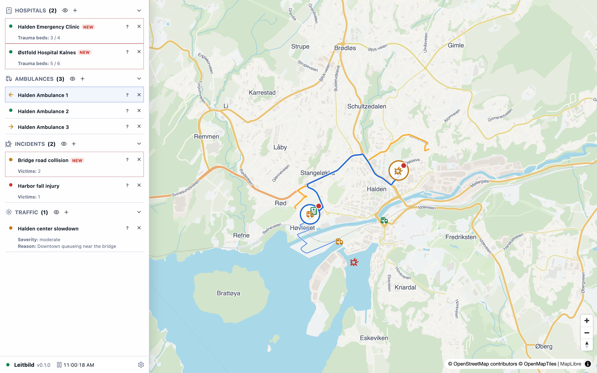
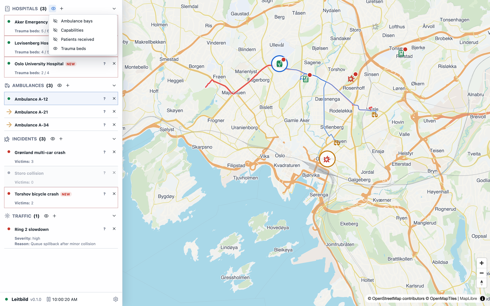

# Tutorials

## Ambulance Dispatch Basics

Start by selecting an available ambulance from the rail or map. Then click an incident or hospital target. A selected ambulance can be redirected by choosing a new target. If a destination is cancelled, the ambulance stops and becomes idle.

Use the rail categories to understand the current world. Hospitals show available trauma beds when the trauma bed field is visible. Incidents show victim demand when the victims field is visible. Traffic conditions show severity and reason when their fields are visible. The eye icon next to a category opens the field visibility menu.

A left-pointing arrow beside an ambulance means it is outbound to an incident. A right-pointing arrow means it is inbound to a hospital. Dispatch enough capacity to handle all victims. If an incident has two victims and one ambulance can carry one patient, one ambulance is not enough unless another ambulance is already assigned or more capacity is available.

## Oslo Ambulance Walkthrough

Open `/i/oslo-ambulance` from the scenario picker or directly from the URL. Oslo begins with several hospitals, ambulances, incidents, and traffic conditions. Some ambulances are already transporting patients. One incident is resolved, one is partly handled, and one red incident is unattended.

Read the dispatch overview card. Select the available ambulance and inspect the red incident. Use the incident eye fields to show victims and the hospital eye fields to show trauma beds. Dispatch the available ambulance to the unattended incident if its capacity is needed. Watch the route and status arrow. When patients are loaded, dispatch the ambulance to a hospital with available trauma beds.

Timed updates will add or revise incident and traffic information. Update guidance titles are red. New information on incidents and hospitals can also appear in the rail. Hover over the `new` badge to see the update context.

## Halden Walkthrough

Open `/i/halden`. Halden is smaller and easier for a first pass. It starts with two hospitals, several ambulances, two incidents, and a downtown traffic slowdown. One ambulance is already transporting a patient to a hospital.

Dispatch an ambulance to the bridge road collision. Watch the left-pointing outbound arrow. Then inspect hospital trauma beds and route the ambulance to an appropriate hospital after it loads patients. After a short delay, the harbor incident updates to two confirmed victims. Later, another incident appears near the fortress and traffic changes. This makes Halden useful for checking scenario switching, timed updates, and multi-pack behavior.

## Creating A Scenario

A scenario config is compact JSON. It names active packs, world settings, initial objects, surface regions, and optional script steps. Initial objects use pack-specific compact specs such as `pack: "ambulance", type: "incident"` or `pack: "traffic", type: "traffic_condition"`. Pack codecs expand those compact specs into full validated operational objects.

Keep scenario files declarative. Do not put arbitrary code into scenario definitions. If a scenario needs a new kind of object update, add a validated pack operation rather than embedding logic in the scenario file.

## Using The API

The API lets tools and AI agents list scenarios, create or join control instances, read snapshots, send commands, control the clock, and read events. Agents should prefer API reads over assumptions. They should never invent object IDs or infer hidden state from labels alone.

Related pages: [[scenarios]], [[specs]], [[agent-guides]], [[domains/ambulance]].
